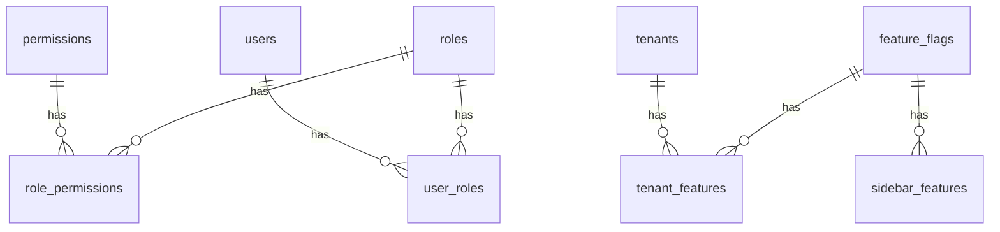

# RBAC System Tables Technical Documentation

## Core Tables

### 1. `roles` Table

```sql
CREATE TABLE roles (
    id SERIAL PRIMARY KEY,
    name TEXT NOT NULL UNIQUE,
    description TEXT,
    created_at TIMESTAMPTZ NOT NULL DEFAULT NOW()
);
```

- **Purpose**: Stores role definitions (USER, ADMIN, SUPER_ADMIN, GLOBAL_ADMIN)
- **Key Fields**:
  - `id`: Auto-incrementing integer for better performance
  - `name`: Unique role identifier (e.g., "ADMIN")
  - `description`: Human-readable role description
- **Relationships**: One-to-many with `role_permissions` and `user_roles`

### 2. `permissions` Table

```sql
CREATE TABLE permissions (
    id UUID PRIMARY KEY DEFAULT gen_random_uuid(),
    name TEXT NOT NULL UNIQUE,
    description TEXT,
    created_at TIMESTAMPTZ NOT NULL DEFAULT NOW(),
    updated_at TIMESTAMPTZ NOT NULL DEFAULT NOW()
);
```

- **Purpose**: Stores granular permissions for actions
- **Key Fields**:
  - `id`: UUID for global uniqueness
  - `name`: Unique permission identifier (e.g., "view_dashboard")
- **Types of Permissions**:
  - Service-specific: `start_*`, `view_*`
  - Administrative: `manage_users`, `manage_roles`
  - Feature management: `configure_features`

### 3. `role_permissions` Table

```sql
CREATE TABLE role_permissions (
    id UUID PRIMARY KEY DEFAULT gen_random_uuid(),
    role_id INTEGER NOT NULL,
    permission_id UUID NOT NULL,
    created_at TIMESTAMPTZ NOT NULL DEFAULT NOW(),
    FOREIGN KEY (role_id) REFERENCES roles(id) ON DELETE CASCADE,
    FOREIGN KEY (permission_id) REFERENCES permissions(id) ON DELETE CASCADE,
    UNIQUE (role_id, permission_id)
);
```

- **Purpose**: Maps roles to their assigned permissions
- **Key Fields**:
  - `role_id`: References `roles.id`
  - `permission_id`: References `permissions.id`
- **Constraints**: Unique combination of role_id and permission_id

### 4. `user_roles` Table

```sql
CREATE TABLE user_roles (
    id UUID PRIMARY KEY DEFAULT gen_random_uuid(),
    user_id UUID NOT NULL,
    role_id INTEGER NOT NULL,
    created_at TIMESTAMPTZ NOT NULL DEFAULT NOW(),
    FOREIGN KEY (role_id) REFERENCES roles(id) ON DELETE CASCADE,
    UNIQUE (user_id, role_id)
);
```

- **Purpose**: Assigns roles to users
- **Key Fields**:
  - `user_id`: References auth.users
  - `role_id`: References `roles.id`
- **Constraints**: User can have each role only once

## Feature Management Tables

### 5. `feature_flags` Table

```sql
CREATE TABLE feature_flags (
    id UUID PRIMARY KEY DEFAULT gen_random_uuid(),
    name TEXT NOT NULL UNIQUE,
    description TEXT,
    default_enabled BOOLEAN DEFAULT FALSE,
    created_at TIMESTAMPTZ DEFAULT NOW(),
    updated_at TIMESTAMPTZ DEFAULT NOW()
);
```

- **Purpose**: Defines available features/services
- **Key Fields**:
  - `name`: Unique feature identifier
  - `default_enabled`: Default state for new tenants
- **Core Features**:
  - LocalMiner
  - ContentMap
  - FrontendScout
  - SiteHarvest
  - EmailHunter
  - ActionQueue
  - SocialRadar
  - ContactLaunchpad

### 6. `tenant_features` Table

```sql
CREATE TABLE tenant_features (
    id UUID PRIMARY KEY DEFAULT gen_random_uuid(),
    tenant_id UUID NOT NULL,
    feature_id UUID NOT NULL,
    is_enabled BOOLEAN DEFAULT FALSE,
    created_at TIMESTAMPTZ DEFAULT NOW(),
    updated_at TIMESTAMPTZ DEFAULT NOW(),
    FOREIGN KEY (feature_id) REFERENCES feature_flags(id) ON DELETE CASCADE,
    FOREIGN KEY (tenant_id) REFERENCES tenants(id) ON DELETE CASCADE,
    UNIQUE (tenant_id, feature_id)
);
```

- **Purpose**: Controls which features are enabled for each tenant
- **Key Fields**:
  - `tenant_id`: References `tenants.id`
  - `feature_id`: References `feature_flags.id`
  - `is_enabled`: Override for this tenant
- **Constraints**: Each feature can be configured once per tenant

### 7. `sidebar_features` Table

```sql
CREATE TABLE sidebar_features (
    id UUID PRIMARY KEY DEFAULT gen_random_uuid(),
    feature_id UUID NOT NULL,
    sidebar_name TEXT NOT NULL,
    url_path TEXT NOT NULL,
    icon TEXT,
    display_order INTEGER,
    created_at TIMESTAMPTZ DEFAULT NOW(),
    updated_at TIMESTAMPTZ DEFAULT NOW(),
    FOREIGN KEY (feature_id) REFERENCES feature_flags(id) ON DELETE CASCADE
);
```

- **Purpose**: Defines UI navigation for features
- **Key Fields**:
  - `feature_id`: References `feature_flags.id`
  - `sidebar_name`: Display name in UI
  - `url_path`: Navigation path
  - `display_order`: Order in sidebar
- **Standard Tabs** (per feature):
  1. Control Center
  2. Discovery Scan
  3. Deep Analysis
  4. Review & Export
  5. Smart Alerts
  6. Performance Insights

## Table Relationships



## Default Data

### Default Roles

1. USER: Basic access
2. ADMIN: Service management
3. SUPER_ADMIN: Full system access
4. GLOBAL_ADMIN: Cross-tenant access

### Default Permissions

1. Service Permissions:

   - `start_*`: Ability to initiate service
   - `view_*`: Ability to view service results

2. Administrative Permissions:
   - `view_dashboard`
   - `manage_users`
   - `manage_roles`
   - `manage_permissions`
   - `configure_features`
   - `manage_api_keys`

### Permission Assignments

- USER: Only view permissions
- ADMIN: View + start permissions
- SUPER_ADMIN/GLOBAL_ADMIN: All permissions

## Usage Examples

### Check User Permissions

```sql
SELECT EXISTS (
    SELECT 1
    FROM permissions p
    JOIN role_permissions rp ON p.id = rp.permission_id
    JOIN roles r ON r.id = rp.role_id
    JOIN user_roles ur ON r.id = ur.role_id
    WHERE ur.user_id = 'user-uuid-here'
    AND p.name = 'permission-name-here'
);
```

### Check Feature Availability

```sql
SELECT EXISTS (
    SELECT 1
    FROM tenant_features tf
    JOIN feature_flags ff ON tf.feature_id = ff.id
    WHERE tf.tenant_id = 'tenant-uuid-here'
    AND ff.name = 'feature-name-here'
    AND tf.is_enabled = true
);
```

### Get User's Roles

```sql
SELECT r.name
FROM roles r
JOIN user_roles ur ON r.id = ur.role_id
WHERE ur.user_id = 'user-uuid-here';
```

### Get Sidebar Items

```sql
SELECT sf.*
FROM sidebar_features sf
JOIN feature_flags ff ON sf.feature_id = ff.id
JOIN tenant_features tf ON ff.id = tf.feature_id
WHERE tf.tenant_id = 'tenant-uuid-here'
AND tf.is_enabled = true
ORDER BY sf.display_order;
```

## Integration Points

### 1. User Authentication

- JWT token contains user_id and tenant_id
- Permission middleware checks user roles and permissions
- Feature middleware checks tenant feature access

### 2. UI Integration

- Sidebar rendered based on enabled features
- Feature access controlled by permissions
- Role-based UI element visibility

### 3. API Access Control

- Endpoint permissions defined in router
- Permission middleware enforces access
- Feature flags control endpoint availability

## Maintenance Tasks

### Regular Maintenance

1. Review and clean up unused permissions
2. Audit role assignments
3. Check feature flag states
4. Verify sidebar feature ordering

### Data Integrity

1. Check for orphaned records
2. Verify foreign key constraints
3. Monitor table sizes
4. Check index usage

### Performance Monitoring

1. Watch query performance
2. Monitor cache hit rates
3. Check table statistics
4. Review index usage statistics
