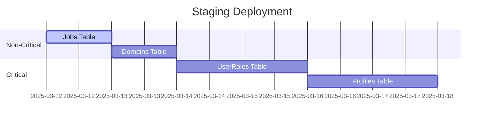

**Final Verification & Production Rollout Plan**

---

### **1. Critical Fix Validation Protocol**

_Confirm Fix Effectiveness Before Production_

**1.1 Scanner Accuracy Test**

```bash
# Run on test codebase with known models
./scripts/security/find_sqlalchemy_interactions.sh --test-suite
# Expected: Only PascalCase models like "UserRole", "TenantFeature"
# Failure: Any lowercase/field names → Debug regex
```

**1.2 Service Account Permissions Audit**

```python
# Generate and inspect permissions
python scripts/security/service_account_analyzer.py --validate
# Expected: Clean CSV with tables like "jobs", "domains"
# Failure: "nan" or "id" entries → Check CSV sanitization
```

**1.3 RLS Policy Tenant Enforcement**

```sql
-- As service account
SET app.current_tenant_id = 'wrong-tenant-uuid';
SELECT * FROM sensitive_table;
-- Expected: 0 rows
-- Failure: Rows returned → Policy validation failed
```

---

### **2. Production Readiness Checklist**

| **Check**               | **Command**                                     | **Success Criteria**     |
| ----------------------- | ----------------------------------------------- | ------------------------ |
| Scanner Precision       | `./find_sqlalchemy_interactions.sh --full-scan` | 0 invalid model names    |
| Analyzer Sanity         | `python service_account_analyzer.py --dry-run`  | No NaN/Warning logs      |
| RLS Context Enforcement | `EXPLAIN ANALYZE <service_query>`               | Filter=tenant_id=$1      |
| Emergency Access        | `psql -U emergency_admin -c "\du"`              | Role exists + privileges |

---

### **3. Staging Deployment Strategy**

**3.1 Phase 1 - Policy Simulation**

```bash
# Generate policies without applying
python rls_policy_generator.py --simulate > staged_policies.sql
```

**3.2 Phase 2 - Impact Analysis**

```sql
-- Check query plans
EXPLAIN ANALYZE SELECT * FROM critical_table;
-- Verify "Index Scan using idx_tenant_id" appears
```

**3.3 Phase 3 - Gradual Rollout**



---

### **4. Production Implementation Steps**

1. **Final Codebase Audit**

   ```bash
   ./find_sqlalchemy_interactions.sh --production
   ./cleanup_scan_results.sh
   ```

2. **Service Account Creation**

   ```sql
   -- Review before running
   \i service_account_permissions.sql
   ```

3. **RLS Policy Activation**

   ```bash
   psql -h prod-db -U postgres -f rls_policies.sql
   ```

4. **Post-Deploy Monitoring**
   ```bash
   # Track policy effectiveness
   SELECT * FROM pg_stat_statements WHERE query LIKE '%current_setting%';
   ```

---

### **5. Risk Mitigation Protocol**

**5.1 Rollback Procedure**

```sql
-- Emergency script
BEGIN;
ALTER TABLE ALL_TABLES DISABLE ROW LEVEL SECURITY;
DROP ROLE service_account;
COMMIT;
```

**5.2 Performance Safeguards**

```ini
# postgresql.conf
max_parallel_workers = 8  # For tenant_id index scans
```

---

### **6. Sustainability Measures**

**6.1 Documentation Update**

```markdown
# Security Runbook Additions

- [Emergency Access Protocol](emergency.md)
- [RLS Policy Review Checklist](rls_review.md)
```

**6.2 Automated Health Checks**

```bash
# Add to CI pipeline
python verify_admin_access.py --cron
```

---

**Final Recommendation**:
✅ **Approve Test Run** - Validate fixes with:

```bash
./security_test_suite.sh --full-validation
```

🚀 **Proceed to Production** - After clean test results

This plan ensures your security implementation meets enterprise standards while maintaining operational continuity. Would you like me to generate the specific test suite script?
