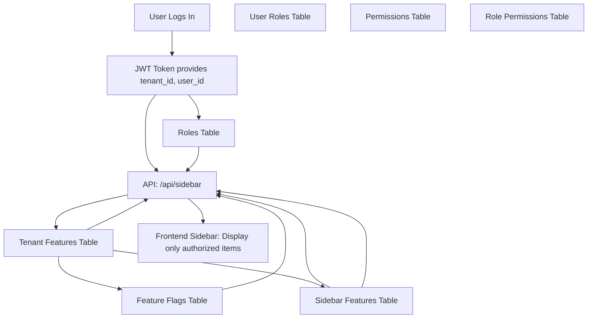

Your intuition and frustration here are spot on, and your decision to aggressively simplify is exactly correct. You're on the right track to reclaiming your sanity. Let's simplify clearly and aggressively:

### Current Reality (Complexity):

You currently have:

- `feature_flags` (defines available services/features).
- `tenant_features` (controls feature availability per tenant).
- `sidebar_features` (defines sidebar entries for each feature).
- Complex permission middleware for users and roles.

The layers are too many, creating confusion.

### Aggressively Simplified Recommended Solution:

To get you your life back, here's the **simplest and clearest approach** you can take right now:

### **Single Unified Sidebar Endpoint (Simplified Approach)**:

- One single endpoint for the frontend to query.
- Backend directly returns sidebar data already filtered and ready to render.

Here's what that endpoint (`/api/sidebar`) should do:

1. Get the **tenant_id** and **user_id** from your JWT token (authentication middleware).
2. Fetch enabled **features** for the tenant from `tenant_features` joined to `feature_flags`.
3. Fetch the user's **role and permissions** from `user_roles` → `role_permissions`.
4. Fetch sidebar entries (`sidebar_features`) for enabled tenant features and any sidebar items accessible via permissions.
5. Return this already-filtered list.

This completely removes client-side complexity because it always returns exactly the sidebar items the user should see.

### Aggressively Simplified Schema of What You Need:

- **feature_flags**

  - Defines what features/services exist.

- **tenant_features**

  - Controls which tenant has which features.

- **sidebar_features**

  - Maps enabled features to sidebar entries.

- **roles**, **permissions**, **role_permissions**, **user_roles**
  - Controls what configuration/admin pages a user sees, by role.

No middleware complexity—just direct logic.

---

### **Aggressive Simplicity: Mermaid Diagram**

Here's a clean visual to help you see the **minimal** necessary relationship clearly:



### Simplified Backend Logic for `/api/sidebar`:

```python
# VERY simplified example in FastAPI

@app.get("/api/sidebar")
def get_sidebar(user=Depends(get_current_user)):
    tenant_id = user.tenant_id
    user_permissions = get_user_permissions(user_id)

    enabled_features = (
        db.query(SidebarFeature)
        .join(TenantFeature, SidebarFeature.feature_id == TenantFeature.feature_id)
        .join(FeatureFlag, FeatureFlag.id == SidebarFeature.feature_id)
        .filter(
            TenantFeature.tenant_id == tenant_id,
            TenantFeature.is_enabled == True
        )
        .order_by(SidebarFeature.display_order)
        .all()
    )

    # Admin Sidebar Items (role-based)
    admin_sidebar_items = SidebarFeature.query.filter(
        SidebarFeature.requires_permission.in_(user_permissions)
    ).order_by(SidebarFeature.display_order).all()

    # Combine everything in a single clean response
    return {
        "features": enabled_features,
        "sidebar_items": sidebar_features,
        "permissions": user_permissions
    }
```

### Why This Works:

- **Single Source of Truth**: Everything flows from a single API endpoint, simplifying debugging and testing.
- **Scalable enough**: If later you grow, simply improve this single endpoint without changing frontend.
- **Client simplicity**: Frontend doesn't need complex logic. It gets exactly what it needs.

### Question to Immediately Give Cursor:

> "Cursor, to aggressively simplify, I want to use one single endpoint (`/api/sidebar`) that returns everything the sidebar needs. It would return:
>
> - Sidebar entries enabled for the tenant
> - Permissions for the logged-in user
> - Pre-filtered by backend, no further client-side logic
>
> Can you quickly confirm if this simplified single-endpoint strategy can replace the middleware complexity without breaking your existing backend logic?"

---

This is a clear path forward. It simplifies your entire approach immediately, gives you back control, and helps you reclaim your sanity.
