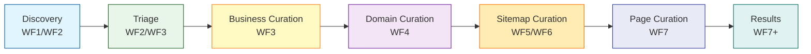
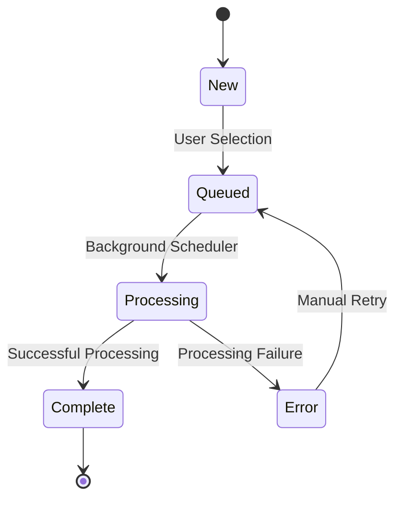
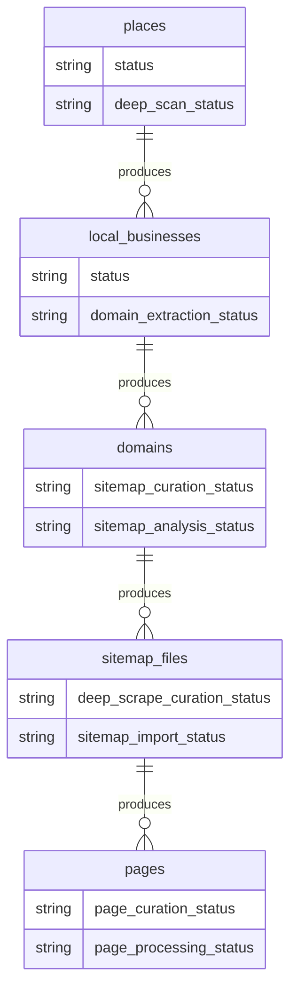
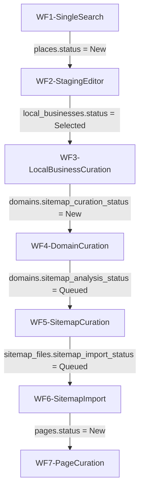
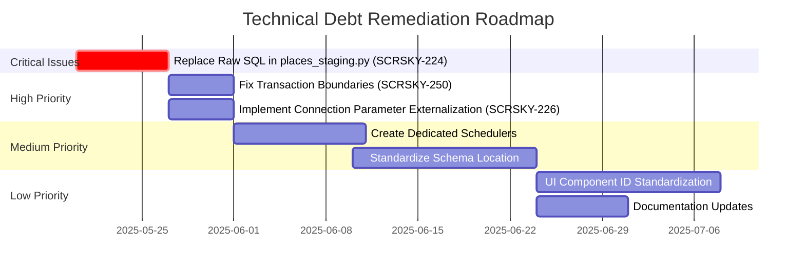

# ScraperSky Files by Layer and Workflow

**Date:** 2025-05-19
**Version:** 4.0
**Author:** Cascade AI

## Introduction: The 7-Layer Architecture & Progressive Workflow Pipeline

ScraperSky follows a strict 7-layer architectural pattern implemented across a progressive data enrichment pipeline. The system discovers, processes, and enriches web data through a series of specialized workflow stages, each adding additional value to the underlying data.

### The 7-Layer Architecture

Each layer has specific responsibilities:

1. **Layer 1: Models & ENUMs** - Database models and status enums (SQLAlchemy ORM)
2. **Layer 2: Schemas** - API request/response schemas (Pydantic models)
3. **Layer 3: Routers** - API endpoints (FastAPI routers)
4. **Layer 4: Services** - Business logic and background processing
5. **Layer 5: Configuration** - Application settings and environment configuration
6. **Layer 6: UI Components** - Frontend components and user interfaces
7. **Layer 7: Testing** - Unit, integration, and workflow tests

### Progressive Data Enrichment Pipeline

The core workflows form a progressive data enrichment pipeline:

1. **Discovery (WF1/WF2)**: Initial data collection through Google Maps API integration
2. **Triage (WF2/WF3)**: Initial filtering and classification of discovered data
3. **Business Curation (WF3)**: Enrichment of business entities with additional metadata
4. **Domain Curation (WF4)**: Domain identification, validation, and website discovery
5. **Sitemap Curation (WF5/WF6)**: Discovery, processing, and analysis of website sitemaps
6. **Page Curation (WF7)**: Page-level content analysis and processing
7. **Results**: Final processing and presentation of enriched data

## Producer-Consumer Pattern & Status Transitions

All workflows follow the **Producer-Consumer pattern**, where:
- A user action triggers a status update via an API endpoint (Producer)
- A background scheduler polls for records with specific status values (Consumer)
- Standardized status transitions track progress

### Standard Status Transitions

## File Mapping Matrix

The following matrix shows the complete mapping of files by layer and workflow. Files are annotated with their status as follows:

**Legend:**
✓ - Follows current naming conventions perfectly
⚠️ - Technical debt/deviation from conventions
[NOVEL] - File is specific to this workflow
[SHARED] - File is shared across multiple workflows

| Layer | WF1-SingleSearch | WF2-StagingEditor | WF3-LocalBusinessCuration | WF4-DomainCuration | WF5-SitemapCuration | WF6-SitemapImport | WF7-PageCuration |
|-------|------------------|-------------------|---------------------------|-------------------|---------------------|-------------------|------------------|
| **Layer 1: Models & ENUMs** | `src/models/place_search.py` [FILE:0101] [SHARED] `src/models/place.py` [FILE:0100] [SHARED] Enum: `PlaceSearchStatusEnum` Enum: `PlaceStatusEnum` | `src/models/place.py` [FILE:0100] [SHARED] Enum: `PlaceStatusEnum` Enum: `DeepScanStatusEnum` | `src/models/local_business.py` [FILE:0102] [SHARED] Enum: `PlaceStatusEnum` (reused) Enum: `DomainExtractionStatusEnum` | `src/models/domain.py` [FILE:0103] [SHARED] Enum: `SitemapCurationStatusEnum` Enum: `SitemapAnalysisStatusEnum` | `src/models/sitemap.py` [FILE:0104] [SHARED] Enum: `SitemapImportCurationStatusEnum` Enum: `SitemapImportProcessStatusEnum` | `src/models/sitemap.py` [FILE:0104] [SHARED] `src/models/page.py` [FILE:0105] [SHARED] Enum: `SitemapImportProcessStatusEnum` Enum: `PageStatusEnum` | `src/models/page.py` [FILE:0105] [SHARED] Enum: `PageCurationStatus` ✓ Enum: `PageProcessingStatus` ✓ |
| **Layer 2: Schemas** | `src/models/api_models.py::PlacesSearchRequest` [SHARED] ⚠️ | `src/models/api_models.py::PlaceBatchStatusUpdateRequest` [SHARED] `src/models/api_models.py::PlaceStagingStatusEnum` [SHARED] | `src/models/api_models.py::LocalBusinessBatchStatusUpdateRequest` [SHARED] ⚠️ | `src/models/api_models.py::DomainBatchCurationStatusUpdateRequest` [SHARED] `src/models/api_models.py::SitemapCurationStatusApiEnum` [SHARED] | `src/models/sitemap_file.py::SitemapFileBatchUpdate` [SHARED] ⚠️ | N/A (Triggered by WF5 DB state) | `src/schemas/page_curation.py::PageCurationUpdateRequest` [SHARED] ✓ `src/schemas/page_curation.py::PageCurationUpdateResponse` [SHARED] ✓ |
| **Layer 3: Routers** | `src/routers/google_maps_api.py` [FILE:2001] [NOVEL] | `src/routers/places_staging.py` [FILE:2002] [NOVEL] | `src/routers/local_businesses.py` [FILE:2003] [NOVEL] | `src/routers/domains.py` [FILE:2004] [NOVEL] | `src/routers/sitemap_files.py` [FILE:2005] [NOVEL] | `src/routers/dev_tools.py` [FILE:2014] [SHARED] | `src/routers/page_curation.py` [FILE:2011] [NOVEL] ✓ |
| **Layer 4: Services** | `src/services/places/places_search_service.py` [FILE:3011] [NOVEL] `src/services/places/places_service.py` [FILE:3012] [NOVEL] `src/services/places/places_storage_service.py` [FILE:3013] [NOVEL] | `src/services/sitemap_scheduler.py` [SHARED] ⚠️ `src/services/places/places_deep_service.py` [FILE:3014] [SHARED] | `src/services/sitemap_scheduler.py` [SHARED] ⚠️ `src/services/business_to_domain_service.py` [FILE:3001] [SHARED] | `src/services/domain_sitemap_submission_scheduler.py` [FILE:3003] [NOVEL] `src/services/domain_to_sitemap_adapter_service.py` [FILE:3002] [NOVEL] | `src/services/sitemap_files_service.py` [FILE:3006] [NOVEL] | `src/services/sitemap_import_scheduler.py` [FILE:3005] [SHARED] `src/services/sitemap_import_service.py` [FILE:3004] [SHARED] | `src/services/page_curation_service.py` [FILE:3007] [NOVEL] ✓ `src/services/page_curation_scheduler.py` [NOVEL] ✓ |
| **Layer 5: Configuration** | `.env`/`docker-compose.yml`: `GOOGLE_MAPS_API_KEY` | `.env`/`docker-compose.yml`: `SITEMAP_SCHEDULER_INTERVAL_MINUTES` `SITEMAP_SCHEDULER_BATCH_SIZE` `SITEMAP_SCHEDULER_MAX_INSTANCES` | `.env`/`docker-compose.yml` (Reuses scheduler config from WF2) ⚠️ | `.env`/`docker-compose.yml`: `DOMAIN_SITEMAP_SCHEDULER_INTERVAL_MINUTES` `DOMAIN_SITEMAP_SCHEDULER_BATCH_SIZE` `DOMAIN_SITEMAP_SCHEDULER_MAX_INSTANCES` ✓ | `.env`/`docker-compose.yml` (Reuses scheduler config from WF2) ⚠️ | `.env`/`docker-compose.yml`: `SITEMAP_IMPORT_SCHEDULER_INTERVAL_MINUTES` `SITEMAP_IMPORT_SCHEDULER_BATCH_SIZE` `SITEMAP_IMPORT_SCHEDULER_MAX_INSTANCES` ✓ | `.env`/`docker-compose.yml`: `PAGE_CURATION_SCHEDULER_INTERVAL_MINUTES` `PAGE_CURATION_SCHEDULER_BATCH_SIZE` ✓ |
| **Layer 6: UI Components** | `static/js/single-search-tab.js` [NOVEL] HTML Tab ID: `singleSearch` | `static/js/staging-editor-tab.js` [NOVEL] HTML Tab ID: `stagingEditor` | `static/js/local-business-curation-tab.js` [NOVEL] HTML Tab ID: `localBusinessCuration` | `static/js/domain-curation-tab.js` [NOVEL] HTML Tab ID: `domainCurationPanel` ✓ | `static/js/sitemap-curation-tab.js` [NOVEL] HTML Tab ID: `sitemapCurationPanel` ✓ | N/A (Background Process) | `static/js/page-curation-tab.js` [NOVEL] HTML Tab ID: `pageCurationPanel` ✓ |
| **Layer 7: Testing** | `tests/routers/test_google_maps_api.py` [NOVEL] `tests/services/places/test_places_search_service.py` [NOVEL] `tests/services/places/test_places_service.py` [NOVEL] `tests/services/places/test_places_storage_service.py` [NOVEL] | `tests/routers/test_places_staging.py` [NOVEL] `tests/services/places/test_places_deep_service.py` [NOVEL] `tests/services/test_sitemap_scheduler.py` [SHARED] | `tests/routers/test_local_businesses.py` [NOVEL] `tests/services/test_sitemap_scheduler.py` [SHARED] | `tests/routers/test_domains.py` [NOVEL] `tests/services/test_domain_sitemap_submission_scheduler.py` [NOVEL] | `tests/routers/test_sitemap_files.py` [NOVEL] `tests/services/test_sitemap_files_service.py` [NOVEL] `tests/services/test_sitemap_scheduler.py` [SHARED] | `tests/services/test_sitemap_import_service.py` [NOVEL] `tests/services/test_sitemap_import_scheduler.py` [NOVEL] | `tests/routers/test_page_curation.py` [NOVEL] `tests/services/test_page_curation_service.py` [NOVEL] `tests/services/test_page_curation_scheduler.py` [NOVEL] |

## Database Tables by Workflow

Each workflow operates on specific database tables with clear producer-consumer relationships.

### Core Tables and Relationships

| Workflow | Primary Input Table | Primary Output Table | Notes |
|----------|---------------------|----------------------|-------|
| WF1-SingleSearch | N/A (External API) | `places` | Records created with status="New" |
| WF2-StagingEditor | `places` | `places` and `local_businesses` | Status updated to "Selected", deep_scan_status set to "Queued" |
| WF3-LocalBusinessCuration | `local_businesses` | `local_businesses` and `domains` | Status updated to "Selected", domain_extraction_status set to "Queued" |
| WF4-DomainCuration | `domains` | `domains` | sitemap_curation_status updated to "Selected", sitemap_analysis_status set to "Queued" |
| WF5-SitemapCuration | `sitemap_files` | `sitemap_files` | deep_scrape_curation_status updated to "Selected", sitemap_import_status set to "Queued" |
| WF6-SitemapImport | `sitemap_files` | `pages` | Creates Page records from sitemap URLs |
| WF7-PageCuration | `pages` | `pages` | page_curation_status updated to desired value |

## Standardized Status Fields by Workflow

According to the `CONVENTIONS_AND_PATTERNS_GUIDE.md`, each workflow should have consistent status field naming following the `{workflow_name}_{type}_status` pattern:

| Workflow | Correct Curation Status Field | Correct Processing Status Field | Current Implementation | Compliance |
|----------|------------------------------|--------------------------------|------------------------|------------|
| WF1-SingleSearch | `business_search_curation_status` | `business_search_processing_status` | Uses direct API calls | ⚠️ Non-compliant |
| WF2-StagingEditor | `staging_curation_status` | `staging_processing_status` | `status`, `deep_scan_status` | ⚠️ Non-compliant |
| WF3-LocalBusinessCuration | `local_business_curation_status` | `local_business_processing_status` | `status`, `domain_extraction_status` | ⚠️ Non-compliant |
| WF4-DomainCuration | `domain_curation_status` | `domain_processing_status` | `sitemap_curation_status`, `sitemap_analysis_status` | ⚠️ Non-compliant |
| WF5-SitemapCuration | `sitemap_curation_status` | `sitemap_processing_status` | `deep_scrape_curation_status`, `sitemap_import_status` | ⚠️ Non-compliant |
| WF6-SitemapImport | `sitemap_import_curation_status` | `sitemap_import_processing_status` | `sitemap_import_status` | ⚠️ Partially compliant |
| WF7-PageCuration | `page_curation_status` | `page_processing_status` | `page_curation_status`, `page_processing_status` | ✓ Compliant |

## Producer-Consumer Workflow Connections

The following diagram and table illustrate how workflows connect via the producer-consumer pattern:

| Producer Workflow | Consumer Workflow | Interface Table | Handoff Field | Handoff Value | Compliant with Pattern |
|-------------------|-------------------|-----------------|---------------|---------------|------------------------|
| WF1-SingleSearch | WF2-StagingEditor | `places` | `status` | `PlaceStatusEnum.New` | ✓ |
| WF2-StagingEditor | WF3-LocalBusinessCuration | `local_businesses` | `status` | `PlaceStatusEnum.Selected` | ✓ |
| WF3-LocalBusinessCuration | WF4-DomainCuration | `domains` | `sitemap_curation_status` | `SitemapCurationStatusEnum.New` | ✓ |
| WF4-DomainCuration | WF5-SitemapCuration | `domains` | `sitemap_analysis_status` | `SitemapAnalysisStatusEnum.Queued` | ✓ |
| WF5-SitemapCuration | WF6-SitemapImport | `sitemap_files` | `sitemap_import_status` | `SitemapImportProcessStatusEnum.Queued` | ✓ |
| WF6-SitemapImport | WF7-PageCuration | `pages` | `status` | `PageStatusEnum.New` | ✓ |

## Technical Issues by Workflow

Each workflow has specific technical issues that have been identified and assigned to Jira tickets:

| Workflow | Technical Issues | Jira Tickets | Severity | Resolution Plan |
|----------|------------------|--------------|----------|-----------------|
| WF1-SingleSearch | ~~Raw SQL query~~ (REMEDIATED 2025-08-01), hardcoded connection parameters, missing transaction boundary | ~~SCRSKY-225~~ (REMEDIATED), SCRSKY-226, SCRSKY-250, SCRSKY-251 | ~~HIGH~~ (RESOLVED), MEDIUM, MEDIUM, MEDIUM | ~~Replace raw SQL with SQLAlchemy ORM~~ (COMPLETED), move connection parameters to settings, add explicit transaction boundaries, enhance error handling |
| WF2-StagingEditor | Raw SQL in places_staging.py, misleading API parameter, incomplete JobService integration | SCRSKY-224, SCRSKY-225, SCRSKY-226 | CRITICAL, MEDIUM, LOW | Replace raw SQL with SQLAlchemy ORM, clarify or remove misleading API parameters, complete JobService integration |
| WF3-LocalBusinessCuration | No eligibility check before queueing domain extraction, naming confusion in scheduler | SCRSKY-230, SCRSKY-231 | MEDIUM, LOW | Add eligibility check based on website_url field, create dedicated scheduler file for local business workflow |
| WF4-DomainCuration | Direct API call to internal endpoint, hardcoded internal API URL | SCRSKY-232, SCRSKY-233 | LOW, LOW | Replace direct API call with service-to-service communication, move URL to configuration settings |
| WF5-SitemapCuration | Documentation gap between WF5 and WF6, status field naming inconsistency | SCRSKY-236, SCRSKY-237 | MEDIUM, LOW | Add explicit documentation about workflow connections, standardize field naming in future DB migration |
| WF6-SitemapImport | No retry mechanism for transient failures, limited URL validation, transaction boundaries in wrong layer | SCRSKY-236, SCRSKY-237, SCRSKY-235 | MEDIUM, LOW, MEDIUM | Implement retry mechanism with exponential backoff, enhance URL validation, move transaction boundaries to router |
| WF7-PageCuration | Most compliant; serves as reference for other workflows | N/A | N/A | Use as reference model for standardizing other workflows |

## Architectural Compliance Summary

The following table summarizes compliance with key architectural principles:

| Architectural Principle | Description | Overall Compliance | Remediation Plan |
|------------------------|-------------|-------------------|------------------|
| **Layer 1: ORM Usage** | All database access must use SQLAlchemy ORM | Mostly compliant, with exceptions in WF2 (raw SQL in places_staging.py) | SCRSKY-224: Replace raw SQL with SQLAlchemy ORM |
| **Layer 3: Transaction Boundaries** | Routers own transaction boundaries | Generally compliant, with some issues in dev_tools.py (WF6) | SCRSKY-235: Refactor dev_tools.py to follow transaction boundary pattern |
| **Layer 4: Background Services** | Each workflow should have a dedicated scheduler | Partially compliant - WF2 and WF3 share sitemap_scheduler.py | SCRSKY-231: Create dedicated schedulers for each workflow |
| **Layer 5: Configuration** | Settings should follow workflow-specific naming | Partially compliant - newer workflows follow conventions | Standardize configuration naming in future updates |
| **Layer 6: UI Component IDs** | UI components should follow standard ID patterns | Mixed compliance - newer UIs follow conventions | Standardize older UI components during UI refresh |
| **Status Field Naming** | Status fields should follow `{workflow_name}_{type}_status` pattern | Only newest workflow (WF7) fully compliant | Consider database migration to standardize field names |

## Technical Debt Analysis

The following key areas of technical debt have been identified:

1. **Layer 2: Schemas Location:**
   - **Issue:** Schemas should be in `src/schemas/{workflow_name}.py` but are mostly in `src/models/api_models.py` [FILE:0107]
   - **Impact:** Makes code harder to navigate and maintain
   - **Resolution Plan:** Gradual migration of schemas to dedicated files

2. **Shared Scheduler:**
   - **Issue:** WF2 and WF3 both use `sitemap_scheduler.py` when each should have dedicated schedulers
   - **Impact:** Makes error isolation difficult, complicates maintenance
   - **Resolution Plan:** Create dedicated scheduler files for each workflow

3. **Non-standard Status Fields:**
   - **Issue:** Most workflows don't follow the current naming conventions for status fields
   - **Impact:** Inconsistent code patterns, harder to understand
   - **Resolution Plan:** Database migration to standardize field names

4. **Raw SQL Usage:**
   - **Issue:** Found in places_staging.py, violating the ORM requirement
   - **Impact:** Potential for SQL injection, harder to maintain
   - **Resolution Plan:** Replace with SQLAlchemy ORM (SCRSKY-224)

5. **Schema Naming:**
   - **Issue:** Batch update request schemas don't follow current naming conventions
   - **Impact:** Inconsistent API interfaces
   - **Resolution Plan:** Standardize schema naming in future updates

## Path to Standardization

Based on the `CONVENTIONS_AND_PATTERNS_GUIDE.md`, future development and refactoring should prioritize:

1. **Move schemas** to dedicated `src/schemas/{workflow_name}.py` files
2. **Rename status fields** to follow `{workflow_name}_{type}_status` pattern
3. **Create dedicated schedulers** for each workflow
4. **Update environment variable names** to follow workflow-specific naming
5. **Refactor raw SQL** to use SQLAlchemy ORM
6. **Update UI component IDs** to follow standard patterns

WF7-PageCuration appears to be the most compliant workflow and should serve as a reference model for future development and refactoring efforts.

## Implementation Roadmap

The following implementation roadmap is recommended to address the identified issues:

## Audit Checklist by Layer

### Layer 1: Models & ENUMs
- [ ] Verify all models use SQLAlchemy ORM exclusively
- [ ] Confirm naming conventions: `src/models/{source_table_name}.py` (singular, snake_case)
- [ ] Validate class naming: `{SourceTableTitleCase}`
- [ ] Check status ENUMs follow naming pattern: `{WorkflowNameTitleCase}CurationStatus`
- [ ] Ensure no tenant ID references in models (per architectural guardrails)

### Layer 2: Schemas
- [ ] Verify schema files follow `src/schemas/{workflow_name}.py` pattern
- [ ] Confirm schema classes follow `{WorkflowNameTitleCase}{Action}Request/Response`
- [ ] Check if batch update schemas correctly use the workflow name prefix
- [ ] Ensure consistent validation patterns
- [ ] Verify proper inheritance from base schemas where appropriate

### Layer 3: Routers
- [ ] Verify all endpoints follow REST conventions
- [ ] Confirm transaction boundaries are properly managed
- [ ] Check for raw SQL usage (should be none)
- [ ] Validate error handling and response standardization
- [ ] Ensure proper authentication/authorization checks

### Layer 4: Services
- [ ] Verify each workflow has dedicated service components
- [ ] Confirm background schedulers follow naming conventions
- [ ] Check for proper separation of concerns
- [ ] Validate error handling and logging
- [ ] Ensure no direct database access (should use ORM via models)

### Layer 5: Configuration
- [ ] Verify environment variables follow naming conventions
- [ ] Confirm settings are properly loaded and used
- [ ] Check for hardcoded values that should be configuration
- [ ] Validate scheduler settings are properly defined
- [ ] Ensure secure handling of sensitive configuration

### Layer 6: UI Components
- [ ] Verify JS files follow `{workflow-name-kebab-case}-tab.js` pattern
- [ ] Confirm tab panel IDs follow `{workflowNameCamelCase}Panel` pattern
- [ ] Check table IDs follow `{workflowNameCamelCase}Table` pattern
- [ ] Validate filter and action control IDs follow conventions
- [ ] Ensure proper DOM event handlers and API interaction

### Layer 7: Testing
- [ ] Verify each workflow has appropriate test coverage
- [ ] Confirm router tests validate API contracts
- [ ] Check service tests verify business logic
- [ ] Validate scheduler tests verify background processing
- [ ] Ensure end-to-end workflow tests exist

## Reference Documents

For more detailed information, refer to:

1. **[CONVENTIONS_AND_PATTERNS_GUIDE.md](../../Docs_6_Architecture_and_Status/CONVENTIONS_AND_PATTERNS_GUIDE.md)** - The high-level guide and index for all naming and structural standards.
2. **[1.0-ARCH-TRUTH-Definitive_Reference.md](../Docs_6_Architecture_and_Status/1.0-ARCH-TRUTH-Definitive_Reference.md)** - Definitive architectural reference
3. **[v_5_REFERENCE_IMPLEMENTATION_WF2.yaml](../Docs_7_Workflow_Canon/workflows/v_5_REFERENCE_IMPLEMENTATION_WF2.yaml)** - Example canonical workflow definition
4. **[README Workflow Cannon.md](../Docs_7_Workflow_Canon/README%20Workflow%20Cannon.md)** - Overview of workflow documentation
5. **[00-30000-FT-PROJECT-OVERVIEW.md](../Docs_6_Architecture_and_Status/00-30000-FT-PROJECT-OVERVIEW.md)** - High-level project overview

---

*This document serves as the comprehensive reference for ScraperSky files, components, and workflows. It provides a layer-by-layer and workflow-by-workflow mapping of all system components and identifies areas for standardization and improvement.*
