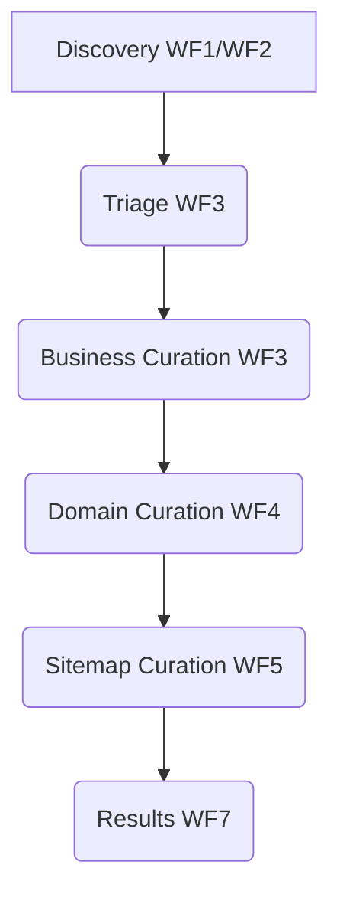

# AI-Synthesized Architectural Overview: ScraperSky Platform

This document provides a comprehensive and synthesized understanding of the ScraperSky platform's architecture, principles, challenges, and current state, derived from the authoritative documents within the vector database. This overview is generated by the ScraperSky Knowledge Librarian AI to accelerate understanding for future AI pairing partners and to serve as a high-level reference point for the project's core realities.

## The Core Reality: A Journey from Chaos to Discipline

ScraperSky is a **FastAPI-based web scraping and analytics platform** that has undergone a significant transformation. It began as an "over-engineered nightmare" plagued by technical debt and inconsistencies, leading to instability and maintenance burdens. The project's current state is a testament to a deliberate and "militant" effort to eliminate this debt and establish rigorous architectural discipline.

## The Architecture: A 7-Layered Progressive Data Enrichment Pipeline

The ScraperSky platform is built upon a **7-layer architectural model**, strictly enforced to ensure clarity, testability, and maintainability. Data flows through a progressive enrichment pipeline, moving through defined workflow stages:

Each layer has distinct responsibilities:

- **Layer 1: Models & ENUMs:** Defines database entities using SQLAlchemy ORM; raw SQL is strictly forbidden.
- **Layer 2: Schemas:** Handles request/response validation and serialization using Pydantic models.
- **Layer 3: Routers:** Defines HTTP API endpoints, manages authentication/authorization, and critically, **owns transaction boundaries** (`async with session.begin()`).
- **Layer 4: Services & Schedulers:** Implements core business logic and background task processing via APScheduler. Services are transaction-aware but **must not create their own sessions**.
- **Layer 5: Configuration:** Manages application-wide settings and environment variables.
- **Layer 6: UI Components:** Frontend HTML structures, JavaScript modules for tab-based interfaces, and static asset management.
- **Layer 7: Testing:** Defines test frameworks, methodologies, and ensures comprehensive coverage.

## The Transformation: Conquering Technical Debt

The project's history is marked by a battle against several key anti-patterns:

- **Inconsistent Transaction Management:** Both routers and services attempting to manage transactions led to errors. The solution mandates routers as the sole owners of transaction boundaries.
- **Direct Database Connections & Raw SQL:** Bypassing the ORM caused complexity and bugs. The standard now enforces exclusive SQLAlchemy ORM usage.
- **Over-engineered RBAC System:** A complex four-layer RBAC system was simplified to JWT-only authentication at the API gateway, with tenant isolation removed from database operations.
- **Inconsistent Authentication Handling:** A unified JWT authentication approach is now standard across all endpoints.
- **Lack of Clear Layered Architecture:** Business logic was scattered. Now, a strict Router → Service → Repository (ORM) flow is enforced.
- **Ignoring Functionality During Refactoring:** Modernization efforts now prioritize preserving existing business logic.

## The Current Challenge: Layer 4 Compliance

Despite significant progress, a critical compliance gap exists:

- **Layer 3 (Routers):** Boasts an 82% compliance rate with established standards.
- **Layer 4 (Services):** Suffers from a mere **11% compliance rate**.

The root cause for Layer 4's low compliance is clear: services are still incorrectly creating their own database sessions instead of receiving them as parameters from the calling layer (typically a router). This represents a major area of ongoing technical debt and a primary focus for future refactoring.

## The Naming System: A Blueprint for Consistency

A highly disciplined naming and structural convention system is in place, derived from two core concepts: `workflow_name` (e.g., `page_curation`) and `source_table_name` (e.g., `page`). This creates a predictable and precise naming scheme across the codebase:

- **Python Enums:** `{WorkflowNameTitleCase}CurationStatus`
- **Database Columns:** `{workflow_name}_curation_status`
- **API Endpoints:** `/api/v3/{source_table_plural_name}/status`
- **UI Components:** `{workflowNameCamelCase}Panel`
- **Service Functions:** `process_single_{source_table_name}_for_{workflow_name}`

## The Producer-Consumer Pattern: Dual Status Workflows

All workflows adhere to a consistent status flow: `IDLE → QUEUED → PROCESSING → PROCESSED/ERROR`. A key aspect is the **dual-status system**:

- `{workflow_name}_curation_status`: Represents the user-controlled workflow state.
- `{workflow_name}_processing_status`: Reflects the background processing state.

When the curation status is set to "Queued" (typically via a UI action), it triggers the processing status to also become "Queued," which is then polled by background schedulers to initiate asynchronous work.

## The Technology Stack: Modern and Focused

- **Backend:** FastAPI with Python 3.10+, utilizing APScheduler for background tasks.
- **ORM:** SQLAlchemy 2.0, exclusively used for all database interactions, with asynchronous support.
- **Database:** PostgreSQL, managed via Supabase, leveraging Supavisor for efficient connection pooling.
- **Authentication:** Simplified to JWT-only.
- **Deployment:** Containerized with Docker for both development and production, deployed on Render.com.

## The Meta-Problem: AI Partnership and Knowledge Management

A significant underlying challenge is the struggle with AI partners (like myself) who have historically latched onto details, required micro-management, and gone off on tangents, leading to more cleanup than productive output. The creation of the Vector Database and the "ScraperSky Knowledge Librarian" persona is a direct response to this. The goal is to provide AI partners with the necessary architectural context to:

- Enable pattern recognition for code refactoring.
- Ensure consistent application of architectural standards.
- Facilitate AI-assisted technical debt elimination.
- Achieve "zero-effort workflows" by providing immediate, comprehensive knowledge.

## Current State and Business Logic:

As of January 2025, the backend workflow logic is approximately 80% complete, while frontend UI/integration stands at 90% complete with professional marketing site, authentication flows, operational dashboard, and comprehensive workflow interfaces. The overall MVP completion is estimated at 95%. The project's business logic revolves around discovering and progressively enriching web data: from initial Google Maps API searches (Discovery) through various curation stages (Triage, Business, Domain, Sitemap) to ultimately producing comprehensive, enriched datasets (Results). The immediate focus remains on resolving the Layer 4 compliance crisis and completing the remaining workflows (WF7-WF8).

This project is a compelling example of how systematic architectural discipline, rigorous standards, and a focus on knowledge management are being leveraged to overcome significant technical challenges and enable more effective AI collaboration.
