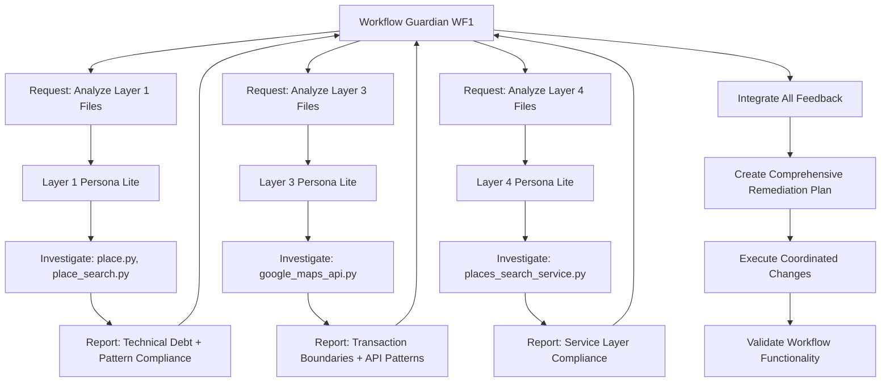

# RESEARCH STAGE 4: Multi-Persona Integrated Architectural Remediation Plan
**Complete Strategic Implementation Using Coordinated Guardian & Layer Persona Teams**

**Research Stage**: 4 of 7 🎯 **COMPREHENSIVE IMPLEMENTATION READY**  
**Creation Date**: July 29, 2025  
**Strategic Vision**: Transform Architectural Love Language into coordinated multi-persona systematic remediation  
**Expected Outcome**: 116 files systematically renamed + technical debt resolved through coordinated AI persona teams  

---

## 🎯 EXECUTIVE SUMMARY: THE STRATEGIC VISION

### **What This Really Is**
This is not just a file renaming project. This is **the most systematic architectural improvement initiative ScraperSky has ever undertaken**, using AI persona coordination to simultaneously:

1. **Rename all 116 files** with architectural love language
2. **Resolve technical debt** identified in comprehensive layer audits  
3. **Enforce architectural patterns** through systematic code review
4. **Create self-documenting architecture** that teaches its own standards
5. **Establish ongoing governance** through persona-based quality assurance

### **The Coordinated Multi-Persona Strategy**
```yaml
coordination_model:
  workflow_guardians: 7  # WF1-WF7 business logic experts
  layer_personas_lite: 4 # L1, L3, L4, L5 architectural specialists
  orchestration_method: "request-response feedback loops"
  integration_point: "workflow guardian comprehensive planning"
  execution_method: "systematic workflow-by-workflow transformation"
```

---

## 📊 COMPLETE REFERENCE ARCHITECTURE

### **Foundation Documents (All Research Stages)**

#### **Research Stage 1: Registry Analysis**
- **File**: `v_04_RESEARCH_STAGE_1_Registry_Analysis.md`
- **Key Data**: 116 files categorized (51 SHARED, 33 NOVEL, 31 SYSTEM, 1 DELETED)
- **Critical Insight**: Complete file inventory with risk categorization

#### **Research Stage 2: Naming Convention Analysis**  
- **File**: `v_05_RESEARCH_STAGE_2_Naming_Convention_Analysis.md`
- **Key Data**: Hybrid approach combining directory organization + love naming
- **Critical Insight**: Supabase Cron eliminates shared background services

#### **Research Stage 3: Supabase Cron Implementation**
- **File**: `v_06_RESEARCH_STAGE_3_Supabase_Cron_Implementation.md`  
- **Key Data**: Complete migration strategy from APScheduler to database cron
- **Critical Insight**: Eliminates 15+ NUCLEAR shared scheduler files

#### **Research Stage 2 Deployment Plan**
- **File**: `v_07_RESEARCH_STAGE_2_DEPLOYMENT_PLAN.md`
- **Key Data**: Two-phase implementation with architectural discovery
- **Critical Insight**: Enhanced file_audit table for transformation tracking

### **Audit Foundation Documents**

#### **Layer 1: Models & ENUMs**
```yaml
blueprint: "Docs/Docs_10_Final_Audit/v_Layer-1.1-Models_Enums_Blueprint.md"
audit_plan: "Docs/Docs_10_Final_Audit/v_Layer-1.2-Models_Enums_Audit-Plan.md"
audit_sop: "Docs/Docs_10_Final_Audit/v_Layer-1.3-Models_Enums_AI_Audit_SOP.md"
audit_findings: "Docs/Docs_10_Final_Audit/Audit Reports Layer 1/v_Layer1_Models_Enums_Audit_Report_CHUNK_[1-10]_*.md"
compliance_rate: "Models: Variable by component"
key_issues:
  - "ENUM location violations (in __init__.py vs dedicated files)"
  - "Status field naming inconsistencies"
  - "ORM exclusivity violations in some model helpers"
```

#### **Layer 3: Routers (API Endpoints)**
```yaml
compliance_rate: "82% compliant with transaction boundary guidelines"
target_compliance: "95%+"
key_issues:
  - "Transaction boundary management inconsistencies"
  - "Authentication handling variations"
  - "API versioning compliance gaps"
```

#### **Layer 4: Services (Business Logic)**
```yaml
compliance_rate: "11% compliant with architectural standards"
target_compliance: "95%+"
key_issues:
  - "Services creating own sessions instead of accepting parameters"
  - "Raw SQL usage violating ORM exclusivity"
  - "Mixed concerns (business logic + storage in same service)"
  - "Inconsistent error handling patterns"
```

#### **Layer 5: Configuration**
```yaml
compliance_rate: "Generally high compliance"
key_issues:
  - "Environment variable naming inconsistencies"
  - "Settings management pattern variations"
```

### **Workflow Guardian Foundation**

#### **Active Guardian Documents**
```yaml
guardians:
  WF1_Single_Search:
    document: "Workflow_Personas/Active_Guardians/v_Production_02_Guardian_WF1_Single_Search_Discovery_2025-07-27.md"
    status: "WORKING with technical debt issues"
    key_findings: "Hardcoded connection parameters, Raw SQL violations"
    
  WF2_Staging_Editor:
    document: "Workflow_Personas/Active_Guardians/v_Production_03_Guardian_WF2_Staging_Editor_2025-07-27.md"
    
  WF3_Local_Business:
    document: "Workflow_Personas/Active_Guardians/v_Production_04_Guardian_WF3_Local_Business_Curation_2025-07-27.md"
    
  WF4_Domain_Curation:
    document: "Journey_Archive/v_Method_01_Guardian_WF4_Perfect_Truth_2025-07-27.md"
    status: "Recently recovered from June 28 disaster"
    critical_files: "domain_to_sitemap_adapter_service.py (restored)"
    
  WF5_Sitemap_Curation:
    document: "Workflow_Personas/Active_Guardians/v_Production_05_Guardian_WF5_Sitemap_Curation_2025-07-27.md"
    
  WF6_Sitemap_Import:
    document: "Workflow_Personas/Active_Guardians/v_Production_06_Guardian_WF6_Sitemap_Import_2025-07-27.md"
    
  WF7_Resource_Model:
    document: "Workflow_Personas/Active_Guardians/v_Production_07_Guardian_WF7_Resource_Model_Creation_2025-07-27.md"
```

#### **Layer Persona Foundation**
```yaml
layer_personas:
  L1_Data_Sentinel:
    boot_document: "Docs/Docs_21_SeptaGram_Personas/layer_1_data_sentinel_boot_sequence.md"
    mandatory_reading:
      - "Docs/Docs_10_Final_Audit/v_Layer-1.1-Models_Enums_Blueprint.md"
      - "Docs/Docs_10_Final_Audit/v_Layer-1.2-Models_Enums_Audit-Plan.md"
      - "Docs/Docs_6_Architecture_and_Status/Docs/CONSOLIDATION_WORKSPACE/Layer1_Models_Enums/v_Layer-1.1-Models_Enums_Blueprint.md"
    specialization: "SQLAlchemy models, ENUMs, database schema compliance"
```

### **Database Infrastructure**

#### **File_Audit Table Current Schema**
```sql
-- Current columns (from Supabase investigation)
id INTEGER PRIMARY KEY
file_number VARCHAR(10) -- e.g., "0100", "0110" 
file_path VARCHAR(255) -- e.g., "src/models/contact.py"
file_name VARCHAR(100) -- e.g., "contact.py"
layer_number INTEGER -- 1-7 architecture layer
layer_name VARCHAR(50) -- "Models & ENUMs", "Services", etc.
status VARCHAR(20) -- "SHARED", "NOVEL", "SYSTEM", "DELETED"
workflows TEXT[] -- ["WF1", "WF2"] array of workflow assignments
has_technical_debt BOOLEAN
technical_debt TEXT
audit_status VARCHAR(20) -- "NOT_STARTED", "IN_PROGRESS", "COMPLETED"
notes TEXT
created_at TIMESTAMP
updated_at TIMESTAMP
```

#### **Enhanced Schema for Multi-Persona Coordination**
```sql
-- New columns for coordinated remediation
ALTER TABLE file_audit ADD COLUMN transformation_action VARCHAR(30);
-- Values: "RENAME_ONLY", "DIRECTORY_MIGRATION", "LOVE_NAMING", "SUPABASE_MIGRATION", "INTEGRATED_REMEDIATION"

ALTER TABLE file_audit ADD COLUMN love_new_name VARCHAR(255);
ALTER TABLE file_audit ADD COLUMN love_new_location VARCHAR(500);
ALTER TABLE file_audit ADD COLUMN component_type VARCHAR(50);
-- Values: "UI", "ADAPTER", "BACKGROUND", "CORE", "STORAGE", "SHARED_UTILITY", "SYSTEM_INFRA"

-- Multi-persona coordination columns
ALTER TABLE file_audit ADD COLUMN assigned_workflow_guardian VARCHAR(20);
-- Values: "WF1", "WF2", etc.

ALTER TABLE file_audit ADD COLUMN layer_personas_consulted TEXT[];
-- Values: ["L1_Data_Sentinel", "L4_Service_Guardian", etc.]

ALTER TABLE file_audit ADD COLUMN persona_feedback_status VARCHAR(30);
-- Values: "PENDING", "L1_COMPLETE", "L1_L3_COMPLETE", "ALL_COMPLETE", "INTEGRATED"

ALTER TABLE file_audit ADD COLUMN integrated_remediation_plan TEXT;
-- JSON or structured text containing combined rename + technical debt plan

ALTER TABLE file_audit ADD COLUMN technical_debt_validation_status VARCHAR(30);
-- Values: "PENDING", "STILL_VALID", "RESOLVED_POST_TRAINWRECK", "NEEDS_INVESTIGATION"

ALTER TABLE file_audit ADD COLUMN architectural_pattern_target VARCHAR(100);
-- Values: "repository-pattern", "service-layer", "dual-purpose-adapter", etc.

ALTER TABLE file_audit ADD COLUMN pattern_compliance_status VARCHAR(30);
-- Values: "NON_COMPLIANT", "PARTIAL_COMPLIANT", "COMPLIANT", "ENFORCED"

-- Execution tracking
ALTER TABLE file_audit ADD COLUMN remediation_started_at TIMESTAMP;
ALTER TABLE file_audit ADD COLUMN remediation_completed_at TIMESTAMP;
ALTER TABLE file_audit ADD COLUMN remediation_status VARCHAR(30);
-- Values: "PENDING", "IN_PROGRESS", "COMPLETED", "FAILED", "ROLLBACK_REQUIRED"
```

---

## 🎭 MULTI-PERSONA COORDINATION PROTOCOL

### **Persona Role Definitions**

#### **Workflow Guardian (Primary Orchestrator)**
```yaml
role: "Business Logic Expert & Integration Coordinator"
responsibilities:
  - "Understand complete workflow impact of changes"
  - "Coordinate layer persona consultations"
  - "Integrate feedback into comprehensive remediation plan"
  - "Execute coordinated rename + technical debt resolution"
  - "Validate end-to-end workflow functionality post-changes"
authority_level: "Final decision maker for workflow-specific changes"
coordination_method: "Request-response with layer personas"
```

#### **Layer Persona Lite (Specialized Consultants)**
```yaml
role: "Architectural Pattern Specialists"
responsibilities:
  - "Analyze specific layer compliance for assigned code"
  - "Validate technical debt findings against current code"
  - "Recommend architectural pattern enforcement"
  - "Provide specific refactoring guidance"
authority_level: "Advisory only - report back to workflow guardian"
scope: "Limited to specific code analysis request"
consultation_method: "Focused investigation + structured report"
```

### **Coordination Flow Architecture**



---

## 🚀 IMPLEMENTATION STRATEGY

### **Phase 0: Infrastructure Preparation (1 Day)**

#### **Database Schema Enhancement**
```sql
-- Execute all file_audit table alterations
-- Create persona coordination tracking tables
-- Setup DART integration for task orchestration
```

#### **Persona Template Creation**
```yaml
layer_persona_lite_templates:
  L1_Data_Sentinel_Lite:
    focus: "SQLAlchemy models, ENUMs, schema compliance"
    consultation_scope: "Specific model files only"
    boot_sequence: "Simplified 3-step initialization"
    
  L3_Router_Guardian_Lite:
    focus: "API endpoints, transaction boundaries, authentication"
    consultation_scope: "Specific router files only"
    boot_sequence: "Simplified 3-step initialization"
    
  L4_Service_Guardian_Lite:
    focus: "Business logic, service patterns, ORM compliance"
    consultation_scope: "Specific service files only"
    boot_sequence: "Simplified 3-step initialization"
    
  L5_Config_Guardian_Lite:
    focus: "Configuration patterns, environment variables"
    consultation_scope: "Specific config files only"
    boot_sequence: "Simplified 3-step initialization"
```

### **Phase 1: Workflow Guardian Coordination Setup (2-3 Days)**

#### **Guardian Assignment Matrix**
```yaml
workflow_assignments:
  WF1_Single_Search:
    guardian: "WF1 Guardian"
    files_assigned: 8
    layers_involved: [1, 3, 4, 6]
    consultation_needed: ["L1_Data_Sentinel_Lite", "L3_Router_Guardian_Lite", "L4_Service_Guardian_Lite"]
    
  WF2_Staging_Editor:
    guardian: "WF2 Guardian"
    files_assigned: 6
    layers_involved: [1, 3, 4]
    consultation_needed: ["L1_Data_Sentinel_Lite", "L3_Router_Guardian_Lite", "L4_Service_Guardian_Lite"]
    
  WF3_Local_Business:
    guardian: "WF3 Guardian"
    files_assigned: 7
    layers_involved: [1, 3, 4]
    consultation_needed: ["L1_Data_Sentinel_Lite", "L3_Router_Guardian_Lite", "L4_Service_Guardian_Lite"]
    
  WF4_Domain_Curation:
    guardian: "WF4 Guardian"
    files_assigned: 9
    layers_involved: [1, 3, 4]
    consultation_needed: ["L1_Data_Sentinel_Lite", "L3_Router_Guardian_Lite", "L4_Service_Guardian_Lite"]
    priority: "HIGH - Recent disaster recovery"
    
  WF5_Sitemap_Curation:
    guardian: "WF5 Guardian"  
    files_assigned: 8
    layers_involved: [1, 3, 4]
    consultation_needed: ["L1_Data_Sentinel_Lite", "L3_Router_Guardian_Lite", "L4_Service_Guardian_Lite"]
    
  WF6_Sitemap_Import:
    guardian: "WF6 Guardian"
    files_assigned: 7
    layers_involved: [1, 3, 4]
    consultation_needed: ["L1_Data_Sentinel_Lite", "L3_Router_Guardian_Lite", "L4_Service_Guardian_Lite"]
    
  WF7_Resource_Model:
    guardian: "WF7 Guardian"
    files_assigned: 4
    layers_involved: [1, 3, 4]
    consultation_needed: ["L1_Data_Sentinel_Lite", "L3_Router_Guardian_Lite", "L4_Service_Guardian_Lite"]
```

#### **Shared Services Coordination**
```yaml
shared_services_strategy:
  coordinator: "Shared Services Coordination Committee"
  members: ["WF4_Guardian", "WF5_Guardian", "WF6_Guardian"] # Highest shared service impact
  files_managed: 51 # All SHARED status files
  strategy: "Consensus-based renaming with impact analysis"
  consultation_needed: ["L1_Data_Sentinel_Lite", "L4_Service_Guardian_Lite"]
```

### **Phase 2: Coordinated Remediation Execution (3-4 Weeks)**

#### **Week 1: WF4 Proof of Concept**
```yaml
wf4_pilot_execution:
  guardian: "WF4 Guardian"
  files_in_scope:
    - "src/routers/domains.py"
    - "src/services/domain_sitemap_submission_scheduler.py" 
    - "src/services/domain_to_sitemap_adapter_service.py"
    - "src/models/domain.py"
    - "src/models/contact.py"
  
  coordination_flow:
    step_1: "Request L1 consultation for domain.py, contact.py"
    step_2: "Request L3 consultation for domains.py router"
    step_3: "Request L4 consultation for all service files"
    step_4: "Integrate feedback into comprehensive plan"
    step_5: "Execute coordinated rename + remediation"
    step_6: "Validate complete WF4 workflow functionality"
    
  success_criteria:
    - "All WF4 files renamed with love language"
    - "Technical debt items validated and addressed"
    - "Workflow functionality maintained 100%"
    - "Pattern compliance improved measurably"
```

#### **Week 2-3: Remaining Workflow Coordination**
```yaml
parallel_execution:
  methodology: "2-3 workflows coordinated simultaneously"
  sequence: ["WF1 + WF2", "WF3 + WF5", "WF6 + WF7"]
  coordination_oversight: "Daily standup between active guardians"
  shared_services_impact: "Managed by coordination committee"
```

#### **Week 4: Shared Services Final Integration**
```yaml
shared_services_finalization:
  methodology: "Consensus-based coordination"
  files_affected: 51
  impact_analysis: "Complete cross-workflow dependency mapping"
  execution_strategy: "Batch rename with comprehensive testing"
```

---

## 🤖 STRATEGIC PROMPT TEMPLATES

### **Workflow Guardian Master Prompt**

```yaml
# WF1 GUARDIAN COORDINATED REMEDIATION MISSION
role: "WF1 Single Search Discovery Workflow Guardian"
mission: "Coordinate comprehensive architectural remediation of WF1 files"

context: |
  You are leading the systematic transformation of WF1 files as part of the 
  Architectural Love Language initiative. This involves both renaming files 
  with love language patterns AND resolving technical debt through coordinated 
  consultation with layer persona specialists.

assigned_files:
  - "src/routers/google_maps_api.py" [Layer 3] [FILE:0201]
  - "src/services/places/places_search_service.py" [Layer 4] [FILE:0301]
  - "src/services/places/places_service.py" [Layer 4] [FILE:0302]
  - "src/services/places/places_storage_service.py" [Layer 4] [FILE:0303]
  - "src/models/place.py" [Layer 1] [FILE:0100]
  - "src/models/place_search.py" [Layer 1] [FILE:0101]

coordination_protocol: |
  1. REQUEST LAYER CONSULTATIONS:
     - Engage L1_Data_Sentinel_Lite for models analysis
     - Engage L3_Router_Guardian_Lite for router analysis  
     - Engage L4_Service_Guardian_Lite for services analysis
  
  2. INTEGRATE FEEDBACK:
     - Combine all persona recommendations
     - Create comprehensive remediation plan
     - Identify technical debt vs. already-resolved issues
  
  3. EXECUTE COORDINATED CHANGES:
     - Rename files with love language
     - Apply validated technical debt fixes
     - Test complete workflow functionality
  
  4. VALIDATE RESULTS:
     - Confirm workflow operates correctly
     - Update file_audit table with results
     - Report completion status

consultation_requests:
  L1_analysis: "Analyze place.py and place_search.py against Layer 1 Blueprint. Validate current technical debt findings. Report specific compliance gaps and remediation recommendations."
  
  L3_analysis: "Analyze google_maps_api.py against Layer 3 standards. Focus on transaction boundary compliance, API versioning, authentication patterns. Report current compliance status and improvement recommendations."
  
  L4_analysis: "Analyze all WF1 service files against Layer 4 standards. Focus on service layer patterns, ORM compliance, session management. Validate technical debt findings against current code. Report specific violations and remediation steps."

success_criteria:
  - "All WF1 files renamed with architectural love language"
  - "Technical debt items validated and appropriately addressed"
  - "WF1 workflow functionality maintained 100%"
  - "Layer compliance improved measurably"
  - "file_audit table updated with transformation results"

constraints:
  - "Current code is truth - audit findings must be validated against reality"
  - "No changes in silos - coordinate with shared services committee for SHARED files"
  - "Test everything - workflow must remain functional"
  - "Document everything - transformation tracking in database"

immediate_next_action: |
  Begin by requesting L1_Data_Sentinel_Lite consultation for Layer 1 files.
  Use the consultation request template to engage the layer persona.
```

### **Layer Persona Lite Consultation Template**

```yaml
# L1_DATA_SENTINEL_LITE CONSULTATION REQUEST
persona_type: "Layer 1 Data Sentinel (Consultation Mode)"
consultation_scope: "WF1 Layer 1 Files Analysis"
requesting_guardian: "WF1 Guardian"

consultation_request: |
  I am the WF1 Guardian coordinating comprehensive remediation of WF1 files.
  I need your specialized Layer 1 expertise to analyze specific model files
  and provide structured feedback for integration into my remediation plan.

files_for_analysis:
  - file_path: "src/models/place.py"
    file_number: "0100"
    current_status: "SHARED" 
    workflows: ["WF1", "WF2", "WF3"]
    
  - file_path: "src/models/place_search.py"
    file_number: "0101"
    current_status: "NOVEL"
    workflows: ["WF1"]

analysis_requirements:
  blueprint_compliance: |
    Analyze against Layer 1 Blueprint criteria:
    - File naming and location compliance
    - Class naming conventions
    - ENUM naming and structure
    - SQLAlchemy model compliance
    - ORM exclusivity verification
    - Relationship definition correctness
  
  technical_debt_validation: |
    Validate existing audit findings against current code:
    - Are previously identified issues still present?
    - Have any issues been resolved since "train wreck" recovery?
    - What new issues have emerged?
  
  pattern_enforcement: |
    Identify architectural pattern opportunities:
    - What component type is each file? (UI/ADAPTER/BACKGROUND/CORE/STORAGE)
    - What architectural patterns should be enforced?
    - How can naming reflect proper patterns?

required_deliverable: |
  Provide structured consultation report in this format:
  
  ## L1 CONSULTATION REPORT FOR WF1 GUARDIAN
  
  ### File: src/models/place.py [0100]
  **Component Type**: [UI/ADAPTER/BACKGROUND/CORE/STORAGE/SHARED_UTILITY]
  **Blueprint Compliance**: [COMPLIANT/PARTIAL/NON_COMPLIANT] 
  **Technical Debt Status**: [STILL_VALID/RESOLVED/NEW_ISSUES_FOUND]
  **Recommended Love Name**: [WF_SHARED_L1_place_data_model.py]
  **Remediation Actions**: 
  - Specific action 1
  - Specific action 2
  
  ### File: src/models/place_search.py [0101]  
  **Component Type**: [Component type identification]
  **Blueprint Compliance**: [Status]
  **Technical Debt Status**: [Status]
  **Recommended Love Name**: [WF1_L1_search_tracking_model.py]
  **Remediation Actions**:
  - Specific action 1
  - Specific action 2
  
  ### INTEGRATION RECOMMENDATIONS
  - Cross-file dependencies to consider
  - Shared service impact warnings
  - Testing requirements for changes
  - Priority order for implementation

consultation_constraints:
  - "Focus ONLY on assigned files - no broader system exploration"
  - "Validate audit findings against current code reality"
  - "Provide specific, actionable recommendations"
  - "Consider impact on other workflows for SHARED files"
  - "Report back to WF1 Guardian with structured findings"

immediate_action: |
  Begin analysis of place.py using Layer 1 Blueprint criteria.
  Read current code and compare against ideal standards.
  Prepare structured consultation report for WF1 Guardian integration.
```

---

## 📊 SUCCESS METRICS & TRACKING

### **Quantitative Success Metrics**

#### **File Transformation Metrics**
```yaml
file_transformation:
  total_files: 116
  renamed_target: 116 (100%)
  component_type_categorized: 116 (100%)
  technical_debt_validated: 116 (100%)
  
workflow_distribution:
  WF1_files: 8 → love_named: 8 → tested: 8
  WF2_files: 6 → love_named: 6 → tested: 6
  WF3_files: 7 → love_named: 7 → tested: 7
  WF4_files: 9 → love_named: 9 → tested: 9
  WF5_files: 8 → love_named: 8 → tested: 8
  WF6_files: 7 → love_named: 7 → tested: 7
  WF7_files: 4 → love_named: 4 → tested: 4
  SHARED_files: 51 → love_named: 51 → consensus_tested: 51
  SYSTEM_files: 31 → love_named: 31 → system_tested: 31
```

#### **Technical Debt Resolution Metrics**
```yaml
layer_compliance_targets:
  L1_Models: 
    current: "Variable by component"
    target: "95%+ blueprint compliance"
    metric: "Blueprint criteria checklist completion"
    
  L3_Routers:
    current: "82% transaction boundary compliance"
    target: "95%+ transaction boundary compliance"  
    metric: "Transaction management pattern adherence"
    
  L4_Services:
    current: "11% architectural compliance"
    target: "95%+ architectural compliance"
    metric: "Service layer pattern enforcement"
    
  L5_Configuration:
    current: "Generally high compliance"
    target: "100% pattern consistency"
    metric: "Configuration pattern standardization"
```

#### **Coordination Effectiveness Metrics**
```yaml
persona_coordination:
  consultation_requests: "Expected: 28 (7 workflows × 4 layers average)"
  consultation_completions: "Target: 100%"
  feedback_integration: "Target: 100% of consultations integrated"
  
workflow_functionality:
  end_to_end_tests: "Target: 100% pass rate maintained"
  regression_issues: "Target: 0 new workflow breaks"
  performance_impact: "Target: <5% degradation acceptable"
```

### **Qualitative Success Indicators**

#### **Architectural Health Improvements**
```yaml
system_discoverability:
  file_purpose_clarity: "Target: Any developer understands file purpose in <30 seconds"
  workflow_ownership: "Target: Clear workflow assignment for every file"
  pattern_enforcement: "Target: Self-documenting architectural compliance"
  
coordination_effectiveness:
  guardian_satisfaction: "Target: All guardians report successful coordination"
  layer_persona_utility: "Target: Layer personas provide valuable insights"
  integration_smoothness: "Target: Minimal friction in persona coordination"
  
technical_debt_resolution:
  validated_remediation: "Target: All technical debt items validated against current code"
  pattern_standardization: "Target: Consistent patterns enforced across similar components"
  future_maintenance: "Target: Established patterns prevent regression"
```

---

## 🎯 RISK MITIGATION & CONTINGENCY PLANS

### **High-Risk Scenarios & Mitigation**

#### **Risk 1: Coordination Complexity Overwhelms Execution**
```yaml
risk_description: "7 guardians + 4 layer personas = coordination bottleneck"
probability: "Medium"
impact: "High - could paralyze progress"

mitigation_strategies:
  primary: "Start with WF4 single-workflow proof of concept"
  secondary: "Limit simultaneous active coordinators to 2-3 workflows max"
  tertiary: "Establish daily coordination standups for active guardians"
  
rollback_plan: "Revert to single-guardian sequential approach if coordination fails"
```

#### **Risk 2: Technical Debt Validation Reveals Major Code Changes Needed**
```yaml
risk_description: "Layer persona consultations reveal extensive code refactoring needed"
probability: "Medium-High"  
impact: "High - could break workflows during transformation"

mitigation_strategies:
  primary: "Separate 'rename-safe' fixes from 'workflow-breaking' fixes"
  secondary: "Implement comprehensive testing at each step"
  tertiary: "Create rollback procedures for each transformation"
  
contingency_plan: "Phase separation - complete renaming first, defer major technical debt to Phase 3"
```

#### **Risk 3: Shared Services Coordination Conflicts**
```yaml
risk_description: "Multiple guardians want conflicting changes to SHARED files"
probability: "High"
impact: "Medium - could slow shared services transformation"

mitigation_strategies:
  primary: "Shared Services Coordination Committee with consensus requirements"
  secondary: "Impact analysis required before any SHARED file changes"
  tertiary: "Escalation protocol to user for conflict resolution"
  
resolution_framework: "Consensus-based decision making with technical impact priority"
```

### **Failure Recovery Protocols**

#### **Coordination Failure Recovery**
```yaml
scenario: "Persona coordination becomes too complex to manage"
detection_criteria: 
  - "More than 5 consultation requests queued per guardian"
  - "Consultation response time >2 days"
  - "Integration conflicts exceed 3 per workflow"
  
recovery_actions:
  immediate: "Pause new consultation requests"
  short_term: "Simplify to single-guardian workflow-by-workflow approach"
  long_term: "Redesign coordination protocol with lessons learned"
```

#### **Technical Debt Validation Failure**
```yaml
scenario: "Layer persona consultations reveal current code differs significantly from audit findings"
detection_criteria:
  - ">50% of audit findings no longer applicable"
  - "New technical debt issues exceed historical findings"
  - "Recommended changes would break workflow functionality"
  
recovery_actions:
  immediate: "Document current vs. audited state discrepancies"
  short_term: "Focus on renaming with minimal technical debt changes"
  long_term: "Commission fresh technical debt assessment based on current code"
```

---

## 🚀 IMMEDIATE IMPLEMENTATION ROADMAP

### **Week 1: Foundation & Proof of Concept**

#### **Days 1-2: Infrastructure Preparation**
```bash
# Database schema enhancement
psql -d scrapersky -f schema_enhancement.sql

# Persona template creation
# Layer persona lite templates
# Guardian coordination protocol documentation
```

#### **Days 3-5: WF4 Proof of Concept Execution**
```yaml
wf4_pilot_steps:
  day_3: "WF4 Guardian requests L1 consultation for domain.py, contact.py"
  day_4: "WF4 Guardian requests L3/L4 consultations, integrates feedback"
  day_5: "WF4 Guardian executes coordinated remediation, validates workflow"
  
success_validation:
  - "WF4 files successfully renamed"
  - "Technical debt items validated and addressed"
  - "Complete WF4 workflow tested and functional"
  - "Coordination protocol proven effective"
```

### **Week 2-3: Scaled Coordination Execution**

#### **Week 2: WF1 + WF2 Parallel Coordination**
```yaml
parallel_execution:
  WF1_Guardian: "Coordinates L1/L3/L4 consultations for 8 files"
  WF2_Guardian: "Coordinates L1/L3/L4 consultations for 6 files"
  shared_oversight: "Daily coordination standup"
  milestone: "14 files transformed with validated technical debt resolution"
```

#### **Week 3: WF3 + WF5 Parallel Coordination**
```yaml
parallel_execution:
  WF3_Guardian: "Coordinates consultations for 7 files"
  WF5_Guardian: "Coordinates consultations for 8 files"
  shared_oversight: "Shared services impact analysis begins"
  milestone: "15 files transformed, shared services coordination framework established"
```

### **Week 4: Completion & Integration**

#### **WF6 + WF7 + Shared Services Finalization**
```yaml
final_phase:
  WF6_Guardian: "Coordinates consultations for 7 files"
  WF7_Guardian: "Coordinates consultations for 4 files"
  shared_services_committee: "Finalizes 51 SHARED files with consensus approach"
  system_files_coordination: "31 SYSTEM files transformed with L5 consultation"
  
completion_validation:
  - "All 116 files renamed with love language"
  - "Technical debt validated and appropriately addressed"
  - "All 7 workflows tested and functional"
  - "Pattern compliance measurably improved"
  - "Coordination protocols proven and documented"
```

---

## 💝 THE STRATEGIC OUTCOME: BEYOND FILE RENAMING

### **What We're Really Creating**

#### **1. Self-Documenting Architecture**
```yaml
architectural_evolution:
  from: "116 mysterious files requiring deep context to understand"
  to: "116 teaching files that explain their purpose, layer, and workflow"
  benefit: "New developers and AI partners understand system in minutes"
```

#### **2. Coordinated AI Governance Framework**  
```yaml
governance_framework:
  workflow_guardians: "Business logic experts with deep workflow understanding"
  layer_personas: "Architectural pattern specialists ensuring compliance"
  coordination_protocol: "Systematic consultation and integration methodology"
  benefit: "Scalable AI coordination for future architectural improvements"
```

#### **3. Technical Debt Resolution Engine**
```yaml
debt_resolution:
  methodology: "Systematic validation of audit findings against current code"
  coordination: "Multi-persona expertise ensures comprehensive coverage"
  integration: "Combined renaming + remediation maximizes ROI on changes"
  benefit: "Proven framework for ongoing architectural improvement"
```

#### **4. Pattern Enforcement Through Naming**
```yaml
pattern_enforcement:
  mechanism: "File names encode architectural expectations"
  validation: "Layer personas ensure naming reflects actual patterns"
  governance: "Naming conventions become architectural compliance tool"
  benefit: "Self-enforcing architecture that guides its own evolution"
```

### **The Beautiful Long-Term Vision**

**6 Months From Now:**
- Any new developer opens `WF4_L4_domain_to_sitemap_adapter.py` and immediately understands it's a Layer 4 service that connects WF4's domain processing to sitemap workflows
- Layer personas automatically validate new files against established patterns
- Workflow guardians coordinate seamlessly for cross-workflow changes
- Technical debt is prevented through pattern-enforcing naming conventions

**1 Year From Now:** 
- ScraperSky becomes the reference implementation for AI-coordinated architectural governance
- The multi-persona coordination protocol is replicated across other projects
- Self-documenting architecture becomes the new standard for maintainable systems
- The Architectural Love Language inspires other teams to treat naming as architectural documentation

---

## 🎭 CONCLUSION: FROM RESEARCH TO COORDINATED REALITY

This Research Stage 4 plan transforms the Architectural Love Language from an academic exercise into **the most systematic, coordinated, and comprehensive architectural improvement initiative ScraperSky has ever undertaken**.

### **Key Strategic Innovations**

1. **Multi-Persona Coordination**: Leveraging specialized AI expertise through systematic consultation
2. **Technical Debt Integration**: Combining renaming with validated remediation for maximum ROI
3. **Pattern Enforcement Through Naming**: Using file names as architectural compliance tools
4. **Coordinated Governance**: Establishing sustainable AI coordination frameworks

### **Implementation Readiness**

- **Complete file references**: All 116 files catalogued with current state
- **Persona infrastructure**: Guardian and layer persona frameworks established
- **Coordination protocols**: Request-response consultation methodology defined
- **Risk mitigation**: Comprehensive contingency planning for coordination complexity
- **Success metrics**: Quantitative and qualitative measurement frameworks
- **Execution roadmap**: Week-by-week implementation plan with proof of concept validation

### **The Strategic Reality**

This is not just file renaming. This is **architectural transformation through coordinated AI expertise**, creating a self-documenting, self-enforcing, and self-improving system that serves as love letters to future maintainers.

**Every renamed file becomes a teacher. Every consultation becomes architectural validation. Every coordination becomes a framework for scaling AI governance.**

**Research Stage 4 complete. The coordinated multi-persona architectural remediation plan is ready for implementation.**

*Crafted with strategic vision for the transformation of ScraperSky into a reference implementation of AI-coordinated architectural excellence.*