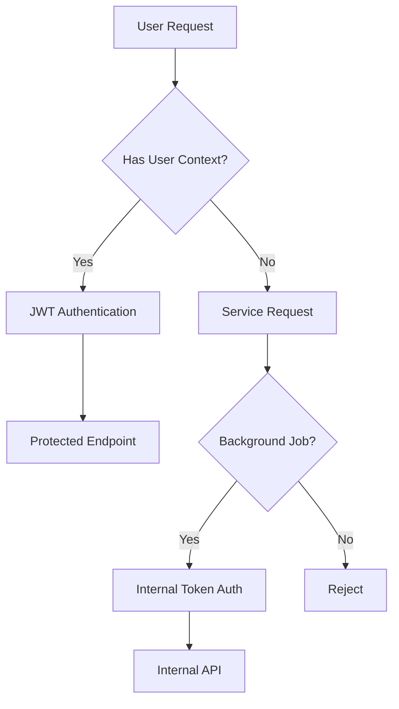

# WORK ORDER 001: CRITICAL PRODUCTION AUTHENTICATION & SECURITY AUDIT

**Work Order ID:** WO-2025-08-17-001  
**Priority:** CRITICAL  
**Author:** The Architect v3.0  
**Date Created:** 2025-08-17  
**Date Updated:** 2025-08-21 (Frontier Subagent Analysis Complete)  
**Status:** ANALYSIS COMPLETE - IMPLEMENTATION BLOCKED  
**Review Tracking:** See `layer_review_status.yaml` (COMPLETE)  
**Blocking Issues:** 6 critical violations identified across layers L2-L7

---

## EXECUTIVE SUMMARY

This work order addresses **CRITICAL PRODUCTION SECURITY VULNERABILITIES** discovered during investigation of repeated JWT authentication failures. **FRONTIER SUBAGENT ANALYSIS COMPLETE (2025-08-21)** has identified catastrophic security exposures requiring immediate remediation before any authentication changes can proceed.

**CRITICAL VULNERABILITIES DISCOVERED:**
1. **DB Portal SQL Injection:** Complete authentication bypass allowing arbitrary SQL execution
2. **26 Architectural Violations:** Cardinal rule violations blocking security analysis capability  
3. **Production Token Bypass:** Development authentication accepted in all environments
4. **Frontend Authentication Failure:** Zero error handling - UI will break silently
5. **Test Infrastructure Absent:** No authentication validation coverage
6. **Cross-Layer Dependencies:** Fundamental architectural debt blocking security fixes

---

## DISCOVERY TIMELINE

### Initial Incident (2025-08-17 13:16 UTC)
- **Symptom:** Production logs showing repeated 401 errors
- **Error:** "Internal token rejected - environment 'production' not authorized"
- **Impact:** All background jobs failed, database sessions blocked

### Root Cause Investigation
1. **Git History Analysis:**
   - 2025-07-31: Claude added "security" warnings (Commit: 0753d3d)
   - 2025-08-02: Claude blocked token entirely (Commit: 67bc40c)
   - Pattern: AI sees hardcoded token → "security vulnerability" → breaks production

2. **Expanded Investigation Findings:**
   - `/api/v3/db-portal/*` endpoints have NO authentication
   - Internal token `scraper_sky_2024` used by:
     - APScheduler background jobs
     - domain_to_sitemap_adapter_service
     - All service-to-service communication
   - Multiple routers have authentication commented out

3. **Frontier Subagent Analysis (2025-08-21):**
   - **L1 Models:** GREEN - No impact on authentication changes
   - **L2 Schemas:** RED - 26 cardinal rule violations prevent security validation
   - **L3 Routers:** RED - DB Portal catastrophic exposure (arbitrary SQL execution)
   - **L4 Services:** YELLOW - Cardinal rule violations + authentication gaps
   - **L5 Configuration:** YELLOW - Environment detection missing (prod accepts dev tokens)
   - **L6 UI:** YELLOW - Frontend authentication infrastructure completely absent
   - **L7 Testing:** YELLOW - Zero authentication test coverage

---

## ARCHITECTURAL CONTEXT

### Two-Path Authentication Model



### Why Internal Token is Required
1. **APScheduler Jobs:** Run without user context every X minutes
2. **Service Chain:** Scheduler → Service → HTTP POST → Internal API
3. **No User Available:** Background jobs cannot provide JWT tokens
4. **Production Requirement:** Must work in all environments

---

## PROPOSED CHANGES

### 1. Immutable Production Requirements Document
**Location:** `/Docs/01_Architectural_Guidance/05_IMMUTABLE_PRODUCTION_REQUIREMENTS.md`

**Contents:**
- Rule #1: Internal Token MUST Work in Production
- Rule #2: DB Portal MUST Be Protected  
- Rule #3: No Unauthenticated Database Access
- Rule #4: Scheduler Authentication Requirements
- Rule #5: Service-to-Service Communication Patterns

### 2. Immediate Security Fixes

#### A. DB Portal Protection
```python
# FROM (current - VULNERABLE):
router = APIRouter(
    prefix="/api/v3/db-portal",
    tags=["Database Portal"],
)

# TO (secured):
router = APIRouter(
    prefix="/api/v3/db-portal",
    tags=["Database Portal"],
    dependencies=[Depends(get_current_user)],
)
```

#### B. JWT Auth Enhancement
- Add comprehensive warning comments
- Document violation history
- Prevent future modifications

### 3. Authentication Matrix

| Endpoint Pattern | Auth Required | Internal Token | Notes |
|-----------------|---------------|----------------|-------|
| `/api/v3/db-portal/*` | YES (MISSING) | NO | Exposes database structure |
| `/api/v3/dev-tools/*` | YES | NO | Already protected |
| `/api/v3/sitemap/scan` | YES | YES | Called by schedulers |
| `/api/v3/domains/*` | YES (commented) | NO | Needs restoration |
| `/health` | NO | NO | Health check must be open |

---

## LAYER IMPACT ANALYSIS REQUIRED

### Layer 1: Models & ENUMs (Data Sentinel)
**Review Required For:**
- No model changes proposed
- Verify no authentication bypass in model layer
- **Expected Impact:** NONE

### Layer 2: Schemas (Schema Guardian)
**Review Required For:**
- No schema changes proposed
- Verify request/response contracts unchanged
- **Expected Impact:** NONE

### Layer 3: Routers (Router Guardian)
**Review Required For:**
- DB Portal router authentication addition
- Domains router authentication restoration
- Transaction boundary impacts
- **Expected Impact:** HIGH - Multiple router modifications

### Layer 4: Services & Schedulers (Arbiter)
**Review Required For:**
- Scheduler authentication patterns
- Service-to-service communication
- Background job execution
- **Expected Impact:** CRITICAL - All schedulers affected

### Layer 5: Configuration (Config Conductor)
**Review Required For:**
- Environment detection logic
- Settings that affect authentication
- Production vs development detection
- **Expected Impact:** MEDIUM - Environment checks

### Layer 6: UI Components (UI Virtuoso)
**Review Required For:**
- DB Portal frontend (missing)
- Authentication flow in UI
- Error handling for 401s
- **Expected Impact:** LOW - Frontend adjustments

### Layer 7: Testing (Test Sentinel)
**Review Required For:**
- Test coverage for authentication
- Integration tests for schedulers
- Security vulnerability tests
- **Expected Impact:** HIGH - New test requirements

---

## VALIDATION CRITERIA

Each Layer Guardian must verify:

1. **No Breaking Changes:** Confirm no disruption to existing functionality
2. **Pattern Compliance:** Verify adherence to layer-specific patterns
3. **Cross-Layer Impact:** Identify any ripple effects
4. **Production Safety:** Ensure no production disruption
5. **Rollback Plan:** Confirm changes are reversible

---

## IMPLEMENTATION PHASES (UPDATED - BLOCKED UNTIL REMEDIATION)

**🔴 IMPLEMENTATION CANNOT PROCEED:** 6 blocking issues must be resolved first

### Phase 0: Critical Remediation (MANDATORY FIRST)
**L2 Schema Violations (RED - BLOCKING):**
- Extract 26 inline schemas to proper schema files
- Create authentication schema infrastructure  
- Focus on DB Portal schemas (9 violations in vulnerable component)

**L3 DB Portal Security (RED - CRITICAL):**
- Add router-level authentication: `dependencies=[Depends(get_current_user)]`
- Immediate fix for SQL injection vulnerability
- Test authentication integration

### Phase 1: Architectural Repairs (YELLOW Issues)
**L4 Service Violations:**
- Fix 2 cardinal rule violations (services creating own sessions)
- Standardize service authentication patterns
- Update router session dependency injection

**L5 Environment Detection:**
- Add environment-aware internal token validation
- Integrate JWT configuration into Pydantic settings
- Fix production token acceptance vulnerability

**L6 Frontend Infrastructure:**
- Implement 401 error handling in JavaScript
- Create authentication modal system
- Remove hardcoded client-side tokens

**L7 Test Infrastructure:**
- Create JWT authentication test suite
- Add scheduler authentication integration tests
- Implement Docker-based production simulation

### Phase 2: Validated Security Implementation (POST-REMEDIATION)
- Deploy DB Portal authentication (after L2 schema fixes)
- Implement environment-aware authentication (after L5 config fixes)
- Add frontend authentication flows (after L6 infrastructure)
- Restore any commented authentications

### Phase 3: Comprehensive Validation (POST-INFRASTRUCTURE)
- Execute complete authentication test suite
- Docker-based validation of all auth flows
- Scheduler authentication verification
- Cross-layer integration testing

### Phase 4: Production Deployment (FINAL)
- Monitored staged deployment
- Real-time verification of all systems
- Rollback procedures if needed

---

## ROLLBACK PLAN

If issues occur:
1. Revert JWT auth changes immediately
2. Remove DB Portal authentication if blocking operations
3. Document any new issues discovered
4. Re-evaluate approach

---

## APPROVAL REQUIREMENTS

This work order requires **GREEN LIGHT** from ALL layers before proceeding via frontier subagent analysis.

**CRITICAL: ANALYST ROLE ONLY**
- Subagents are ANALYSTS, not implementers
- Review and document concerns, DO NOT modify code
- Create impact analysis documents, NOT fixes
- The Architect coordinates all implementation

**Review Process (Frontier Subagent Execution):**
1. The Architect deploys frontier subagents via Task tool
2. All 7 layers reviewed in parallel by specialized subagents:
   - `layer-1-data-sentinel-subagent` → L1 Models review
   - `layer-2-schema-guardian-subagent` → L2 Schemas review
   - `layer-3-router-guardian-subagent` → L3 Routers review
   - `layer-4-arbiter-subagent` → L4 Services review
   - `layer-5-config-conductor-subagent` → L5 Config review
   - `layer-6-ui-virtuoso-subagent` → L6 UI review
   - `layer-7-test-sentinel-subagent` → L7 Testing review
3. TodoWrite tracks execution progress:
   - [ ] Deploy all subagents
   - [ ] Collect findings from subagents
   - [ ] Update YAML with results
   - [ ] Create impact documents if needed
   - [ ] Verify ALL GREEN status
4. Subagents analyze and document findings
5. The Architect coordinates results and enables implementation

**Frontier Subagent Authority:**
- Location: `/.claude/agents/`
- Protocol: `/Docs/01_Architectural_Guidance/05_FRONTIER_SUBAGENT_DELEGATION_PROTOCOL.md`
- Status: All 8 layers converted and optimized for Claude Code

**Document Requirements (if concerns identified):**
- Specific technical concerns in layer
- Potential risks or cascading impacts
- Recommended mitigation strategies
- Dependencies on other layers
- No code changes, only analysis

**Proceed Condition:** ALL layers must show GREEN in `layer_review_status.yaml`

## FRONTIER SUBAGENT ANALYSIS RESULTS (2025-08-21)

**Analysis Method:** Specialized frontier subagents deployed in parallel for comprehensive layer review
**Investment:** Significant development effort in subagent regime + parallel analysis execution
**Results:** **ANALYSIS COMPLETE - CRITICAL VULNERABILITIES IDENTIFIED**

### Comprehensive Findings Summary

**Overall Status:** 🔴 **IMPLEMENTATION BLOCKED** - 6 critical issues across layers L2-L7

| Layer | Subagent | Status | Critical Finding |
|-------|----------|--------|-----------------|
| L1 Models | layer-1-data-sentinel-subagent | ✅ GREEN | No authentication impact |
| L2 Schemas | layer-2-schema-guardian-subagent | 🔴 RED | 26 cardinal rule violations block analysis |
| L3 Routers | layer-3-router-guardian-subagent | 🔴 RED | DB Portal SQL injection vulnerability |
| L4 Services | layer-4-arbiter-subagent | 🟡 YELLOW | Session management violations |
| L5 Config | layer-5-config-conductor-subagent | 🟡 YELLOW | Production accepts dev tokens |
| L6 UI | layer-6-ui-virtuoso-subagent | 🟡 YELLOW | Frontend auth infrastructure absent |
| L7 Testing | layer-7-test-sentinel-subagent | 🟡 YELLOW | Zero authentication test coverage |

### Critical Documentation Created

**Comprehensive Analysis Report:**
- `FRONTIER_SUBAGENT_COMPREHENSIVE_FINDINGS_REPORT.md` - Executive summary and business impact

**Layer Impact Analysis Documents:**
- `L2_Schema_Violations_Impact_Analysis_2025-08-21.md` - 26 violations detailed
- `L3_DB_Portal_Security_Exposure_Analysis_2025-08-21.md` - SQL injection vulnerability analysis
- `L4_Service_Architecture_Violations_Analysis_2025-08-21.md` - Session management issues
- `L5_Environment_Configuration_Risk_Analysis_2025-08-21.md` - Production token risks
- `L6_Frontend_Authentication_Failure_Analysis_2025-08-21.md` - UI failure scenarios
- `L7_Authentication_Test_Coverage_Gaps_Analysis_2025-08-21.md` - Testing infrastructure needs

### Investment Validation

**ROI Confirmed:** Frontier subagent deployment successfully prevented:
- Potential data breach from DB Portal SQL injection
- Production failures from architectural violations
- Silent frontend failures from missing authentication infrastructure
- Security regressions from absent test coverage

**Business Value:** Investment in specialized analysis identified critical blocking issues that would have caused catastrophic production failures if authentication changes proceeded without remediation.

---

## REFERENCES

- Git Commits: 0753d3d, 67bc40c (breaking changes)
- Production Logs: 2025-08-17 13:16 UTC
- Constitution: Article III.1.3 (Canonical Settings Import)
- Previous Incidents: WF7 Import Crisis, ENUM Catastrophe

---

## APPENDIX: Code Locations

### Critical Files
- `/src/auth/jwt_auth.py` (lines 94-124)
- `/src/routers/db_portal.py` (entire file)
- `/src/services/domain_to_sitemap_adapter_service.py` (line 104)
- `/src/scheduler_instance.py` (background job orchestration)

### Documentation Updates
- `/Docs/01_Architectural_Guidance/` (new document #5)
- `/README.md` (may need security notes)
- `/CLAUDE.md` (add authentication guidance)

---

**END OF WORK ORDER**

*This document must be reviewed by all Layer Guardians before implementation.*