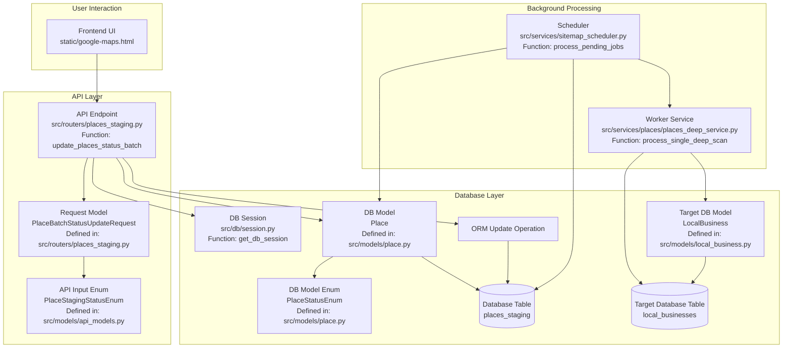

# Architectural Pattern: Curation-Driven Background Processing

**Document ID:** 02-CURATION-DRIVEN-BACKGROUND-PROCESSING-PATTERN
**Status:** Documented
**Created:** April 2025
**Author:** Gemini Assistant & User

## 1. Pattern Summary

This pattern describes a workflow where user actions in a frontend interface (specifically, selecting one or more items and setting a specific primary status) trigger a conditional background process via a unified API endpoint, without requiring explicit user initiation of the background task.

**Use Case Example:** Allowing users to review staged data (`places_staging`), select items as "Selected", and have this action automatically queue those items for a secondary process like a detailed data scrape (`deep_scan_status = 'queued'`).

## 2. Core Components & Workflow

```mermaid
sequenceDiagram
    participant User
    participant Frontend UI (e.g., google-maps.html)
    participant API Endpoint (e.g., PUT /places/staging/status)
    participant DB Models (e.g., Place, PlaceStatusEnum)
    participant Database (places_staging table)
    participant Scheduler (e.g., APScheduler Job)
    participant Worker Service (e.g., PlacesDeepService)

    User->>+Frontend UI: Selects Items & Chooses Status (e.g., "Selected")
    Frontend UI->>+API Endpoint: Sends PUT request with place_ids & status="Selected"
    API Endpoint->>+DB Models: Validates input against API Enum (PlaceStagingStatusEnum)
    API Endpoint->>DB Models: Maps API Enum to DB Enum (PlaceStatusEnum) by Name
    API Endpoint->>Database: Begins Transaction
    alt Status is "Selected" (or other trigger status)
        API Endpoint->>Database: UPDATE places_staging SET status='Selected', deep_scan_status='queued', updated_at=now() WHERE place_id IN (...)
    else Status is non-triggering
        API Endpoint->>Database: UPDATE places_staging SET status='New/Archived/...', updated_at=now() WHERE place_id IN (...)
    end
    API Endpoint->>Database: Commits Transaction
    Database-->>-API Endpoint: Update Result (Success/Failure)
    API Endpoint-->>-Frontend UI: Returns Success Response (updated_count, queued_count)
    Frontend UI-->>-User: Shows Success Message & Refreshes Grid

    Note right of Scheduler: Runs Periodically

    Scheduler->>+Database: Queries for places_staging WHERE deep_scan_status='queued\'
    Database-->>-Scheduler: Returns Queued Items
    loop For Each Queued Item
        Scheduler->>Database: Begins Transaction
        Scheduler->>Database: UPDATE places_staging SET deep_scan_status='processing' WHERE place_id = current_item_id
        Scheduler->>Database: Commits Transaction
        Scheduler->>+Worker Service: process_single_item(place_id)
        Worker Service-->>-Scheduler: Returns Success/Failure
        alt Process Success
            Scheduler->>Database: Begins Transaction
            Scheduler->>Database: UPDATE places_staging SET deep_scan_status='completed' WHERE place_id = current_item_id
            Scheduler->>Database: Commits Transaction
        else Process Failure
            Scheduler->>Database: Begins Transaction
            Scheduler->>Database: UPDATE places_staging SET deep_scan_status='failed', deep_scan_error='...\' WHERE place_id = current_item_id
            Scheduler->>Database: Commits Transaction
        end
    end
    Scheduler-->>-User: (Logging/Monitoring)

```

## 3. Component Dependency Tree & File Paths

This outlines the key components and their relationships:



**Component Notes & Logic:**

- **`static/google-maps.html`**: Contains the data grid, selection checkboxes, and dropdown. JS logic collects selected `place_ids` and the status string, then calls the API endpoint.
- **`src/routers/places_staging.py` (`update_places_status_batch`)**: Defines the `PUT /api/v3/places/staging/status` endpoint. Uses `PlaceBatchStatusUpdateRequest` for input validation. Contains the core logic for mapping API enum to DB enum, conditionally deciding whether to queue, constructing the SQLAlchemy `update` statement, and executing it within a transaction.
- **`src/models/api_models.py` (`PlaceStagingStatusEnum`)**: Defines the enum accepted by the API request model. Its member values must match what the frontend sends. Its member names must align with `PlaceStatusEnum` names.
- **`src/models/place.py` (`Place`, `PlaceStatusEnum`, `DeepScanStatusEnum`)**: Defines the SQLAlchemy model for `places_staging` and the enums representing the database types. `PlaceStatusEnum` member values must match the database enum values exactly.
- **`places_staging` (Table)**: The source table containing items for curation and the status fields (`status`, `deep_scan_status`).
- **`src/services/sitemap_scheduler.py` (`process_pending_jobs`)**: Contains the APScheduler job logic that queries `places_staging` for `deep_scan_status='queued'`, updates status to `processing`, calls the worker, and updates the final status (`completed`/`failed`).
- **`src/services/places/places_deep_service.py` (`process_single_deep_scan`)**: Contains the logic for the background task itself (e.g., calling external APIs, saving detailed data to `local_businesses`).
- **`src/models/local_business.py` (`LocalBusiness`)**: Defines the SQLAlchemy model for the target table where the background worker saves its results.
- **`local_businesses` (Table)**: The target table populated by the background worker service.

## 4. Key Mechanisms Explained

### 4.1 The "Magic" Single/Batch API Endpoint

The endpoint (`PUT /api/v3/places/staging/status`) seamlessly handles updates for both single items and batches of items without needing separate endpoints. This is achieved through the Pydantic request model (`PlaceBatchStatusUpdateRequest`):

```python
class PlaceBatchStatusUpdateRequest(BaseModel):
    # Key field: Expects a LIST of strings
    place_ids: List[str] = Field(..., min_length=1, description="List of one or more Google Place IDs to update.")
    status: PlaceStagingStatusEnum = Field(..., description="The new main status to set.")
```

- The `place_ids` field is defined as `List[str]`.
- FastAPI automatically validates that the incoming JSON contains a `place_ids` key with a value that is an array of strings.
- The backend logic then uses this list directly in the `WHERE Place.place_id.in_(update_request.place_ids)` clause of the SQLAlchemy `update` statement.
- Whether the list contains one ID or many IDs, the `.in_()` operator handles it correctly. This eliminates the need for separate `/places/staging/{place_id}/status` and `/places/staging/batch/status` endpoints.

### 4.2 The Conditional Trigger Mechanism

The logic that conditionally queues items for the background process resides entirely **within the API endpoint function (`update_places_status_batch`)** in `src/routers/places_staging.py`. It works as follows:

1.  **Map API Status to DB Status:** After validating the input `status` (e.g., `"Selected"`) using the API Enum (`PlaceStagingStatusEnum`), the code maps it to the corresponding member of the DB Enum (`PlaceStatusEnum`) by comparing member names (e.g., `PlaceStatusEnum.Selected`). Let's call this `target_db_status_member`.
2.  **Check Trigger Condition:** The code explicitly checks if this mapped database status member is the designated trigger status:
    ```python
    trigger_deep_scan = (target_db_status_member == PlaceStatusEnum.Selected)
    ```
3.  **Conditional Update Values:** When constructing the SQLAlchemy `update` statement's `values`, it includes the background status field conditionally:
    ```python
    update_values = {
        Place.status: target_db_status_member,
        Place.updated_at: datetime.utcnow()
        # Potentially add updated_by here too
    }
    if trigger_deep_scan:
        logger.info(f"API status '{new_main_status.name}' ... will trigger deep scan queueing.")
        update_values[Place.deep_scan_status] = DeepScanStatusEnum.queued
        update_values[Place.deep_scan_error] = None # Clear previous errors
    ```
4.  **Atomic Execution:** The entire update (setting main status and conditionally setting background status) happens within a single database transaction, ensuring atomicity.

The background process itself is completely decoupled; it only knows to look for records where `deep_scan_status` equals `'queued'`.

### 4.3 ORM Usage Requirement

As per project standards defined in **`Docs/Docs_1_AI_GUIDES/01-ABSOLUTE_ORM_REQUIREMENT.md`**, all database interactions within this pattern (and the entire application) **MUST** be performed using the SQLAlchemy ORM.

- **Fetching Data:** Use `select()` statements with model classes (e.g., `select(Place)`).
- **Updating Data:** Use `update()` statements with model classes and column attributes (e.g., `update(Place).where(...).values(...)`).
- **Session Management:** Use the provided session utilities (`get_db_session`, `get_background_session`) and transaction contexts (`async with session.begin():`).
- **Raw SQL is Forbidden:** Direct execution of raw SQL strings using `text()` or `session.execute("RAW SQL...")` is strictly prohibited in application code to maintain type safety, prevent SQL injection vulnerabilities, and leverage the ORM's features.

## 5. Critical Alignment Points & Lessons Learned

Misalignment between components, especially enums, was the primary source of issues during implementation.

1.  **Enum Definitions are Critical:**
    - **Database Enum Type (PostgreSQL):** The ultimate source of truth for allowed string values. Query it (`SELECT unnest(enum_range(NULL::your_enum_type));`) if unsure.
    - **DB Model Enum (SQLAlchemy Model - e.g., `models/place.py`):** Member **values** (strings) MUST exactly match the database enum type values (case-sensitive). Member **names** (Python identifiers) are used internally.
    - **API Input Enum (API Model - e.g., `models/api_models.py`):** Member **values** (strings) must match what the frontend sends. Member **names** should align with DB Model Enum names if mapping logic relies on `.name`.
2.  **Frontend Dropdown:** `<option>` values must match the **values** defined in the API Input Enum.
3.  **Endpoint Mapping Logic:** MUST correctly map the received API Input Enum member to the DB Model Enum member _before_ using it in database operations. Comparing by `.name` is often safer than comparing by `.value` if casing differs.
4.  **Conditional Trigger:** Base the decision to queue the background task on the mapped **DB Model Enum member**, not the raw API input value.
5.  **Verify Edits:** Do not assume automated code edits succeeded. Check confirmation messages or re-read files if errors persist unexpectedly.

By ensuring strict alignment, particularly around enums, this pattern provides a robust way to link user curation actions to automated background processing.
