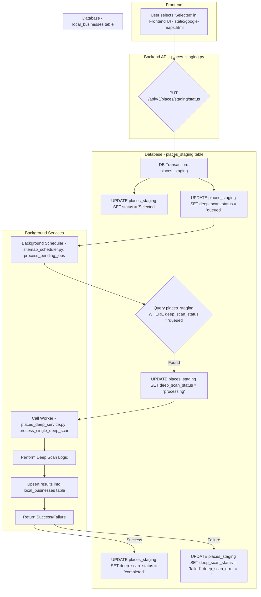

# Detailed Workflow: Place Staging Selection to Deep Scan & Local Business Creation

**Document ID:** 02a-DETAIL-Deep-Scan-Workflow
**Status:** Final
**Created:** April 2025
**Author:** Gemini Assistant & User
**Related Patterns:**

- `01-SCHEDULED-TASKS-APSCHEDULER-PATTERN.md` (Scheduler Principles)
- `02-CURATION-DRIVEN-BACKGROUND-PROCESSING-PATTERN.md` (General Pattern)

## 1. Objective

This document provides a concrete, step-by-step breakdown of the existing workflow where a user selects records in the `places_staging` table via the UI, triggering a background deep scan process that ultimately populates the `local_businesses` table. This serves as the specific implementation example referenced by pattern document `02`.

## 2. Workflow Diagram (Mermaid)

## 3. Step-by-Step Explanation

1.  **User Action (A):** In the frontend UI (`static/google-maps.html`), the user selects one or more rows from the `places_staging` data grid and uses the dropdown/update mechanism to set their status to `Selected`.
2.  **API Call (B):** The frontend triggers a `PUT` request to the `/api/v3/places/staging/status` endpoint, handled by the router in `src/routers/places_staging.py`. The request payload includes the list of `place_ids` and the target status (`Selected`).
3.  **Database Update (C, D, E):** The API endpoint function (`update_places_status_batch`) initiates a database transaction. Within this transaction, it updates the specified rows in the `places_staging` table:
    - Sets the main `status` column to `Selected` (D).
    - Sets the `deep_scan_status` column to `queued` (E) as a conditional side-effect of the main status being set to `Selected`.
4.  **Scheduler Pickup (F, G):** The shared background scheduler service, running the `process_pending_jobs` function (likely within `src/services/sitemap_scheduler.py` based on previous context, though not explicitly named in pattern `01`), periodically queries the `places_staging` table for records where `deep_scan_status = \'queued\'` (G).
5.  **Processing State (H):** When the scheduler finds queued records, it updates their `deep_scan_status` to `processing` to prevent other scheduler instances (if scaled) from picking up the same job.
6.  **Worker Invocation (I):** The scheduler calls the specific worker function responsible for the deep scan task: `process_single_deep_scan` located in `src/services/places/places_deep_service.py`.
7.  **Deep Scan Logic (J):** The `process_single_deep_scan` function executes the core business logic for the deep scan. This involves potentially calling external APIs or performing web scraping based on the `place_id`.
8.  **Result Storage (K):** Upon successful completion of the deep scan logic, the worker function upserts the detailed results into the `local_businesses` table, linking back via the `place_id` if necessary (or using other identifiers).
9.  **Final Status Update (L, M, N):** The worker function returns a success or failure indication.
    - On success (L -> M), the scheduler updates the original `places_staging` record\'s `deep_scan_status` to `completed`.
    - On failure (L -> N), the scheduler updates the `deep_scan_status` to `failed` and populates the `deep_scan_error` field with relevant error details.

## 4. Key Components Involved

- **Frontend:** `static/google-maps.html` (UI for selection)
- **API Router:** `src/routers/places_staging.py` (Handles status update requests)
- **Database Tables:** `places_staging`, `local_businesses`
- **Database Enums:** `PlaceStatusEnum`, `DeepScanStatusEnum` (defined in `src/models/place.py` or similar)
- **Scheduler:** `src/services/sitemap_scheduler.py` (Contains `process_pending_jobs`) - Follows pattern `01`.
- **Worker:** `src/services/places/places_deep_service.py` (Contains `process_single_deep_scan`)

This detailed flow serves as the established, working reference for implementing similar curation-driven background tasks.
