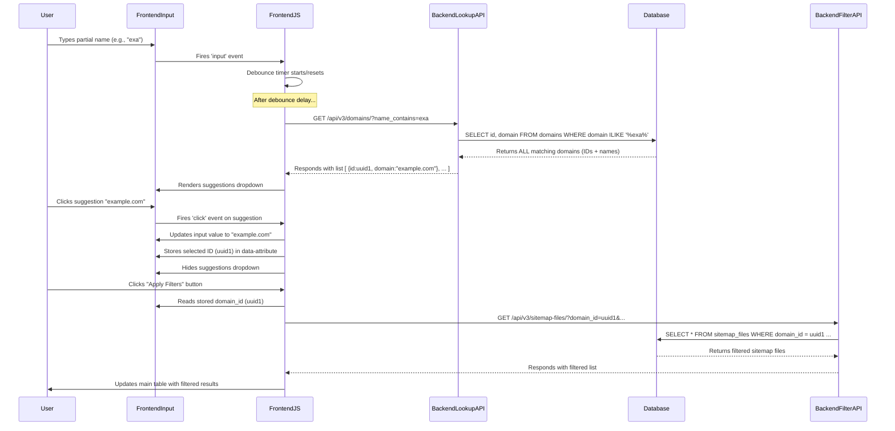

# Pattern 04: Frontend Typeahead Lookup for Backend ID Filtering

**Related Patterns:** `03-FE-LOOKUP-FOR-BE-ID-PATTERN.md` (This pattern is a specific, dynamic implementation of the general lookup need).

## 1. Purpose / Problem

Often, a user interface needs to allow filtering a primary entity list (e.g., Sitemap Files, Local Businesses) based on a _related_ entity (e.g., Domain, Source Business). Users naturally want to filter by the related entity's **name** (e.g., type "example.com" or "Joe's Coffee"), which is user-friendly.

However, the backend API typically requires the related entity's unique **ID** (e.g., a UUID) for efficient database filtering (using foreign keys and indices). We need a way to bridge this gap: let the user search by name but send the corresponding ID to the backend API when applying the main filter.

## 2. Solution Overview: Dynamic Typeahead/Autocomplete

The solution involves a dynamic typeahead (or autocomplete) feature in the frontend, powered by a dedicated backend lookup endpoint:

1.  **User Interaction:** The user starts typing the name of the related entity into a designated input field.
2.  **Frontend JS:** JavaScript listens for input, debounces the calls, and sends the typed text to a backend lookup endpoint for the _related_ entity.
3.  **Backend Lookup:** The backend endpoint searches the related entity table (e.g., `domains`) for names matching the provided text.
4.  **Frontend JS:** JavaScript receives the list of matching names and IDs, displays them in a dropdown below the input.
5.  **User Selection:** The user clicks on a suggestion from the dropdown.
6.  **Frontend JS:** JavaScript fills the input field with the selected name, **stores the selected entity's ID** (e.g., in a `data-` attribute), and hides the dropdown.
7.  **Filter Application:** When the user clicks the main "Apply Filters" button for the primary entity list, the frontend JavaScript reads the **stored ID** and includes it as a filter parameter (e.g., `domain_id=...`) in the API call to fetch the primary entity list.



## 3. Components

### 3.1. Frontend

**HTML (`google-maps.html` context):**

- **Text Input Field:** The primary input where the user types the name.
  ```html
  <input
    type="text"
    id="someEntityNameFilter"
    placeholder="Start typing name..."
  />
  ```
- **Suggestions Container:** A `div` (initially hidden) positioned below the input to display suggestions.
  ```html
  <div
    id="someEntitySuggestions"
    class="suggestions-dropdown"
    style="display: none;"
  ></div>
  ```
- **ID Storage:** Implicitly store the selected ID on the input field itself using a `data-*` attribute.
  ```html
  <!-- ID is stored via JS: inputElement.dataset.selectedEntityId = '...' -->
  ```
- **CSS:** Styles for the suggestions dropdown (`.suggestions-dropdown`, `.suggestion-item`) to position it correctly and make it look interactive (see `google-maps.html` for examples).

**JavaScript (e.g., `/static/js/some-tab.js`):**

- **Element References:** Get references to the input field and suggestions container.
- **`input` Event Listener:** Attach to the input field.
  - Get the current `query` text.
  - **Crucially, clear any previously stored ID** (`delete inputElement.dataset.selectedEntityId;`) so that simply typing without selecting doesn't apply an old filter.
  - Call a _debounced_ version of the `fetchSuggestions` function.
- **Debounce Function:** A standard utility function to prevent API calls on every keystroke.
  ```javascript
  function debounce(func, delay) {
    /* ... standard implementation ... */
  }
  const debouncedFetchSuggestions = debounce(fetchSuggestions, 300);
  ```
- **`fetchSuggestions(query)` Function:**
  - If query is too short (e.g., < 2 chars), hide suggestions and return.
  - Construct the URL for the backend lookup endpoint (e.g., `/api/v3/{related_entity}/?name_contains=${encodeURIComponent(query)}`). **Note:** For the MVP, we removed the `&size=10` limit to show all matching suggestions; this may need revisiting for performance post-MVP.
  - Make the `fetch` call (`GET`, include Auth header).
  - Handle the response: Call `renderSuggestions` with the `items` array.
  - Handle errors (log, potentially show an error in the suggestions box).
- **`renderSuggestions(suggestions)` Function:**
  - Clear the suggestions container.
  - If no suggestions, display a "No results" message.
  - Otherwise, iterate through suggestions:
    - Create a `div` for each suggestion (`suggestion-item`).
    - Set its `textContent` to the display name (e.g., `suggestion.domain`, `suggestion.business_name`).
    - Store the ID on the element: `itemElement.dataset.entityId = suggestion.id;`
    - Add a `click` event listener that calls `handleSuggestionClick`.
    - Append the item element to the container.
  - Show the suggestions container.
- **`handleSuggestionClick(event)` Function:**
  - Get the selected name (`event.target.textContent`) and ID (`event.target.dataset.entityId`).
  - Update the main input field's `.value` with the selected name.
  - **Store the selected ID:** `inputElement.dataset.selectedEntityId = selectedEntityId;`
  - Call `hideSuggestions()`.
- **`hideSuggestions()` Function:** Hide the suggestions container.
- **Click Outside Listener:** Add a global click listener to hide suggestions if the user clicks anywhere outside the input/suggestions dropdown.
- **Integration with `handleApplyFilters()`:**
  - Read the stored ID: `const relatedId = inputElement.dataset.selectedEntityId;`
  - Add it to the `currentFilters` object if it exists: `if (relatedId) { currentFilters.related_entity_id = relatedId; }`
- **Integration with `handleResetFilters()`:**
  - Clear the input field value: `inputElement.value = '';`
  - **Crucially, clear the stored ID:** `delete inputElement.dataset.selectedEntityId;`

### 3.2. Backend

**Lookup Endpoint:**

- **Path:** A `GET` endpoint for the _related_ entity resource (e.g., `/api/v3/domains/`, `/api/v3/local-businesses/`).
- **Query Parameter:** Accepts a parameter for text matching (e.g., `name_contains`, `domain`, `business_name`). Naming should be consistent.
- **Optional Parameters:** May accept `page`, `size` for pagination/limiting results. **Note:** Frontend must explicitly request a limit if desired; the default backend behavior might return all matches.

**Service Logic (`src/services/...`):**

- Accepts the text query parameter.
- Constructs a SQLAlchemy query using `select()`.
- Applies a **case-insensitive** `WHERE` clause using `ilike()` on the relevant name column (e.g., `Domain.domain.ilike(f'%{query}%')`).
- Applies ordering (e.g., by name).
- Applies `limit()` **only if** requested via a `size` parameter from the frontend.
- Executes the query.

**Response Schema (`src/schemas/...`):**

- Uses a `Paginated{Entity}Response` or a simple list.
- The schema for the items in the list (e.g., `DomainRead`, `LocalBusinessRead`) **MUST** include:
  - The entity's `id` (UUID).
  - The field used for display text (e.g., `domain`, `business_name`).

## 4. Example Implementation

- **Sitemap Curation Tab - Domain Filter:**
  - Frontend: `static/js/sitemap-curation-tab.js` (see `domainFilterInput`, `fetchDomainSuggestions`, etc.)
  - Backend: `GET /api/v3/domains/` endpoint, parameter `name_contains`, uses `Domain.domain.ilike()` (Implemented in `src/routers/domains.py` and `src/services/domains_service.py`).

## 5. Key Considerations

- **Debouncing:** Essential on the frontend to prevent overwhelming the backend API with requests on every keystroke. A delay of 250-500ms is typical.
- **Limiting Results:** While the backend _can_ limit results if requested (via `size` param), the frontend needs to decide whether to request a limit. For MVP (e.g., Sitemap Curation domain filter), we removed the frontend limit request (`&size=10`) to improve usability by showing all matches. This decision should be documented and potentially revisited based on production performance and dataset size.
- **Parameter Name Consistency:** Ensure the query parameter name used by the frontend to send the search text (e.g., `name_contains`, `domain_filter`) **exactly matches** the parameter name expected by the backend API endpoint definition. Mismatches will lead to the lookup/filter failing silently.
- **Case-Insensitive Search:** Use `ilike()` (PostgreSQL) or equivalent for database queries to match user expectations.
- **Performance:** Ensure the database column being searched (`domain`, `business_name`) has an appropriate index to support fast `ilike` queries (potentially a trigram index - `CREATE INDEX ... USING gin (... gin_trgm_ops);` - for larger datasets).
- **Error Handling:** Handle potential network errors during the fetch and cases where the API returns an error or no results.
- **UI/UX:** Style the dropdown clearly, ensure it's positioned correctly, handle keyboard navigation (optional), and make sure it reliably hides when focus is lost or a selection is made.
- **Clarity:** Ensure the placeholder text in the input field guides the user (e.g., "Start typing domain name...").
- **ID Storage:** Using `data-*` attributes is generally cleaner than hidden input fields for storing the selected ID.
- **Reset Logic:** Always clear the stored ID when the filter input is cleared or reset.

## 7. Adapting the Pattern for Other Entities/Tabs

This pattern is highly reusable across different tabs or sections where filtering a primary entity list by a related entity's name is required. Here's a guide to adapting the implementation:

**General Steps:**

1.  **Identify Entities & Fields:**

    - **Primary Entity:** The main entity being listed and filtered (e.g., `SitemapFile`, `Domain`, `LocalBusiness`).
    - **Related Entity:** The entity whose name the user will search by (e.g., `Domain`, `LocalBusiness`).
    - **Related Entity Name Field:** The specific field on the related entity containing the searchable name (e.g., `domain`, `business_name`).
    - **Related Entity ID Field:** The field on the related entity containing the unique ID (usually `id`).
    - **Primary Entity FK Field:** The foreign key field on the primary entity that links to the related entity's ID (e.g., `domain_id`, `local_business_id`).

2.  **Verify/Identify API Endpoints:**

    - **Lookup Endpoint:** Confirm the existence and URL structure of the `GET` endpoint for the _related entity_ that supports searching by its name (e.g., `GET /api/v3/{related_entity_plural}/?name_contains=...` or similar).
    - **Primary Filter Endpoint:** Confirm the URL and the exact query parameter name the _primary entity's_ list endpoint expects for filtering by the related entity's ID (e.g., `?{primary_entity_fk_field}=UUID_HERE`).

3.  **Adapt Frontend HTML:**

    - Use unique `id` attributes for the filter input field and its suggestions container, specific to the context (e.g., `domainListLocalBusinessFilterInput`, `domainListLocalBusinessSuggestions`).

4.  **Adapt Frontend JavaScript:**
    - Update element ID references (`document.getElementById(...)` or `$()`) to match the new HTML IDs.
    - In `fetchSuggestions`: Update the `fetch` URL to point to the correct _related entity_ lookup endpoint.
    - In `renderSuggestions`: Ensure the code extracts the correct _display name_ and _ID_ fields from the lookup API response (e.g., `suggestion.business_name`, `suggestion.id`).
    - In `handleSuggestionClick`: Ensure the correct `dataset` attribute is used to store the ID (e.g., `inputElement.dataset.selectedLocalBusinessId = selectedId;`).
    - In `handleApplyFilters`: Ensure the correct `dataset` attribute is read and the correct query parameter name is added to the `currentFilters` object (e.g., `if (selectedLocalBusinessId) { currentFilters.local_business_id = selectedLocalBusinessId; }`).
    - In `handleResetFilters`: Ensure the correct input field value and `dataset` attribute are cleared.
    - Consider renaming JS functions for clarity if multiple typeaheads exist on the same page (e.g., `fetchLocalBusinessSuggestions`).

**Example: Adapting for Tab 3 (Domain Curation - Filtering Domains by Local Business Name)**

- **Primary Entity:** `Domain`
- **Related Entity:** `LocalBusiness`
- **Related Entity Name Field:** `business_name` (assumption, verify schema)
- **Related Entity ID Field:** `id`
- **Primary Entity FK Field:** `local_business_id` (assumption, verify schema)
- **Lookup Endpoint:** Need `GET /api/v3/local-businesses/?business_name_contains=...` (verify existence & exact query param)
- **Primary Filter Endpoint:** Need `GET /api/v3/domains/?local_business_id=...` (verify existence & exact query param)
- **HTML IDs:** e.g., `domainTabLocalBusinessFilterInput`, `domainTabLocalBusinessSuggestions`
- **JS Adaptations:**
  - Update element IDs.
  - `fetch` URL: `/api/v3/local-businesses/?business_name_contains=...`
  - `renderSuggestions`: Use `suggestion.business_name` for display, `suggestion.id` for ID.
  - `handleSuggestionClick`: Store ID in `dataset.selectedLocalBusinessId`.
  - `handleApplyFilters`: Read `dataset.selectedLocalBusinessId`, add to filters as `currentFilters.local_business_id = ...`.
  - `handleResetFilters`: Clear input and `dataset.selectedLocalBusinessId`.
