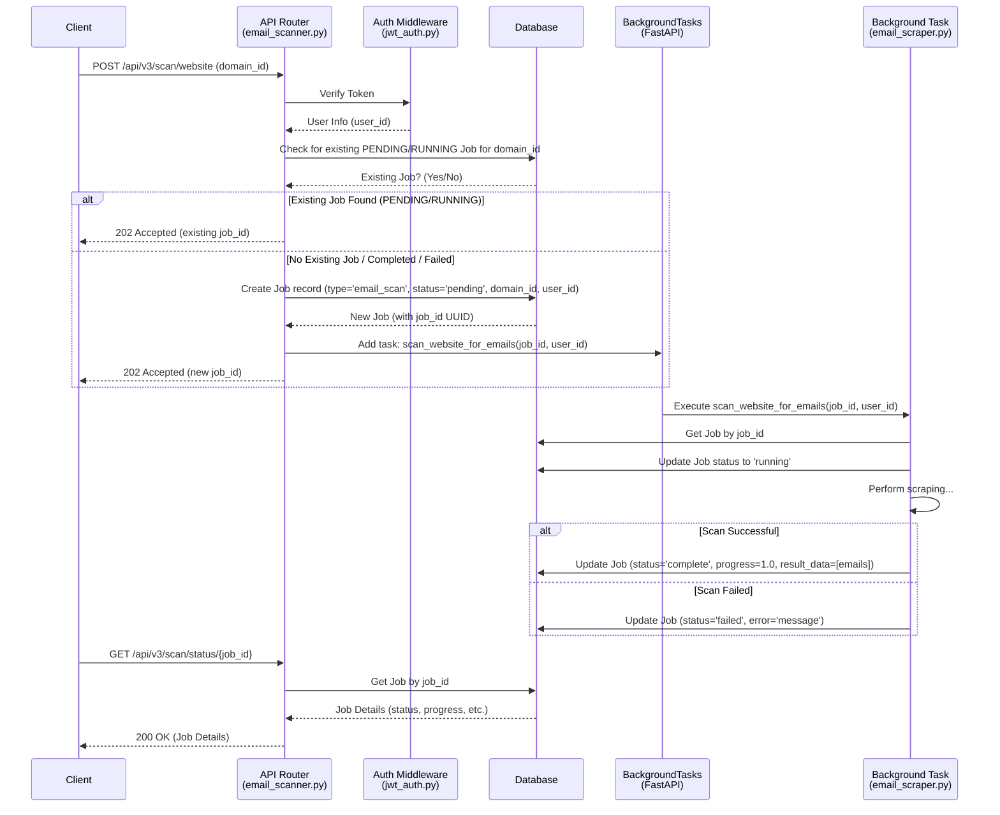
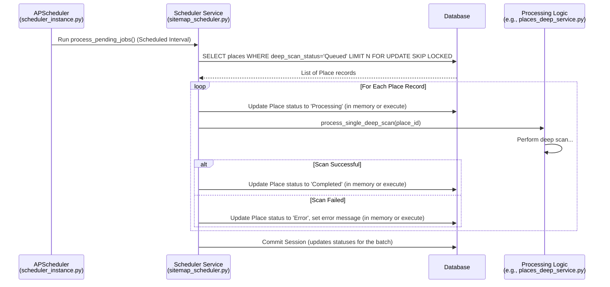
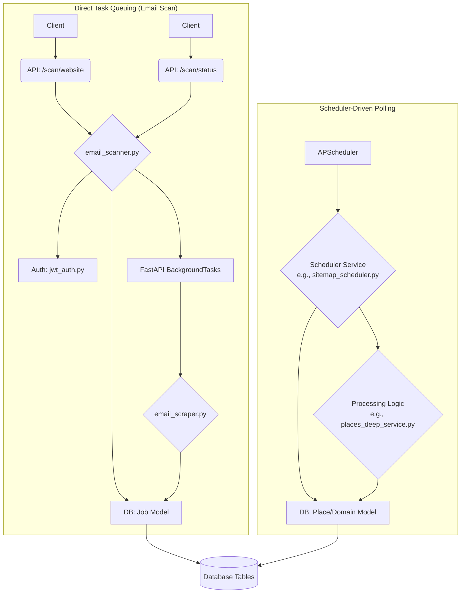

# Background Task Processing Patterns

Two primary patterns for handling background tasks are observed in this application:

1.  **Direct Task Queuing (Used for Email Scanner):**

    - **Trigger:** Initiated directly by an API endpoint call.
    - **Job Record:** A dedicated `Job` record is created _immediately_ upon the API request in the `jobs` table.
    - **Task Execution:** The background task function is added directly to FastAPI's `BackgroundTasks` runner, usually passing the `job_id` (UUID) of the newly created record. Execution starts almost immediately after the API response is sent.
    - **Feedback:** The API endpoint can return the `job_id` immediately, allowing the client to poll a status endpoint.
    - **Use Case:** Suitable for user-initiated actions requiring immediate feedback and dedicated tracking of that specific task instance (e.g., starting a scan, processing a specific user request).

2.  **Scheduler-Driven Polling Queue (Used for Sitemap/Domain/etc. processing):**
    - **Trigger:** Initiated by a scheduled job (e.g., via APScheduler) that runs periodically.
    - **Job Record:** May or may not use a dedicated `Job` record. Often relies on changing a status field on the primary entity's table (e.g., `domains.status = 'pending'`, `places_staging.deep_scan_status = 'Queued'`). A `Job` record might be created _when the scheduler picks up the item_, not upon the initial request (if any).
    - **Task Execution:** The scheduler queries the relevant table for entities with a specific status (e.g., 'pending', 'Queued'). When found, the scheduler calls the processing function for that entity, often in batches. Execution depends on the scheduler's interval.
    - **Feedback:** Feedback is less direct. Status is typically tracked by observing the status field on the primary entity or by querying related `Job` records if used.
    - **Use Case:** Suitable for system-driven batch processing, periodic maintenance tasks, or handling items queued indirectly (e.g., processing all domains marked for analysis).

---

## ASCII Flow Charts

**1. Direct Task Queuing (Email Scanner - `src/routers/email_scanner.py`)**

**2. Scheduler-Driven Polling Queue (Example: Sitemap/DeepScan - `src/services/sitemap_scheduler.py`)**

_(Note: The exact implementation details like session management within the loop might vary, but this shows the general flow.)_

---

## Dependency/Interaction Overview

---

## Key File Paths

- **Direct Task Queuing (Email Scanner):**

  - Router: `src/routers/email_scanner.py`
  - Task: `src/tasks/email_scraper.py`
  - Job Model: `src/models/job.py`
  - Auth: `src/auth/jwt_auth.py`
  - Base Model/DB Session: `src/models/base.py`, `src/session/async_session.py`

- **Scheduler-Driven Polling (Example: Deep Scan):**
  - Scheduler Service: `src/services/sitemap_scheduler.py`
  - Entity Model: `src/models/place.py`
  - Processing Logic: `src/services/places/places_deep_service.py`
  - Shared Scheduler: `src/scheduler_instance.py`
  - Base Model/DB Session: `src/models/base.py`, `src/session/async_session.py`

---
