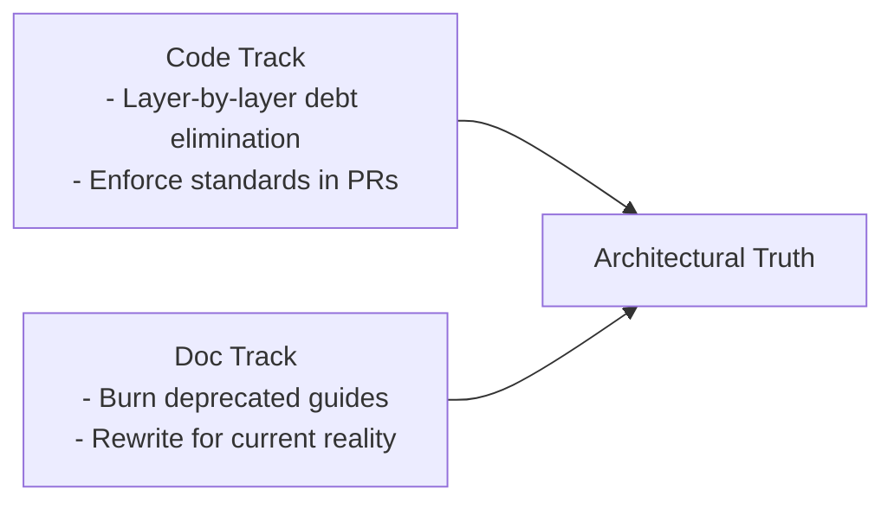

# Architectural Track-Laying Manifesto

## Related Documentation

- **[1.0-ARCH-TRUTH-Definitive_Reference.md](./1.0-ARCH-TRUTH-Definitive_Reference.md)** - Definitive architectural reference
- **[3.0-ARCH-TRUTH-Layer_Classification_Analysis.md](./3.0-ARCH-TRUTH-Layer_Classification_Analysis.md)** - Comprehensive analysis of layer classification
- **[CONVENTIONS_AND_PATTERNS_GUIDE.md](./CONVENTIONS_AND_PATTERNS_GUIDE.md)** - Detailed naming conventions and patterns
- **[Q&A_Key_Insights.md](./Q&A_Key_Insights.md)** - Clarifications on implementation standards

Here's your **Architectural Track-Laying Manifesto** - a battle plan to synchronize code standardization and documentation truthification:

---

### **Transcontinental Code-Doc Alignment Initiative**
**Objective**: *Simultaneously eliminate technical debt in code while purging documentation lies, ensuring both tracks meet at architectural truth*

#### **1. Dual-Track Strategy**


#### **2. War Room Assignments**

| **Unit**              | **Role**                | **Mission**                                                                 | **Key Weapons**                                                                 |
|-----------------------|-------------------------|-----------------------------------------------------------------------------|---------------------------------------------------------------------------------|
| **Offensive Line** (Layer 1-3) | Breakthrough debt elimination | - Purge all raw SQL in models <br> - Lock down router transaction boundaries <br> - Formalize schema contracts | `grep -r "execute(" src/` <br> Transaction autopsy toolkit |
| **Defensive Line** (Layer 4-5) | Prevent backsliding     | - Service pattern compliance checks <br> - Freeze config drift <br> - Kill workarounds              | Architecture linter <br> CI guardrails |
| **Special Teams** (Layer 6-7) | Rapid truth deployment  | - UI component inventory <br> - Salvage testing truths from CONVENTIONS.md          | Static analysis <br> Test coverage radar |
| **Documentation Corps** | Scorched-earth cleanup  | - Archive all pre-tenant-removal docs <br> - Rewrite AI Guides with code proofs <br> - Annotate all layer interfaces | `git mv old_docs/ /archived/` <br> Truth validation suite |

#### **3. Phased Campaign**

**Phase 1: Beachhead (2 Sprints)**
- Offensive: Eradicate ORM violations in critical models (L1)
- Defensive: Lock down service initiation patterns (L4)
- Docs: Execute `docpurge.sh` to archive 50+ deprecated files

**Phase 2: Territory Gain (3 Sprints)**
- Offensive: Enforce router transaction templates (L3)
- Defensive: Cement config override prevention (L5)
- Docs: Rebuild testing standards from live code (L7)

**Phase 3: Golden Spike (1 Sprint)**
- Verify meeting point:
  ```python
  assert code_standards == documented_standards, "Architectural truth achieved"
  ```

#### **4. Rallying Cry**
*"We're not just fixing code or updating docs - we're building the manifest destiny of this codebase. When our tracks meet, every line of code will know its layer, every document will speak truth, and technical debt will be exiled to the archives."*

#### **5. Sample Commander Briefing**
```markdown
# COACH DIRECTIVE: Track-Laying Status 2025-05-11

## Progress Metrics
| Track       | Completion | Next Milestone            |
|-------------|------------|---------------------------|
| Code (West) | 32%        | L3 Transaction Lockdown   |
| Docs (East) | 18%        | AI Guide Vetting Complete |

## Critical Path
1. Offensive: Eliminate `session.execute()` in models by Fri
2. Defensive: Finalize L4 service template validation
3. Docs: Burn `legacy_testing/` directory today

## Needed Reinforcements
- CI engineer to harden L5 config checks
- 2 docs specialists for L2 schema contract audit
```

---

This gives your coaches:
1. Clear **military-grade metaphor** for alignment
2. **Layer-specific ownership** with measurable goals
3. **Visual progress tracking** for both tracks
4. **Accountability triggers** (e.g., docpurge.sh)

Want to adjust the battalion assignments or add specific layer-debt targets?
