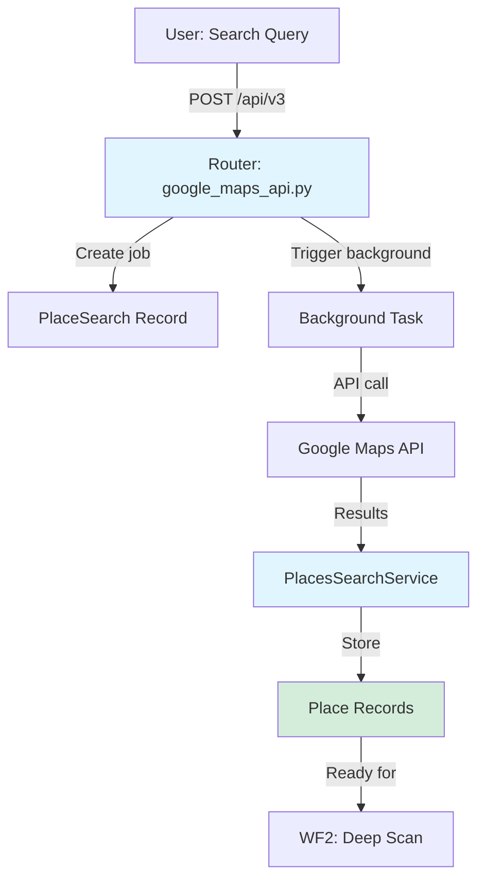

# WF1: Single Search (Google Maps Discovery)
**Purpose:** Business discovery via Google Maps API
**Last Updated:** November 17, 2025
**Part of:** Complete WF1-7 Pipeline Documentation
**Priority:** P0 - Entry point for entire data pipeline

---

## Overview

WF1 is the **entry point** of the ScraperSky data pipeline, enabling users to discover businesses through Google Maps search. It transforms simple search queries (e.g., "eye doctors in Honolulu") into structured Place records that feed downstream workflows.

### Purpose
- Search Google Maps for businesses
- Store Place records with business metadata
- Enable WF2 (enrichment) and WF3 (domain extraction)
- Provide foundation for entire WF1→WF7 pipeline

### Status
✅ **WORKING** (Production-ready)
- Used for business discovery
- Background job processing
- Paginated API results
- Error handling implemented

---

## Data Flow



### Flow Steps
1. **User submits search query** via API
2. **Router creates PlaceSearch job** in database
3. **Background task triggered** (asyncio.create_task)
4. **Service calls Google Maps API** with pagination
5. **Results stored as Place records** in database
6. **Places available for WF2 enrichment**

---

## Components (Layer by Layer)

### Layer 1: Models (Database Schema)

**File:** `src/models/place.py`

**Table:** `places`

**Key Fields:**
```python
class Place(Base):
    id: UUID                      # Primary key
    place_id: str                 # Google's unique place ID
    name: str                     # Business name
    formatted_address: str        # Full address
    website: Optional[str]        # Critical for WF3 domain extraction
    phone_number: Optional[str]
    rating: Optional[float]
    user_ratings_total: Optional[int]
    price_level: Optional[int]

    # Location
    lat: Optional[float]
    lng: Optional[float]

    # Status tracking
    status: str                   # pending/running/complete/failed

    # Metadata
    types: ARRAY(String)          # Business types
    photos: JSONB                 # Photo URLs (populated by WF2)
    reviews: JSONB                # Reviews (populated by WF2)
    opening_hours: JSONB          # Hours (populated by WF2)

    # Audit
    created_at: DateTime
    updated_at: DateTime
    tenant_id: UUID
    user_id: str
```

**Table:** `place_search`

**Purpose:** Track search jobs and parameters

```python
class PlaceSearch(Base):
    id: UUID                      # Job ID
    business_type: str            # e.g., "dentist"
    location: str                 # e.g., "Seattle, WA"
    params: JSONB                 # {"radius_km": 10}
    status: str                   # pending/running/complete/failed
    created_at: DateTime
    updated_at: DateTime
    user_id: str
    tenant_id: UUID
```

---

### Layer 2: Schemas (API Contracts)

**File:** `src/routers/google_maps_api.py` (inline schemas)

**Request Schema:**
```python
class PlacesSearchRequest(BaseModel):
    business_type: str            # Required
    location: str                 # Required
    radius_km: int = 10           # Default 10km
    tenant_id: Optional[str] = None
```

**Response Schema:**
```python
{
    "job_id": "uuid",
    "status": "pending",
    "message": "Search job created"
}
```

---

### Layer 3: Router (API Endpoint)

**File:** `src/routers/google_maps_api.py`

**Endpoint:** `POST /api/v3/localminer-discoveryscan/search/places`

**Authentication:** JWT required (`Depends(get_current_user)`)

**Implementation Pattern:**

```python
# google_maps_api.py lines 105-200
@router.post("/search/places", response_model=Dict)
async def search_places(
    request: PlacesSearchRequest,
    session: AsyncSession = Depends(get_session_dependency),
    current_user: Dict = Depends(get_current_user),
) -> Dict[str, Any]:
    """Search for places using Google Maps API."""

    # Generate job ID
    job_id = str(uuid.uuid4())

    # Router owns transaction boundary
    async with session.begin():
        # Create PlaceSearch record
        search_record = PlaceSearch(
            id=job_id,
            tenant_id=request.tenant_id,
            business_type=request.business_type,
            location=request.location,
            params={"radius_km": request.radius_km},
            status="pending",
            created_at=datetime.utcnow(),
            user_id=current_user.get("user_id", "unknown"),
        )
        session.add(search_record)

    # Trigger background task outside transaction
    asyncio.create_task(process_places_search_background(task_args))

    return {
        "job_id": job_id,
        "status": "pending",
        "message": "Search job created"
    }
```

**Critical Pattern:** Background task triggered with `asyncio.create_task()` OUTSIDE transaction boundary.

**Reference:** Same pattern as [WF4 domain_to_sitemap_adapter_service.py:119-130](../INCIDENTS/2025-11-17-sitemap-jobs-not-processing.md)

---

### Layer 4: Services (Business Logic)

**File:** `src/services/places/places_search_service.py`

**Class:** `PlacesSearchService`

**Key Method:** `search_and_store()`

**Implementation:**

```python
# places_search_service.py lines 232-290
async def search_and_store(
    self,
    session: AsyncSession,
    job_id: str,
    business_type: str,
    location: str,
    radius_km: int,
    api_key: Optional[str],
    user_id: str,
) -> Dict[str, Any]:
    """
    Search Google Places API and store results in database.

    Args:
        session: Database session
        job_id: PlaceSearch job ID
        business_type: Type of business to search
        location: Location to search
        radius_km: Search radius
        api_key: Google Maps API key
        user_id: User initiating search

    Returns:
        Dictionary with results count and status
    """
    # Call Google Places API
    results = await self.search_places(
        location=location,
        business_type=business_type,
        radius_km=radius_km,
        max_results=100
    )

    # Store each result as a Place record
    for place_data in results:
        place = Place(
            id=uuid.uuid4(),
            place_id=place_data["place_id"],
            name=place_data["name"],
            formatted_address=place_data.get("formatted_address"),
            website=place_data.get("website"),  # Critical for WF3!
            phone_number=place_data.get("phone_number"),
            rating=place_data.get("rating"),
            lat=place_data.get("lat"),
            lng=place_data.get("lng"),
            types=place_data.get("types", []),
            status="complete",
            user_id=user_id,
        )
        session.add(place)

    # Update PlaceSearch job status
    job = await session.get(PlaceSearch, job_id)
    job.status = "complete"
    job.updated_at = datetime.utcnow()

    return {
        "status": "complete",
        "results_count": len(results)
    }
```

---

## External Dependencies

### Google Maps API (CRITICAL)

**API:** Google Places API - Text Search

**Configuration:**
```bash
# From .env
GOOGLE_MAPS_API_KEY=your_api_key_here
```

**Usage in Code:**
```python
# From places_search_service.py:50-79
api_key = os.getenv("GOOGLE_MAPS_API_KEY")
if not api_key:
    # Fallback to settings
    api_key = settings.google_maps_api_key
```

**API Endpoint:**
```
https://maps.googleapis.com/maps/api/place/textsearch/json
?query={business_type} in {location}
&radius={radius_meters}
&key={api_key}
```

**Pagination:**
- Google returns max 20 results per page
- Uses `next_page_token` for additional pages
- Requires 2-second delay between page requests
- Implementation: `places_search_service.py:109-143`

**Cost:**
- **Text Search:** $32 per 1,000 requests
- **Free Tier:** $200/month credit (Google Cloud)
- **Optimization:** Cache common queries (NOT YET IMPLEMENTED)

**Rate Limits:**
- Per Google Cloud project
- Monitor in Google Cloud Console
- No built-in rate limiting in code (IMPROVEMENT OPPORTUNITY)

**Failure Modes:**
- `HTTP 403` - Invalid API key
- `HTTP 429` - Quota exceeded
- `HTTP 400` - Invalid query
- Network timeout
- `status != OK` in response

**Mitigation:**
```python
# Current error handling (places_search_service.py:96-105)
if response.status != 200:
    error_msg = f"Google Places API request failed with status {response.status}"
    logger.error(error_msg)
    raise ValueError(error_msg)

if data.get("status") != "OK":
    error_message = data.get("error_message", "Unknown error")
    logger.error(f"Google Places API error: {error_message}")
    raise ValueError(f"Google Places API error: {error_message}")
```

**Reference:** [DEPENDENCY_MAP.md - Google Maps API](../Context_Reconstruction/DEPENDENCY_MAP.md#google-maps-api)

---

## Critical Patterns

### ✅ Correct Patterns Used

**1. Background Task Triggering (Three-Step Pattern)**

```python
# google_maps_api.py:163-200
# Step 1: Define background function
async def process_places_search_background(args: Dict[str, Any]):
    async with get_session() as bg_session:
        async with bg_session.begin():
            result = await places_search_service.search_and_store(...)

# Step 2: Trigger outside transaction
asyncio.create_task(process_places_search_background(task_args))

# Step 3: Return immediately
return {"job_id": job_id, "status": "pending"}
```

**Why This Matters:** Same critical pattern as [WF4 sitemap job fix (9f091f6)](../INCIDENTS/2025-11-17-sitemap-jobs-not-processing.md)

**2. Router Transaction Boundary (Layer 3 Blueprint)**

```python
# Router owns transaction boundary
async with session.begin():
    search_record = PlaceSearch(...)
    session.add(search_record)
# Transaction commits here automatically
```

**Reference:** [PATTERNS.md - Layer 3 Transaction Boundaries](../Context_Reconstruction/PATTERNS.md#layer-3-transaction-boundaries)

**3. Direct Service Calls (No HTTP)**

```python
# ✅ CORRECT: Direct service call
result = await places_search_service.search_and_store(
    session=bg_session,
    job_id=job_id,
    ...
)

# ❌ WRONG: HTTP call (old anti-pattern)
# async with httpx.AsyncClient() as client:
#     response = await client.post("http://localhost:8000/api/...")
```

**Reference:** [PATTERNS.md - Service Communication](../Context_Reconstruction/PATTERNS.md#service-communication)

---

## Status Tracking

### Simple Status (No Dual-Status Pattern)

Unlike WF4-7, WF1 uses **single status field** because there's no user curation step.

**PlaceSearch Status:**
- `pending` - Job created, not yet started
- `running` - Google API call in progress
- `complete` - Search finished, results stored
- `failed` - Error occurred

**Place Status:**
- `complete` - Successfully created from API
- `failed` - Error during storage (rare)

**Why No Dual-Status:**
- No user decision required (automatic discovery)
- WF2 enrichment is also automatic
- Dual-status starts at WF3 (domain curation)

---

## Example Request/Response

### Request

```bash
curl -X POST http://localhost:8000/api/v3/localminer-discoveryscan/search/places \
  -H "Content-Type: application/json" \
  -H "Authorization: Bearer YOUR_JWT_TOKEN" \
  -d '{
    "business_type": "eye doctors",
    "location": "Honolulu, HI",
    "radius_km": 15
  }'
```

### Response

```json
{
  "job_id": "550e8400-e29b-41d4-a716-446655440000",
  "status": "pending",
  "message": "Search job created"
}
```

### Check Status

```bash
curl http://localhost:8000/api/v3/localminer-discoveryscan/status/550e8400-e29b-41d4-a716-446655440000 \
  -H "Authorization: Bearer YOUR_JWT_TOKEN"
```

### Response

```json
{
  "job_id": "550e8400-e29b-41d4-a716-446655440000",
  "status": "complete",
  "progress": 1.0,
  "results_count": 47,
  "created_at": "2025-11-17T10:30:00Z",
  "updated_at": "2025-11-17T10:30:15Z"
}
```

---

## Health Checks

### Verify WF1 Operation

```sql
-- Check recent searches
SELECT id, business_type, location, status, created_at
FROM place_search
WHERE created_at > NOW() - INTERVAL '24 hours'
ORDER BY created_at DESC
LIMIT 10;

-- Check places created
SELECT COUNT(*) as places_created
FROM places
WHERE created_at > NOW() - INTERVAL '24 hours';

-- Check places with websites (important for WF3)
SELECT COUNT(*) as places_with_websites
FROM places
WHERE website IS NOT NULL
AND created_at > NOW() - INTERVAL '24 hours';

-- Check for failed searches
SELECT id, business_type, location, status
FROM place_search
WHERE status = 'failed'
AND created_at > NOW() - INTERVAL '24 hours';
```

### Expected Behavior
1. **Search created:** PlaceSearch status = 'pending'
2. **Within 15 seconds:** PlaceSearch status = 'complete'
3. **Places created:** 10-60 Place records per search (depends on location)
4. **Websites present:** ~60-80% of Place records have website field

---

## Known Issues & Improvements

### Current Gaps

**1. No Caching (Cost Optimization)**
- **Issue:** Repeated searches call API every time
- **Cost Impact:** Wastes credits on common queries
- **Solution:** Implement Redis cache with TTL
- **Priority:** P1 (cost reduction)

**2. No Rate Limiting**
- **Issue:** No client-side rate limiting
- **Impact:** Risk of quota exhaustion
- **Solution:** Add request throttling
- **Priority:** P2

**3. No Retry Logic**
- **Issue:** Transient failures don't retry
- **Impact:** Lost searches on network blips
- **Solution:** Exponential backoff retry
- **Priority:** P1

**4. Limited Error Context**
- **Issue:** Generic error messages
- **Impact:** Difficult debugging
- **Solution:** Enhanced error logging
- **Priority:** P3

**Reference:** [WF4_WF5_WF7_GAPS_IMPROVEMENTS.md](./WF4_WF5_WF7_GAPS_IMPROVEMENTS.md) for similar patterns

---

## Testing

### Manual Testing

```bash
# 1. Search for places
./test_wf1_search.sh

# 2. Check results
psql -c "SELECT COUNT(*) FROM places WHERE created_at > NOW() - INTERVAL '1 hour';"

# 3. Verify websites (for WF3)
psql -c "SELECT name, website FROM places WHERE website IS NOT NULL LIMIT 5;"
```

### Automated Tests

**Location:** `tests/services/test_places_search_service.py` (if exists)

**Test Coverage:**
- API key validation
- Search execution
- Pagination handling
- Error handling
- Result storage

---

## Next Workflow: WF2

After WF1 creates Place records, they're ready for:
- **WF2: Deep Scan** - Enrich with photos, reviews, hours
- **File:** [WF2_DEEP_SCAN.md](./WF2_DEEP_SCAN.md)

---

## Related Documentation

- **WF2 Deep Scan:** [WF2_DEEP_SCAN.md](./WF2_DEEP_SCAN.md)
- **WF3 Domain Extraction:** [WF3_DOMAIN_EXTRACTION.md](./WF3_DOMAIN_EXTRACTION.md)
- **System Map:** [SYSTEM_MAP.md](../Context_Reconstruction/SYSTEM_MAP.md)
- **Dependencies:** [DEPENDENCY_MAP.md](../Context_Reconstruction/DEPENDENCY_MAP.md)
- **Patterns:** [PATTERNS.md](../Context_Reconstruction/PATTERNS.md)

---

**Last Updated:** November 17, 2025
**Status:** Production-ready, documented
**Maintainer:** WF1 Guardian (if assigned)
