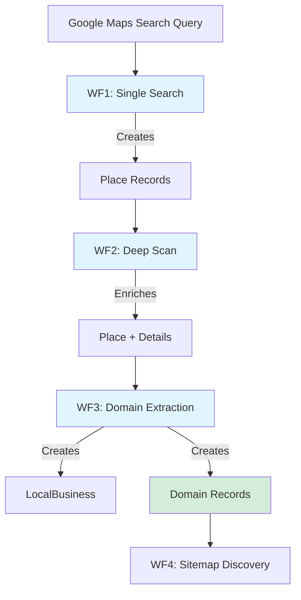

# WF1-3 Overview: Business Discovery & Domain Extraction
**Purpose:** Document the entry workflows (Google Maps → Domains)
**Last Updated:** November 17, 2025
**Related:** WF4_WF5_WF7_COMPLETE_INDEX.md

---

## Overview

WF1-3 represent the **entry point** of the ScraperSky data pipeline, transforming Google Maps business searches into validated domain records ready for sitemap discovery.



---

## WF1: Single Search (Google Maps)

### Purpose
Search Google Maps for businesses based on user queries, creating Place records with basic business information.

### Data Flow
```
User Query → Google Maps API → Place Records → Database
```

### Key Components

**Router:**
- **File:** `src/routers/google_maps_api.py`
- **Endpoint:** `POST /api/v3/google-maps-api/search/places`
- **Authentication:** JWT required

**Services:**
- **File:** `src/services/places/places_search_service.py`
- **File:** `src/services/places/places_service.py`
- **Purpose:** Interface with Google Maps API, store results

**Model:**
- **File:** `src/models/place.py`
- **Table:** `places`
- **Key Fields:**
  - `place_id` (Google's unique ID)
  - `name` (business name)
  - `formatted_address`
  - `website` (critical for WF3)
  - `rating`, `user_ratings_total`

### Configuration
```python
# From .env
GOOGLE_MAPS_API_KEY=your_google_maps_api_key_here

# In code
from src.config.settings import settings
api_key = settings.google_maps_api_key
```

### External Dependency
- **API:** Google Maps Places API
- **Cost:** ~$32 per 1,000 text searches
- **Rate Limits:** Per Google Cloud project
- **Documentation:** `Docs_Context7/External_APIs/Google_Maps_API_Documentation.md`

### Status Fields
Places use basic status tracking:
- **Status:** pending/running/complete/failed
- **No dual-status pattern** (unlike WF4-7)

---

## WF2: Deep Scan (Enrichment)

### Purpose
Enrich existing Place records with additional details from Google Maps API (photos, reviews, business hours, etc.).

### Data Flow
```
Place Record → Deep Scan Service → Google Maps API → Updated Place
```

### Key Components

**Scheduler:**
- **File:** `src/services/deep_scan_scheduler.py`
- **Interval:** Configurable
- **Pattern:** SDK scheduler loop
- **Trigger:** Places with specific status

**Service:**
- **File:** `src/services/places/places_deep_service.py`
- **Method:** `process_single_deep_scan(place_id, tenant_id)`
- **Purpose:** Fetch additional place details

**Model:**
- **File:** `src/models/place.py` (updates existing record)
- **Additional Fields Populated:**
  - `photos` (array of photo URLs)
  - `reviews` (user reviews)
  - `opening_hours`
  - `price_level`
  - Additional metadata

### Service Pattern
```python
# From deep_scan_scheduler.py lines 60-89
service = PlacesDeepService()
result = await service.process_single_deep_scan(
    place_id=str(place.place_id),
    tenant_id=str(place.tenant_id)
)
```

**Pattern:** Direct service call (✅ correct pattern from PATTERNS.md)

---

## WF3: Domain Extraction

### Purpose
Extract website domains from enriched Place records, creating LocalBusiness and Domain records for downstream sitemap discovery.

### Data Flow
```
Place (with website) → Domain Extraction → LocalBusiness + Domain → WF4
```

### Key Components

**Scheduler:**
- **File:** `src/services/domain_extraction_scheduler.py`
- **Pattern:** SDK scheduler loop
- **Test:** `tests/services/test_domain_extraction_scheduler.py`

**Models:**
- **LocalBusiness:** `src/models/local_business.py`
  - Links Place to Domain
  - Additional business metadata
- **Domain:** `src/models/domain.py`
  - Website domain (e.g., "example.com")
  - Sitemap analysis status fields
  - **Dual-status pattern:**
    - `sitemap_curation_status` (New/Selected/Rejected)
    - `sitemap_analysis_status` (queued/submitted/failed)

### Extraction Logic
1. Read `Place.website` field
2. Parse and normalize URL to domain
3. Check if domain already exists (deduplication)
4. Create LocalBusiness record (links Place → Domain)
5. Create Domain record with initial status
6. Domain becomes available for WF4

### Status Pattern
Domains created by WF3 have:
- `sitemap_curation_status = 'New'` (awaiting user decision)
- `sitemap_analysis_status = NULL` (not yet queued for processing)

When user selects domain in WF4 GUI:
- `sitemap_curation_status = 'Selected'`
- `sitemap_analysis_status = 'queued'` (auto-set, triggers WF4 processing)

---

## Database Relationships

```
places (WF1, WF2)
  ↓ 1:N
local_business (WF3)
  ↓ 1:N
domains (WF3 creates, WF4 processes)
  ↓ 1:N
sitemap_files (WF4)
  ↓ 1:N
pages (WF5)
```

### Schema Details
- **places.id** → **local_business.place_id** (FK)
- **local_business.id** → **domains.local_business_id** (FK)
- **domains.id** → **sitemap_files.domain_id** (FK)

---

## Common Patterns

### ✅ Correct Patterns Used

**1. Direct Service Calls**
```python
# From deep_scan_scheduler.py
service = PlacesDeepService()
result = await service.process_single_deep_scan(place_id, tenant_id)
```

**2. SDK Scheduler Loop**
```python
# From domain_extraction_scheduler.py
await run_job_loop(
    model=Domain,
    status_enum=StatusEnum,
    processing_function=service.extract_domain,
    ...
)
```

**3. Async Session Management**
- Services receive `AsyncSession` from scheduler
- No manual commits (SDK handles transactions)

### ⚠️ Differences from WF4-7

**No Dual-Status Pattern (WF1-2):**
- Places use single `status` field
- Simpler workflow (no user curation)

**Dual-Status Pattern (WF3):**
- Domains use both curation and processing status
- Follows same pattern as WF4-7

---

## Health Checks

### Verify WF1-3 Pipeline

```sql
-- Check recent Place creation (WF1)
SELECT COUNT(*) FROM places
WHERE created_at > NOW() - INTERVAL '24 hours';

-- Check Place enrichment (WF2)
SELECT COUNT(*) FROM places
WHERE photos IS NOT NULL
AND created_at > NOW() - INTERVAL '24 hours';

-- Check Domain extraction (WF3)
SELECT COUNT(*) FROM domains
WHERE created_at > NOW() - INTERVAL '24 hours';

-- Check LocalBusiness linking
SELECT COUNT(*) FROM local_business
WHERE created_at > NOW() - INTERVAL '24 hours';

-- Verify WF3 → WF4 handoff
SELECT COUNT(*) FROM domains
WHERE sitemap_curation_status = 'New'
AND created_at > NOW() - INTERVAL '24 hours';
```

### Expected Flow
1. **WF1 creates Places** (dozens per search)
2. **WF2 enriches Places** (within minutes/hours)
3. **WF3 extracts Domains** (if Place has website)
4. **Domains ready for WF4** (status = 'New')

---

## External Dependencies

### Google Maps API (Critical for WF1-2)
- **Used By:** WF1 (search), WF2 (enrichment)
- **Cost:** ~$32-50 per 1,000 requests
- **Rate Limits:** Per Google Cloud project
- **Failure Impact:** WF1-2 stop, no new businesses discovered
- **Mitigation:** Cache results, implement retry logic

**Reference:** [DEPENDENCY_MAP.md](../Context_Reconstruction/DEPENDENCY_MAP.md#google-maps-api)

---

## Investigation Commands

### Find WF1 Services
```bash
find src/ -name "*places*service*.py"
grep -r "google.*maps" src/routers/
grep -r "PlacesService" src/
```

### Find WF2 Services
```bash
find src/ -name "*deep*scan*.py"
grep -r "PlacesDeepService" src/
```

### Find WF3 Services
```bash
find src/ -name "*domain*extract*.py"
grep -r "LocalBusiness" src/models/
grep -r "domain_extraction_scheduler" src/
```

---

## Known Gaps & Improvements

### WF1: Single Search
- [ ] Implement caching for common queries (cost reduction)
- [ ] Add rate limit monitoring
- [ ] Document search result pagination
- [ ] Add retry logic for API failures

### WF2: Deep Scan
- [ ] Document enrichment scheduler configuration
- [ ] Add monitoring for enrichment failures
- [ ] Optimize API call batching

### WF3: Domain Extraction
- [ ] Document URL normalization logic
- [ ] Add domain validation rules
- [ ] Implement duplicate domain handling
- [ ] Document LocalBusiness purpose and usage

---

## Next Steps

After WF3 creates Domain records, the pipeline continues:
- **WF4:** Sitemap Discovery (find sitemap.xml files)
- **WF5:** Sitemap Import (parse sitemaps, extract URLs)
- **WF7:** Page Curation (scrape contacts)

**Note:** There is no WF6. The numbering skips from WF5 to WF7.

**Reference:** [WF4_WF5_WF7_COMPLETE_INDEX.md](./WF4_WF5_WF7_COMPLETE_INDEX.md)

---

## Related Documentation

- **Detailed WF4-7:** [WF4_WF5_WF7_COMPLETE_INDEX.md](./WF4_WF5_WF7_COMPLETE_INDEX.md)
- **System Map:** [SYSTEM_MAP.md](../Context_Reconstruction/SYSTEM_MAP.md)
- **Quick Start:** [QUICK_START.md](../Context_Reconstruction/QUICK_START.md)
- **Patterns:** [PATTERNS.md](../Context_Reconstruction/PATTERNS.md)
- **Dependencies:** [DEPENDENCY_MAP.md](../Context_Reconstruction/DEPENDENCY_MAP.md)

---

**Last Updated:** November 17, 2025
**Status:** Basic overview complete, detailed service documentation in WO-007
