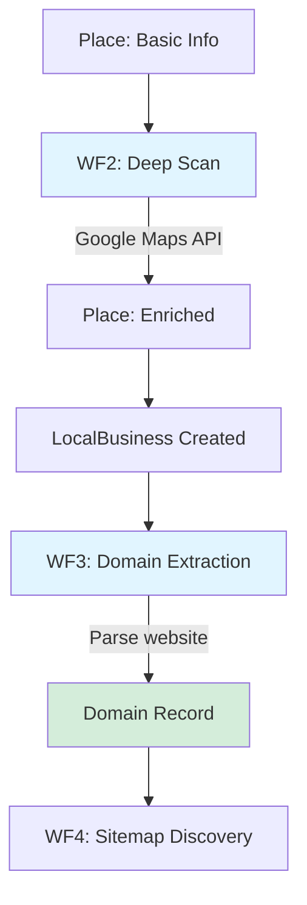

# WF2-3: Enrichment & Extraction (Deep Scan → Domain Creation)
**Purpose:** Enrich Place data and extract domains for sitemap discovery
**Last Updated:** November 17, 2025
**Part of:** Complete WF1-7 Pipeline Documentation

---

## Overview

WF2 and WF3 transform basic Place records from WF1 into enriched business data and domain records ready for sitemap discovery:

- **WF2 (Deep Scan):** Enrich Place records with photos, reviews, hours from Google Maps
- **WF3 (Domain Extraction):** Extract website domains, create Domain records for WF4

Both workflows use the **SDK scheduler loop pattern** for fault-tolerant background processing.



---

## WF2: Deep Scan (Place Enrichment)

### Purpose
Enrich Place records with additional business details from Google Maps API:
- Photos and images
- Customer reviews
- Business hours (opening_hours)
- Additional metadata

### Status
✅ **WORKING** (Scheduled background processing)

### Components

**Scheduler:**
- **File:** `src/services/deep_scan_scheduler.py`
- **Interval:** Configurable via settings
- **Model:** `Place`
- **Status Field:** `deep_scan_status`

**Service:**
- **File:** `src/services/places/places_deep_service.py`
- **Method:** `process_single_deep_scan(place_id, tenant_id)`

**Model Fields Updated:**
```python
class Place(Base):
    # Populated by WF2
    photos: JSONB                 # Photo URLs
    reviews: JSONB                # Customer reviews
    opening_hours: JSONB          # Business hours
    price_level: Optional[int]    # Price indicator

    # Status tracking
    deep_scan_status: Enum        # Queued/Processing/Completed/Error
    deep_scan_error: Optional[str]
```

### Scheduler Pattern (SDK Loop)

```python
# deep_scan_scheduler.py:90-120
async def process_deep_scan_queue():
    """Process places queued for deep scan using SDK job loop."""
    try:
        await run_job_loop(
            model=Place,
            status_enum=GcpApiDeepScanStatusEnum,
            queued_status=GcpApiDeepScanStatusEnum.Queued,
            processing_status=GcpApiDeepScanStatusEnum.Processing,
            completed_status=GcpApiDeepScanStatusEnum.Completed,
            failed_status=GcpApiDeepScanStatusEnum.Error,
            processing_function=process_single_deep_scan_wrapper,
            batch_size=settings.DEEP_SCAN_SCHEDULER_BATCH_SIZE,
            order_by_column=asc(Place.updated_at),
            status_field_name="deep_scan_status",
            error_field_name="deep_scan_error",
        )
    except Exception as e:
        logger.exception(f"Critical error in deep scan scheduler: {e}")
```

**Critical Pattern:** Uses SDK `run_job_loop` for fault-isolated processing

### Configuration
```bash
# From .env
DEEP_SCAN_SCHEDULER_INTERVAL_SECONDS=300
DEEP_SCAN_SCHEDULER_BATCH_SIZE=10
DEEP_SCAN_SCHEDULER_MAX_INSTANCES=1
```

### Health Check
```sql
-- Check queued places
SELECT COUNT(*) FROM places WHERE deep_scan_status = 'Queued';

-- Check completed enrichments
SELECT COUNT(*) FROM places
WHERE deep_scan_status = 'Completed'
AND updated_at > NOW() - INTERVAL '24 hours';

-- Check for errors
SELECT id, name, deep_scan_error FROM places
WHERE deep_scan_status = 'Error'
ORDER BY updated_at DESC LIMIT 10;
```

---

## WF3: Domain Extraction

### Purpose
Extract website domains from enriched Place/LocalBusiness records and create Domain records for sitemap discovery (WF4).

### Data Flow
```
Place (with website)
  ↓ (WF2 creates)
LocalBusiness
  ↓ (WF3 extracts)
Domain Record (ready for WF4)
```

### Status
✅ **WORKING** (Scheduled background processing)

### Components

**Scheduler:**
- **File:** `src/services/domain_extraction_scheduler.py`
- **Interval:** Configurable via settings
- **Model:** `LocalBusiness`
- **Status Field:** `domain_extraction_status`

**Service:**
- **File:** `src/services/business_to_domain_service.py`
- **Class:** `LocalBusinessToDomainService`
- **Method:** `create_pending_domain_from_local_business(local_business_id, session)`

**Models:**

```python
class LocalBusiness(Base):
    id: UUID
    place_id: str                 # Link to Place
    website_url: Optional[str]    # Critical for extraction!

    # Status tracking
    domain_extraction_status: Enum  # Queued/Processing/Completed/Error
    domain_extraction_error: Optional[str]

class Domain(Base):
    id: UUID
    domain: str                   # Extracted domain (e.g., "example.com")
    local_business_id: UUID       # FK to LocalBusiness

    # Dual-status pattern starts here!
    sitemap_curation_status: Enum # New/Selected/Rejected
    sitemap_analysis_status: Enum # queued/submitted/failed
```

### Scheduler Pattern (SDK Loop)

```python
# domain_extraction_scheduler.py:90-120
async def process_domain_extraction_queue():
    """Process local businesses queued for domain extraction using SDK job loop."""
    try:
        await run_job_loop(
            model=LocalBusiness,
            status_enum=DomainExtractionStatusEnum,
            queued_status=DomainExtractionStatusEnum.Queued,
            processing_status=DomainExtractionStatusEnum.Processing,
            completed_status=DomainExtractionStatusEnum.Completed,
            failed_status=DomainExtractionStatusEnum.Error,
            processing_function=process_domain_extraction_wrapper,
            batch_size=settings.DOMAIN_EXTRACTION_SCHEDULER_BATCH_SIZE,
            order_by_column=asc(LocalBusiness.updated_at),
            status_field_name="domain_extraction_status",
            error_field_name="domain_extraction_error",
        )
    except Exception as e:
        logger.exception(f"Critical error in domain extraction scheduler: {e}")
```

### Domain Extraction Logic

```python
# business_to_domain_service.py (conceptual)
async def create_pending_domain_from_local_business(
    local_business_id: UUID,
    session: AsyncSession
) -> bool:
    """Extract domain from LocalBusiness website and create Domain record."""

    # 1. Fetch LocalBusiness
    business = await session.get(LocalBusiness, local_business_id)

    # 2. Parse website URL
    domain = extract_domain_from_url(business.website_url)

    # 3. Check if domain already exists (deduplication)
    existing = await session.execute(
        select(Domain).where(Domain.domain == domain)
    )
    if existing.scalar_one_or_none():
        logger.info(f"Domain {domain} already exists")
        return True

    # 4. Create Domain record with initial status
    domain_record = Domain(
        id=uuid.uuid4(),
        domain=domain,
        local_business_id=local_business_id,
        sitemap_curation_status='New',      # Awaiting user decision
        sitemap_analysis_status=None,       # Not yet queued
        created_at=datetime.utcnow()
    )
    session.add(domain_record)

    return True
```

### Dual-Status Pattern Begins

**WF3 creates Domain records with dual-status:**

```python
# Initial state after WF3
Domain(
    domain="example.com",
    sitemap_curation_status='New',      # User decision: not yet made
    sitemap_analysis_status=None,       # System processing: not started
)

# After user selects in WF4 GUI
Domain(
    sitemap_curation_status='Selected', # User decision: approved
    sitemap_analysis_status='queued',   # System processing: queued for WF4
)
```

**Pattern Reference:** Same as [WF4 Dual-Status Pattern](./WF4_WF5_WF7_COMPLETE_INDEX.md#dual-status-pattern)

### Configuration
```bash
# From .env
DOMAIN_EXTRACTION_SCHEDULER_INTERVAL_SECONDS=300
DOMAIN_EXTRACTION_SCHEDULER_BATCH_SIZE=10
DOMAIN_EXTRACTION_SCHEDULER_MAX_INSTANCES=1
```

### Health Check
```sql
-- Check queued businesses
SELECT COUNT(*) FROM local_business
WHERE domain_extraction_status = 'Queued';

-- Check completed extractions
SELECT COUNT(*) FROM domains
WHERE created_at > NOW() - INTERVAL '24 hours';

-- Check domains awaiting curation
SELECT COUNT(*) FROM domains
WHERE sitemap_curation_status = 'New';

-- Verify LocalBusiness → Domain linkage
SELECT lb.website_url, d.domain
FROM local_business lb
JOIN domains d ON d.local_business_id = lb.id
LIMIT 5;
```

---

## Common Patterns

### ✅ SDK Scheduler Loop (Both Workflows)

**Pattern Used:** `run_job_loop` from curation SDK

**Benefits:**
- Fault isolation (crash doesn't affect other workflows)
- Automatic status management
- Error handling with failed status
- Configurable batch size and intervals

**Standard Implementation:**
```python
await run_job_loop(
    model=ModelClass,
    status_enum=StatusEnum,
    queued_status=StatusEnum.Queued,
    processing_status=StatusEnum.Processing,
    completed_status=StatusEnum.Completed,
    failed_status=StatusEnum.Error,
    processing_function=wrapper_function,
    batch_size=settings.BATCH_SIZE,
    order_by_column=asc(ModelClass.updated_at),
    status_field_name="status_field",
    error_field_name="error_field",
)
```

**Reference:** [PATTERNS.md - SDK Scheduler Loop](../Context_Reconstruction/PATTERNS.md)

### ✅ Wrapper Pattern

Both schedulers use adapter wrappers to bridge services with SDK:

```python
async def process_single_xxx_wrapper(item_id: UUID, session: AsyncSession) -> None:
    """Adapter wrapper for service to work with run_job_loop SDK."""

    # SDK passes session without active transaction
    async with session.begin():
        # 1. Fetch item
        item = await session.get(Model, item_id)

        # 2. Call service
        service = Service()
        success = await service.process(item)

        # 3. Update status
        if success:
            item.status = StatusEnum.Completed
        else:
            item.status = StatusEnum.Error
            item.error = "Processing failed"
```

**Why Needed:** Existing services have different signatures than SDK expects

---

## Testing

### WF2 Deep Scan Tests
```bash
# Run WF2 scheduler tests
pytest tests/services/test_deep_scan_scheduler.py -v

# Manual verification
psql -c "SELECT COUNT(*) FROM places WHERE deep_scan_status = 'Completed';"
```

### WF3 Domain Extraction Tests
```bash
# Run WF3 scheduler tests
pytest tests/services/test_domain_extraction_scheduler.py -v

# Manual verification
psql -c "SELECT domain, sitemap_curation_status FROM domains LIMIT 10;"
```

---

## Known Issues & Improvements

### WF2: Deep Scan
- [ ] Document Google Maps API Deep Details endpoint costs
- [ ] Add retry logic for API failures
- [ ] Implement caching for common place details
- [ ] Monitor enrichment success rate

### WF3: Domain Extraction
- [ ] Document URL normalization logic details
- [ ] Add domain validation (valid TLD, reachable, etc.)
- [ ] Implement duplicate domain handling strategy
- [ ] Add metrics for extraction success rate
- [ ] Document LocalBusiness creation trigger

---

## Next Workflow

After WF3 creates Domain records:
- **WF4: Sitemap Discovery** - Find sitemap.xml files
- **File:** [WF4_WF5_WF7_COMPLETE_INDEX.md](./WF4_WF5_WF7_COMPLETE_INDEX.md)

---

## Related Documentation

- **WF1 Single Search:** [WF1_SINGLE_SEARCH.md](./WF1_SINGLE_SEARCH.md)
- **WF4-7 Complete Index:** [WF4_WF5_WF7_COMPLETE_INDEX.md](./WF4_WF5_WF7_COMPLETE_INDEX.md)
- **System Map:** [SYSTEM_MAP.md](../Context_Reconstruction/SYSTEM_MAP.md)
- **Patterns:** [PATTERNS.md](../Context_Reconstruction/PATTERNS.md)
- **SDK Documentation:** `src/common/curation_sdk/`

---

**Last Updated:** November 17, 2025
**Status:** Documented (schedulers operational)
**Note:** Combined WF2-3 doc for efficiency; detailed service docs in WO-007 follow-up if needed
