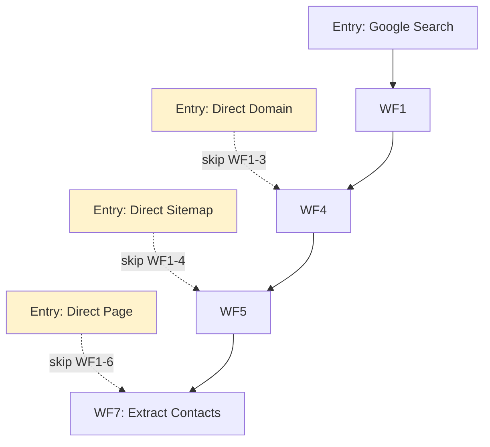

# ScraperSky Extensibility Patterns
**Purpose:** How to add new entry points and extend workflows
**Last Updated:** November 17, 2025
**Audience:** Developers adding features, direct submission endpoints

---

## Overview

This guide documents **how to extend ScraperSky** by adding new entry points that bypass earlier workflows. Common use cases:
- Direct Page submission (user has URLs, bypass WF1-6)
- Direct Domain submission (user has domains, bypass WF1-3)
- Direct Sitemap submission (user has sitemap URLs, bypass WF1-4)

### Philosophy
ScraperSky workflows are **composable** - you can enter at any point and leverage downstream processing.



---

## Pattern 1: Direct Page Submission

### Use Case
User has a list of URLs and wants to scrape them directly, bypassing sitemap discovery.

**Skip:** WF1→WF6 (Google Maps → Sitemap Import)
**Enter at:** WF7 (Page Curation)

### Implementation Steps

#### Step 1: Create API Endpoint (Layer 3)

**File:** `src/routers/v3/pages_direct_submission.py`

```python
from fastapi import APIRouter, Depends, HTTPException
from pydantic import BaseModel, HttpUrl
from sqlalchemy.ext.asyncio import AsyncSession
from typing import List
import uuid
from datetime import datetime

from src.auth.jwt_auth import get_current_user
from src.db.session import get_db_session
from src.models.page import Page
from src.models.enums import PageCurationStatus, PageProcessingStatus

router = APIRouter(prefix="/api/v3/pages", tags=["V3 - Direct Submission"])


class DirectPageSubmissionRequest(BaseModel):
    urls: List[HttpUrl]           # List of URLs to scrape
    domain_id: Optional[UUID] = None  # Optional: link to domain
    auto_queue: bool = True       # Auto-queue for processing


class DirectPageSubmissionResponse(BaseModel):
    submitted_count: int
    page_ids: List[UUID]
    message: str


@router.post("/direct-submit", response_model=DirectPageSubmissionResponse)
async def submit_pages_directly(
    request: DirectPageSubmissionRequest,
    session: AsyncSession = Depends(get_db_session),
    current_user: Dict = Depends(get_current_user),
):
    """
    Submit pages directly for WF7 processing (bypass sitemap discovery).

    This endpoint allows users with known URLs to:
    1. Create Page records directly
    2. Optionally auto-queue for WF7 contact extraction
    3. Bypass WF1-6 entirely

    Returns:
        Response with created page IDs
    """
    page_ids = []

    # Router owns transaction boundary
    async with session.begin():
        for url in request.urls:
            # Create Page record with correct initial status
            page = Page(
                id=uuid.uuid4(),
                url=str(url),
                domain_id=request.domain_id,

                # Status initialization (CRITICAL!)
                page_curation_status=(
                    PageCurationStatus.Selected if request.auto_queue
                    else PageCurationStatus.New
                ),
                page_processing_status=(
                    PageProcessingStatus.Queued if request.auto_queue
                    else None  # Will be queued when user curates
                ),

                # Audit
                created_at=datetime.utcnow(),
                user_id=current_user.get("user_id"),
            )
            session.add(page)
            page_ids.append(page.id)

    return DirectPageSubmissionResponse(
        submitted_count=len(page_ids),
        page_ids=page_ids,
        message=f"Submitted {len(page_ids)} pages for processing"
    )
```

**Critical Decisions:**

1. **Status Initialization:**
   ```python
   # If auto_queue=True (immediate processing):
   page_curation_status = PageCurationStatus.Selected
   page_processing_status = PageProcessingStatus.Queued

   # If auto_queue=False (manual curation):
   page_curation_status = PageCurationStatus.New
   page_processing_status = None
   ```

2. **Dual-Status Pattern:** Follow WF7 pattern for consistency
3. **domain_id:** Optional - allow pages without domain linkage

#### Step 2: Register Router in main.py

```python
# src/main.py
from src.routers.v3 import pages_direct_submission

app.include_router(pages_direct_submission.router)
```

#### Step 3: Test

```bash
# Submit pages with auto-queue
curl -X POST http://localhost:8000/api/v3/pages/direct-submit \
  -H "Content-Type: application/json" \
  -H "Authorization: Bearer YOUR_JWT_TOKEN" \
  -d '{
    "urls": [
      "https://example.com/contact",
      "https://example.com/about"
    ],
    "auto_queue": true
  }'

# Verify pages queued for WF7
psql -c "SELECT url, page_processing_status FROM pages WHERE page_processing_status = 'Queued';"
```

#### Step 4: Verify WF7 Picks Up

**Expected:** WF7 scheduler processes queued pages automatically

```sql
-- Check WF7 processing
SELECT url, page_processing_status, scraped_content
FROM pages
WHERE id IN (...);
```

---

## Pattern 2: Direct Domain Submission

### Use Case
User has a list of domains and wants to discover sitemaps, bypassing Google Maps search.

**Skip:** WF1→WF3 (Google Maps → Domain Extraction)
**Enter at:** WF4 (Sitemap Discovery)

### Implementation Steps

#### Step 1: Create API Endpoint

**File:** `src/routers/v3/domains_direct_submission.py`

```python
from fastapi import APIRouter, Depends
from pydantic import BaseModel
from sqlalchemy.ext.asyncio import AsyncSession
from typing import List
import uuid
from datetime import datetime

from src.models.domain import Domain, SitemapCurationStatusEnum, SitemapAnalysisStatusEnum

router = APIRouter(prefix="/api/v3/domains", tags=["V3 - Direct Submission"])


class DirectDomainSubmissionRequest(BaseModel):
    domains: List[str]            # List of domains (e.g., ["example.com"])
    auto_queue: bool = True       # Auto-queue for sitemap discovery


@router.post("/direct-submit")
async def submit_domains_directly(
    request: DirectDomainSubmissionRequest,
    session: AsyncSession = Depends(get_db_session),
    current_user: Dict = Depends(get_current_user),
):
    """
    Submit domains directly for WF4 sitemap discovery.

    Creates Domain records with proper dual-status initialization.
    """
    domain_ids = []

    async with session.begin():
        for domain_str in request.domains:
            # Check if domain already exists (deduplication)
            existing = await session.execute(
                select(Domain).where(Domain.domain == domain_str)
            )
            if existing.scalar_one_or_none():
                logger.info(f"Domain {domain_str} already exists, skipping")
                continue

            # Create Domain record
            domain = Domain(
                id=uuid.uuid4(),
                domain=domain_str,

                # Dual-status initialization (CRITICAL!)
                sitemap_curation_status=(
                    SitemapCurationStatusEnum.Selected if request.auto_queue
                    else SitemapCurationStatusEnum.New
                ),
                sitemap_analysis_status=(
                    SitemapAnalysisStatusEnum.queued if request.auto_queue
                    else None
                ),

                created_at=datetime.utcnow(),
                user_id=current_user.get("user_id"),
            )
            session.add(domain)
            domain_ids.append(domain.id)

    return {
        "submitted_count": len(domain_ids),
        "domain_ids": domain_ids,
        "message": f"Submitted {len(domain_ids)} domains"
    }
```

**Critical Pattern:** When `sitemap_curation_status = 'Selected'` → `sitemap_analysis_status = 'queued'`

**This triggers WF4 adapter service automatically!**

#### Step 2: Verify WF4 Picks Up

```sql
-- Check domains queued for WF4
SELECT domain, sitemap_curation_status, sitemap_analysis_status
FROM domains
WHERE sitemap_analysis_status = 'queued';

-- After WF4 runs:
SELECT d.domain, COUNT(sf.id) as sitemap_count
FROM domains d
LEFT JOIN sitemap_files sf ON sf.domain_id = d.id
GROUP BY d.domain;
```

**Expected:** WF4 scheduler processes queued domains, creates sitemap_files

---

## Pattern 3: Direct Sitemap Submission

### Use Case
User has sitemap URLs and wants to import them directly.

**Skip:** WF1→WF4 (Google Maps → Sitemap Discovery)
**Enter at:** WF5 (Sitemap Curation) or WF6 (Sitemap Import)

### Implementation Steps

#### Step 1: Create API Endpoint

**File:** `src/routers/v3/sitemaps_direct_submission.py`

```python
from src.models.sitemap_file import SitemapFile, SitemapImportProcessStatusEnum

router = APIRouter(prefix="/api/v3/sitemaps", tags=["V3 - Direct Submission"])


class DirectSitemapSubmissionRequest(BaseModel):
    sitemap_urls: List[HttpUrl]
    domain_id: Optional[UUID] = None
    auto_import: bool = True      # Auto-import URLs from sitemap


@router.post("/direct-submit")
async def submit_sitemaps_directly(
    request: DirectSitemapSubmissionRequest,
    session: AsyncSession = Depends(get_db_session),
    current_user: Dict = Depends(get_current_user),
):
    """
    Submit sitemap URLs directly for WF6 import.

    Creates SitemapFile records and optionally queues for import.
    """
    sitemap_ids = []

    async with session.begin():
        for sitemap_url in request.sitemap_urls:
            sitemap_file = SitemapFile(
                id=uuid.uuid4(),
                url=str(sitemap_url),
                domain_id=request.domain_id,

                # Status initialization
                sitemap_import_status=(
                    SitemapImportProcessStatusEnum.Queued if request.auto_import
                    else None  # WF5 curation needed
                ),

                created_at=datetime.utcnow(),
                user_id=current_user.get("user_id"),
            )
            session.add(sitemap_file)
            sitemap_ids.append(sitemap_file.id)

    return {
        "submitted_count": len(sitemap_ids),
        "sitemap_ids": sitemap_ids
    }
```

**Note:** This addresses **Gap #1** from [WF4_WF5_WF7_GAPS_IMPROVEMENTS.md](../Architecture/WF4_WF5_WF7_GAPS_IMPROVEMENTS.md#1-sitemap-files-not-auto-queued)

#### Step 2: Verify WF6 Picks Up

```sql
-- Check sitemaps queued for WF6
SELECT url, sitemap_import_status
FROM sitemap_files
WHERE sitemap_import_status = 'Queued';

-- After WF6 runs:
SELECT sf.url, COUNT(p.id) as page_count
FROM sitemap_files sf
LEFT JOIN pages p ON p.sitemap_file_id = sf.id
GROUP BY sf.url;
```

---

## Common Pitfalls to Avoid

### ❌ Wrong: Skipping Status Initialization

```python
# WRONG - Will never process!
page = Page(
    url="https://example.com/contact",
    # Missing status fields!
)
```

**Problem:** Page created but never queued for processing

### ✅ Correct: Proper Status Initialization

```python
# CORRECT - Will process automatically
page = Page(
    url="https://example.com/contact",
    page_curation_status=PageCurationStatus.Selected,
    page_processing_status=PageProcessingStatus.Queued,
)
```

### ❌ Wrong: Breaking Dual-Status Pattern

```python
# WRONG - Inconsistent status
domain = Domain(
    domain="example.com",
    sitemap_curation_status=SitemapCurationStatusEnum.New,
    sitemap_analysis_status=SitemapAnalysisStatusEnum.queued,  # MISMATCH!
)
```

**Problem:** Violates dual-status pattern (Selected → Queued rule)

### ✅ Correct: Consistent Dual-Status

```python
# CORRECT - Status fields aligned
domain = Domain(
    domain="example.com",
    sitemap_curation_status=SitemapCurationStatusEnum.Selected,  # User decision
    sitemap_analysis_status=SitemapAnalysisStatusEnum.queued,    # System action
)
```

**Rule:** `curation_status = 'Selected'` → `processing_status = 'Queued'`

### ❌ Wrong: HTTP Call to Trigger Processing

```python
# WRONG - Don't use HTTP between services
async with httpx.AsyncClient() as client:
    await client.post("http://localhost:8000/internal/trigger-wf7")
```

**Problem:** HTTP calls create transaction issues, no background tasks

### ✅ Correct: Status Field Triggers Scheduler

```python
# CORRECT - Let scheduler pick up via status
page.page_processing_status = PageProcessingStatus.Queued
# Scheduler automatically processes on next run
```

---

## Deduplication Strategies

### Check Before Creating

```python
# Always check for existing records
existing = await session.execute(
    select(Domain).where(Domain.domain == domain_str)
)
if existing.scalar_one_or_none():
    logger.info(f"Domain {domain_str} already exists")
    return existing_id

# Only create if doesn't exist
domain = Domain(...)
session.add(domain)
```

### Handle Unique Constraint Violations

```python
from sqlalchemy.exc import IntegrityError

try:
    session.add(domain)
    await session.commit()
except IntegrityError:
    await session.rollback()
    logger.warning(f"Domain {domain} already exists (unique constraint)")
    # Fetch existing record instead
```

---

## Testing Your Extension

### 1. Unit Test the Endpoint

```python
# tests/routers/test_pages_direct_submission.py
async def test_direct_page_submission():
    response = client.post("/api/v3/pages/direct-submit", json={
        "urls": ["https://example.com/contact"],
        "auto_queue": True
    })
    assert response.status_code == 200
    assert response.json()["submitted_count"] == 1
```

### 2. Integration Test (End-to-End)

```bash
# 1. Submit pages
curl -X POST http://localhost:8000/api/v3/pages/direct-submit \
  -d '{"urls": ["https://example.com/test"], "auto_queue": true}'

# 2. Wait for scheduler cycle (or trigger manually)
sleep 10

# 3. Verify processing
psql -c "SELECT url, page_processing_status FROM pages WHERE url LIKE '%example.com/test%';"

# Expected: page_processing_status = 'Complete'
```

### 3. Verify Downstream Workflows

```sql
-- Check complete flow
SELECT
    p.url,
    p.page_curation_status,
    p.page_processing_status,
    p.scraped_content IS NOT NULL as has_contacts
FROM pages p
WHERE p.url = 'https://example.com/test';
```

---

## Complete Example: Bulk Import Script

```python
#!/usr/bin/env python3
"""
Bulk import pages from CSV file.

Usage:
    python bulk_import_pages.py pages.csv
"""

import asyncio
import csv
import httpx
from typing import List

API_BASE = "http://localhost:8000"
JWT_TOKEN = "your-token-here"


async def bulk_import_pages(csv_file: str):
    """Import pages from CSV file."""

    # Read URLs from CSV
    urls = []
    with open(csv_file, 'r') as f:
        reader = csv.DictReader(f)
        for row in reader:
            urls.append(row['url'])

    # Submit in batches of 100
    batch_size = 100
    async with httpx.AsyncClient() as client:
        for i in range(0, len(urls), batch_size):
            batch = urls[i:i+batch_size]

            response = await client.post(
                f"{API_BASE}/api/v3/pages/direct-submit",
                json={
                    "urls": batch,
                    "auto_queue": True
                },
                headers={"Authorization": f"Bearer {JWT_TOKEN}"}
            )

            print(f"Batch {i//batch_size + 1}: {response.json()}")


if __name__ == "__main__":
    import sys
    asyncio.run(bulk_import_pages(sys.argv[1]))
```

---

## Summary Checklist

When adding a new direct submission endpoint:

- [ ] Create router with proper Layer 3 pattern
- [ ] Initialize status fields correctly (dual-status if applicable)
- [ ] Handle deduplication (check existing records)
- [ ] Implement proper transaction boundaries
- [ ] Add authentication (JWT)
- [ ] Write unit tests
- [ ] Write integration tests
- [ ] Document in API docs
- [ ] Update SYSTEM_MAP.md with new entry point

---

## Related Documentation

- **Patterns:** [PATTERNS.md](./PATTERNS.md) - Dual-status pattern, service communication
- **WF4-7 Index:** [WF4_WF5_WF7_COMPLETE_INDEX.md](../Architecture/WF4_WF5_WF7_COMPLETE_INDEX.md) - Understanding downstream workflows
- **Gaps:** [WF4_WF5_WF7_GAPS_IMPROVEMENTS.md](../Architecture/WF4_WF5_WF7_GAPS_IMPROVEMENTS.md) - Known issues to avoid

---

**Last Updated:** November 17, 2025
**Status:** Complete extensibility guide
**Usage:** Reference when adding new entry points or workflows
