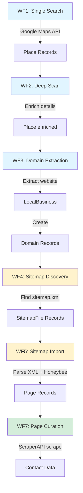

# ScraperSky System Map
**Purpose:** Complete architecture overview  
**Last Updated:** November 17, 2025

---

## Complete Data Flow (All 7 Workflows)

### Visual Flow Diagram



### Text Flow

```
WF1: Single Search (Google Maps)
    ↓ Google Maps API
Place (Google Maps data)
    ↓
WF2: Deep Scan (enrichment)
    ↓ Additional API calls
Place (enriched with photos, reviews, hours)
    ↓
WF3: Domain Extraction
    ↓ Extract website field
LocalBusiness → Domain
    ↓
WF4: Sitemap Discovery/Curation
    ↓ Try common sitemap paths
Domain → SitemapFile (1:N)
    ↓
WF5: Sitemap Import
    ↓ Parse XML, extract URLs, Honeybee categorization
SitemapFile → Page (1:N)
    ↓
WF7: Page Curation / Contact Extraction
    ↓ ScraperAPI + regex extraction
Page → Contacts (in scraped_content JSONB)
```

**Note:** There is NO WF6 workflow. References to "WF6" in code comments are outdated. WF5 handles all sitemap import functionality.

---

## Database Tables

### Core Tables
1. **places** - Google Maps data (WF1, WF2)
2. **local_business** - Extracted business info (WF3)
3. **domains** - Discovered domains (WF3, WF4)
4. **sitemap_files** - Discovered sitemaps (WF4, WF5)
5. **pages** - Individual URLs (WF5, WF7)
6. **jobs** - Background job tracking (WF4)

### Relationships
```
places (1) → (N) local_business
local_business (1) → (N) domains
domains (1) → (N) sitemap_files
sitemap_files (1) → (N) pages
```

**Detailed Schema:** [WF4_WF5_WF7_DATABASE_SCHEMA.md](../Architecture/WF4_WF5_WF7_DATABASE_SCHEMA.md)

---

## Services by Workflow

### WF1: Single Search
**Status:** Needs documentation  
**Tables:** places  
**Find services:** `find src/ -name "*WF1*" -o -name "*single*search*"`

### WF2: Deep Scan
**Status:** Needs documentation  
**Tables:** places  
**Find services:** `find src/ -name "*WF2*" -o -name "*deep*scan*"`

### WF3: Domain Extraction
**Status:** Needs documentation  
**Tables:** local_business, domains  
**Find services:** `find src/ -name "*WF3*" -o -name "*domain*extract*"`

### WF4: Sitemap Discovery
**Services:**
- `DomainToSitemapAdapterService` - Bridges WF3→WF4
- `SitemapProcessingService` - Discovers sitemaps

**Tables:** domains → sitemap_files  
**Scheduler:** domain_sitemap_submission_scheduler (1 min)  
**Details:** [WF4_WF5_WF7_SERVICES.md](../Architecture/WF4_WF5_WF7_SERVICES.md#wf4-services)

### WF5: Sitemap Import
**Services:**
- `SitemapImportService` - Extracts URLs from sitemaps

**Tables:** sitemap_files → pages
**Scheduler:** sitemap_import_scheduler (configurable)
**Details:** [WF4_WF5_WF7_SERVICES.md](../Architecture/WF4_WF5_WF7_SERVICES.md#wf5-services)

**Note:** There is no WF6. The numbering skips from WF5 to WF7.

### WF7: Page Curation
**Services:**
- `PageCurationService` - Scrapes pages, extracts contacts

**Tables:** pages (updates scraped_content)  
**Scheduler:** WF7_V2_L4_2of2_PageCurationScheduler (configurable)  
**Details:** [WF4_WF5_WF7_SERVICES.md](../Architecture/WF4_WF5_WF7_SERVICES.md#wf7-services)

---

## Schedulers

| Scheduler | Interval | Processes | Creates | Status Field |
|-----------|----------|-----------|---------|--------------|
| Domain Sitemap Submission | 1 min | domains (queued) | jobs, sitemap_files | sitemap_analysis_status |
| Sitemap Import | Config | sitemap_files (Queued) | pages | sitemap_import_status |
| Page Curation | Config | pages (Queued) | scraped_content | page_processing_status |

**Configuration:** See `src/config/settings.py` for intervals and batch sizes

---

## API Endpoints

### WF4: Domain Curation
- `GET /api/v3/domains` - List domains
- `PUT /api/v3/domains/status` - Batch update
- `PUT /api/v3/domains/status/filtered` - Update all matching filters

**Router:** `src/routers/v3/WF4_V3_L3_1of1_DomainsRouter.py`

### WF5: Sitemap Curation
- `GET /api/v3/sitemaps` - List sitemaps
- `PUT /api/v3/sitemaps/status` - Batch update

**Router:** `src/routers/v3/WF5_V3_L3_1of1_SitemapRouter.py`

### WF7: Page Curation
- `GET /api/v3/pages` - List pages
- `PUT /api/v3/pages/status` - Batch update
- `PUT /api/v3/pages/status/filtered` - Update all matching filters

**Router:** `src/routers/v3/WF7_V3_L3_1of1_PagesRouter.py`

---

## Status Fields & State Machines

### domains.sitemap_analysis_status
```
NULL → queued → submitted → (terminal)
  ↓                ↓
failed ←──────────┘
```

### sitemap_files.sitemap_import_status
```
NULL → Queued → Processing → Complete
  ↓       ↓          ↓
  └───────┴──────────→ Error
```

### pages.page_processing_status
```
NULL → Queued → Processing → Complete
  ↓       ↓          ↓
  └───────┴──────────→ Error
```

**Dual-Status Pattern:** Each also has a `*_curation_status` field (New/Selected/Rejected)

**Details:** [GLOSSARY.md](./GLOSSARY.md#dual-status-pattern)

---

## Critical Paths

### User Selects Domain for Processing
1. User clicks "Select" in WF4 GUI
2. `PUT /api/v3/domains/status` with `status='Selected'`
3. Router sets `sitemap_curation_status='Selected'` AND `sitemap_analysis_status='queued'`
4. Scheduler picks up (within 1 min)
5. `DomainToSitemapAdapterService.submit_domain_to_legacy_sitemap()`
6. Creates Job + initializes memory + triggers `asyncio.create_task()`
7. `SitemapProcessingService.process_domain_with_own_session()` discovers sitemaps
8. Creates `SitemapFile` records
9. Domain status → 'submitted'

### Sitemap Files Auto-Process (⚠️ Gap)
**Current:** Created with `sitemap_import_status=NULL`  
**Should:** Auto-set to 'Queued'  
**Reference:** [WF4_WF5_WF7_GAPS_IMPROVEMENTS.md #1](../Architecture/WF4_WF5_WF7_GAPS_IMPROVEMENTS.md#1-sitemap-files-not-auto-queued)

### Pages Auto-Selected (Honeybee)
1. `SitemapImportService` extracts URLs
2. For each URL, runs Honeybee categorization
3. If category=CONTACT_ROOT/CAREER_CONTACT/LEGAL_ROOT AND confidence>=0.6 AND depth<=2:
   - Sets `page_curation_status='Selected'`
   - Sets `page_processing_status='Queued'`
   - Sets `priority_level=1`
4. Scheduler picks up queued pages
5. `PageCurationService` scrapes and extracts contacts

---

## External Dependencies

### ScraperAPI
- **Used By:** PageCurationService (WF7)
- **Purpose:** Fetch page HTML for scraping
- **Cost:** 1 credit per page
- **Rate Limit:** Unknown (needs verification)
- **Failure Mode:** page_processing_status='Error'
- **Config:** `settings.scraper_api_key`

### Supabase
- **Type:** PostgreSQL database
- **Access:** Via MCP (Model Context Protocol) tools
- **Tables:** All 6 core tables
- **Connection:** Environment variable
- **Backups:** [Document backup strategy]

### Render.com
- **Type:** Deployment platform
- **Environment:** Production
- **Logs:** Web dashboard
- **Deployment:** Automatic on git push to main
- **Docker:** Container-based

### Honeybee
- **Type:** URL categorization system
- **Used By:** SitemapImportService (WF5)
- **Purpose:** Classify pages by type
- **Categories:** CONTACT_ROOT, CAREER_CONTACT, LEGAL_ROOT, etc.
- **Output:** category, confidence, depth
- **Auto-Selection:** confidence >= 0.6, depth <= 2

**Details:** [DEPENDENCY_MAP.md](./DEPENDENCY_MAP.md)

---

## File Locations

```
src/
├── services/
│   ├── domain_to_sitemap_adapter_service.py (WF4)
│   ├── sitemap/
│   │   └── processing_service.py (WF4→WF5)
│   ├── sitemap_import_service.py (WF5)
│   ├── WF7_V2_L4_1of2_PageCurationService.py (WF7)
│   ├── domain_sitemap_submission_scheduler.py
│   ├── sitemap_import_scheduler.py
│   └── WF7_V2_L4_2of2_PageCurationScheduler.py
├── routers/v3/
│   ├── WF4_V3_L3_1of1_DomainsRouter.py
│   ├── WF5_V3_L3_1of1_SitemapRouter.py
│   └── WF7_V3_L3_1of1_PagesRouter.py
└── models/
    ├── place.py
    ├── local_business.py
    ├── domain.py
    ├── sitemap.py
    └── page.py
```

---

## Service Communication Pattern

**✅ CORRECT:** Direct service calls
```python
service = SomeService()
result = await service.process(item_id, session)
```

**❌ WRONG:** HTTP calls between services  
**Reference:** [PATTERNS.md](./PATTERNS.md#pattern-1-service-communication)

---

## Key Metrics

- **Tables:** 6 core tables
- **Services:** 6+ documented services
- **Schedulers:** 3 main schedulers
- **API Endpoints:** 12+ across 3 routers
- **Status Fields:** 8+ tracking different stages
- **Workflows:** 7 (WF1-WF7)

---

## Investigation Starting Points

**For WF1-3 (Not Yet Documented):**
```bash
# Find WF1 services
find src/ -name "*WF1*" -o -name "*single*" -o -name "*search*"

# Find WF2 services
find src/ -name "*WF2*" -o -name "*deep*" -o -name "*scan*"

# Find WF3 services
find src/ -name "*WF3*" -o -name "*domain*extract*"

# Search for Place model usage
grep -r "from.*models.*place import" src/
```

---

## Related Documentation

- **Detailed Architecture:** [WF4_WF5_WF7_COMPLETE_INDEX.md](../Architecture/WF4_WF5_WF7_COMPLETE_INDEX.md)
- **Database Schema:** [WF4_WF5_WF7_DATABASE_SCHEMA.md](../Architecture/WF4_WF5_WF7_DATABASE_SCHEMA.md)
- **Services:** [WF4_WF5_WF7_SERVICES.md](../Architecture/WF4_WF5_WF7_SERVICES.md)
- **Patterns:** [PATTERNS.md](./PATTERNS.md)
- **Glossary:** [GLOSSARY.md](./GLOSSARY.md)

---

**Note:** This map focuses on WF4-7 which are fully documented. WF1-3 need investigation and documentation. Use the investigation commands above to explore those workflows.
